# 文本生成的最新进展

"Sensibleness and Specificity Average"（SSA）是一个衡量对话系统或生成式人工智能模型输出质量的指标。它主要关注于输出的合理性（Sensibleness）和特定性（Specificity）。简单来说，一个高质量的回答不仅要在逻辑上讲得通，还需要有足够的细节，与提问紧密相关。

- **合理性 (Sensibleness)**：指的是回答是否在逻辑上讲得通、是否符合常识。例如，如果问“猫是什么颜色？”，回答“一般为黄色、黑色或白色”就算是合理。
  
- **特定性 (Specificity)**：指的是回答是否具体、详细，并且针对问题给出了明确信息。继续用上面的例子，“猫通常有多种颜色，包括但不限于黄色、黑色和白色等。”这个回答比第一个更加具体和详尽。

**计算方法**

假设我们有一组评估数据集 \(D\) ，其中每个样本由一个问题 \(q_i\) 和相应的机器生成回答 \(a_i\) 组成。首先需要对每个\(q_i, a_i\) 对进行评分：

1. 通过某种方式（可能依赖专家打分或自动化工具）确定每个\(a_i\) 的合理性得分 \(s_{i}\) 和特定性得分 \(t_{i}\)。
2. 计算整个数据集中所有样本的平均合理性得分 \(\bar{S} = \frac{1}{|D|}\sum s_{i}\) 和平均特定性得分 \(\bar{T} = \frac{1}{|D|}\sum t_{i}\)。
3. 最后将这两者取平均值以获得 SSA 分数：\[SSA = \frac{\bar{S} + \bar{T}}{2}\]

**例子**

假设我们只有两组问答回复：

- Q: 猫可以吃巧克力吗？
    - A: 不可以，巧克力对猫很危险。
    - 合理性评分: 5/5
    - 特定性评分: 4/5

- Q: 太阳从哪边升起？
    - A: 太阳从东方升起。
    - 合理性评分: 5/5
    - 特定性评分: 3/5

那么，

$$
\[
\begin{align*}
\bar{S} &= \frac{(5+5)}{2} = 5 \\
\bar{T} &= \frac{(4+3)}{2} = 3.5 \\
SSA &= \frac{\bar{S} + \bar{T}} {2}=4.25
\end{align*}
\]
$$
所以，在这个非常简化的示例中，该模型产生输出内容总体上既合乎情理又具备一定程度上的详实度，其 SSA 得到了反映。

现在的对话智能体（即聊天机器人）都是非常专业化的，如果用户不偏离场景太远的话，这些机器人的表现还是很不错的。但是，要想让聊天机器人能够完成更广泛话题下的对话任务，发展开放领域聊天机器人就显得很重要了。
开放领域聊天机器人不会仅限于在某个特定领域，而是能够和用户聊近乎所有的话题。这一研究不仅具有学术价值，还可以激发很多有趣的应用，如更深层次的人机交互、提升外语训练的效果，或用于制作交互式电影和游戏角色。
但是，现在的开放领域聊天机器人有一个严重的缺陷——它们产生的对话内容往往没什么意义。要么它们的对话和当前的内容没什么连贯性，或者对现实世界没有常识和基本知识。此外，它们对于当前的语境往往给不出特定的回复。例如，「我不知道」确实是一个可以回答任何问题的答复，但是不够详细。现在的聊天机器人产生这种回复的频率比人类要高很多，因为这种回复可以覆盖很多可能的用户输入。
为了解决这些问题，谷歌的研究者提出了一个新的聊天机器人，名为 Meena。这是一个有着 26 亿参数的端到端神经对话模型，也就是 GPT-2 模型最大版本（15 亿参数）的 1.7 倍。通过实验可以看到，Meena 比现有的 SOTA 聊天机器人能够更好地完成对话，对话内容显得更为具体、清楚。
在测评中，谷歌采用了他们新提出的人类评价指标，名为「Sensibleness and Specificity Average (SSA)」。这个指标能够捕捉基本但对于人类对话重要的属性。值得注意的是，研究者同时还发现，困惑度——一个很容易在各种神经对话模型中实现的计算指标，和 SSA 有着高度的相关性。

Meena（左）和人类（右）之间的对话。
**Meena 机器人**
Meena 是一个端到端的神经对话模型，可以学习如何对给定的对话上下文做出响应。训练 Meena 的目标是最大程度地减少困惑度，以及预测下一个标记（在这种情况下为对话中的下一个单词）的不确定性。
其核心为 Evolved Transformer seq2seq 架构，也就是通过进化神经架构搜索发现的一种 Transformer 体系结构，可以改善困惑度。
Meena 由一个 Evolved Transformer 编码器和 13 个 Evolved Transformer 解码器组成，如下图所示。编码器用于处理对话语境，帮助 Meena 理解对话中已经说过的内容。解码器则利用这些信息生成实际的回复。通过超参数调整后，研究者发现性能更强的解码器是实现高质量对话的关键。

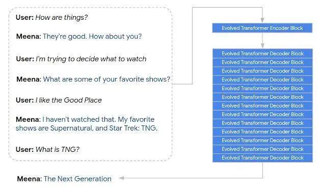

Meena 根据七轮对话的语境生成回复。
用于训练的对话语料以树状脉络形式组织起来，每个回复可以被认为是一轮对话。研究者将每轮对话抽取作为训练样本，而该轮之前的 7 轮对话作为语境信息，构成一组数据。选择 7 轮对话作为语境是因为它既能够获得足够长的语境信息，也还能够让模型在内存限制下进行训练。毕竟文本越长，内存占用就越大。
据博客介绍，Meena 在 341GB 的文本上进行了训练，这些文本是从公共领域社交媒体对话上过滤得到的，和 GPT-2 相比，数据量是后者的 8.5 倍。
**人类评价指标 SSA**
现有聊天机器人的人类评价指标有些复杂，而且在评价者间也很难形成标准一致的评价。这使得研究者设计了一种新的人类评价指标，名为「Sensibleness and Specificity Average (SSA)」。
为了计算 SSA，研究者使用众包方式测试了 Meena、Mitsuku、Cleverbot、小冰和 DialoGPT 等聊天机器人。为了保证评价的连贯性，每个对话都以「Hi」开始。在评价中，人类评价者需要回答两个问题：「对话讲得通吗?」以及「对话够详细具体吗？」评价者使用常识评价聊天机器人的回复。
在评价中，只要有令人困惑、不合逻辑、跑题或者事实性错误的回复，评价者就可以打「对话讲不通」。如果对话讲得通，评价者就需要评价对话是否具体详细。例如，人类对话者说「我喜欢打网球。」，而聊天机器人仅仅回复「这很好。」就可以判断对话是不够具体详细的，因为没有针对语境进行回复。
对于每个聊天机器人，研究者收集了 1600 到 2400 轮对话。每个模型的回复都被人类评价者打上评价结果的标签（对话是否讲得通和对话是否具体详细）。最后的 SSA 分数是两者的均值。如下结果说明，Meena 相比于现有的 SOTA 聊天机器人有着更高的 SSA 分数，接近了人类的表现。

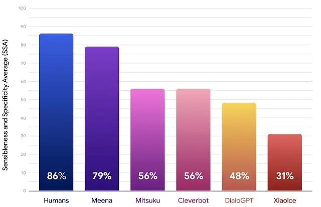

Meena 和其他聊天机器人的性能对比。
**困惑度指标**
但是，由于人类评价存在的问题，很多研究者都希望找到一个能够自动计算的评价指标。这个指标需要能够和人类评价精确对应。研究者在研究中发现，困惑度（perplexity），一个在 seq2seq 模型中常见的指标，和 SSA 有着强相关性。
困惑度用于评价一个语言模型的不确定性，低困惑度说明模型在生成下一个 token（如字、词等）时有着更高的信心。困惑度表示的是模型在选择生成下一个 token 的过程中的候选数量。
在研究中，研究中采用了 8 个不同的模型版本，分别有着超参数和架构上的区别，如层数、注意力 head 数量、训练步数，使用的是 Evolved Transformer 还是一般的 Transformer，使用 hard label 进行旋律还是使用蒸馏的方法进行训练等。从下图来看，越低的困惑度模型有着更高的 SSA 分数，而两者的相关系数很强（R^2 = 0.93）。

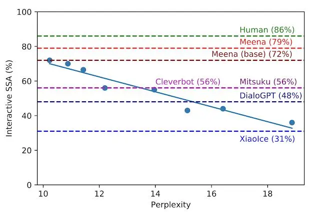

交互式 SSA vs. 困惑度。每个蓝点都是都是 Meena 模型的不同版本。这里绘制出了回归曲线，表明 SSA 与困惑度之间存在很强的相关性。虚线则表示了人，其他机器人，Meena（base），端到端的训练模型以及具有过滤机制和调整解码的 Meena。
最好的端到端 Meena 训练模型，被称之为 Meena（base），实现了 10.2 的困惑度（越小越好）转化为 72% 的 SSA 得分。与其他获得 SSA 分数相比，72% 的 SSA 分数与普通人获得的 86% 的 SSA 分数相差不远。Meena 的完整版具有过滤机制和调整解码，会进一步将 SSA 分数提高到 79%。
**未来的研究与挑战**
按照之前的描述，研究者将继续通过改进算法、架构、数据和计算量去降低神经会话模型的困惑度。
虽然研究者再这项工作中只专注于敏感性和独特性，而其他属性如个性和真实性等依旧值得在后续的工作中加以考虑。此外，解决模型中的安全性和偏差也是一个关键的重点领域，鉴于当下面临的挑战是与此相关的，就目前而言团队不会发布研究演示。但是，研究者正在评估将模型检查点具体化所带来的风险及益处，并且有可能会选择在未来几个月内使其可用，用来帮助推进该领域的研究工作。

https://zhuanlan.zhihu.com/p/104383357

https://www.jiqizhixin.com/articles/2020-04-14

https://zhuanlan.zhihu.com/p/334374764

**本文说明：**

针对“给定一个topic，如何生成一篇文章的demo或者辅助生成文章demo”的问题，通过实现一个文本生成的demo模型、测试并验证demo模型、阅读文本生成和文本控制等相关方向的论文和资料，对于AI（辅助）写作方面有一个整体的理解，我将个人理解、总结、思考初步总结成以下内容。

**本文档主要包含四部分：**

**第一部分主要描述了本人对Ai（辅助）理解的大致思路的整体概述，以及针对当前研究现状本人对研究过程中可能遇到的问题的思考和想法；**

**第二部分描述了本人实现Demo模型的测试及分析的具体细节；**

**第三部分分析和比较了当前各主流模型在性能上的优缺点，及本人对当前可控文本生成使用模型的理解。**

## 关于实现AI写作的个人理解与思考

考虑一般场景下的AI写作，其本质是文本生成问题，要求生成的文本要与给出的topic具备相关性，且语言流畅、符合人类行文逻辑（对生成的文本没有特殊的要求，如情感属性等）；

**实现思路：**

如图1，首先对给定的topic进行处理，需要找到涉及到的话题、关键词，如使用LDA主题模型等，将提取到的关键词和topic涉及到的领域作为文本生成过程中的监督项，通过attention机制，用于控制生成的文本与某个关键词或者话题的相关性，保证生成的文本符合topic；

基于编解码模型搭建模型架构，其本质上是一个语言模型，根据当前编码器的输入预测一个词的输出（具体使用的模型可以根据情况而定，比如RNN,LSTM,Transformer等）；在生成过程中，使用编码器编码源语句，在每次产生新单词后，将新单词加入到源输入语句后面，作为新的输入句，以如此循环往复的机制来生成文本。

在每个生成步骤中，模型在生成下一个输出时，可以采用注意力机制融合前面生成的符号和监督项的特征，解码器接收融合特征并解码输出对应的句子，监督项的存在保证了解码器生成句子与主题的相关性，以及不同句子与不同主题的相关性。

为避免模型陷入循环，不断生成同一个单词，可以设置参数top-k，当模型预测输出时候从概率前top-k个单词中随机选择，作为一下一个单词，从而避免重读输出。

文本结束：如果出现文本结束标志，就结束文本预测。

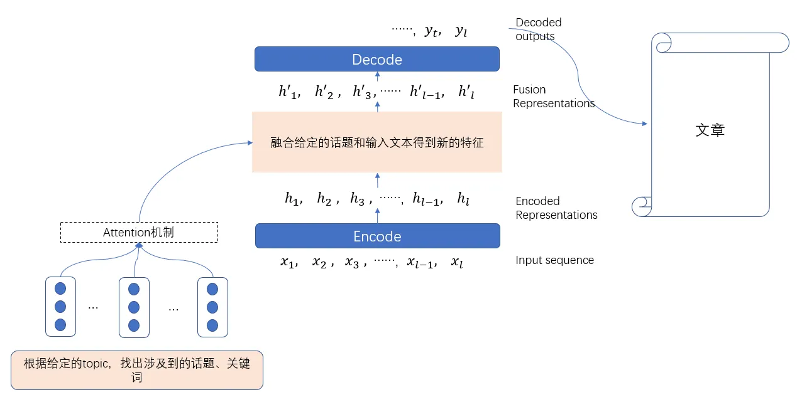

目前在可控文本生成的研究工作中，主要是采用了Seq2Seq框架，当前的主要研究方向是在模型训练过程中，如何使用给定的topic去控制编码输出过程，如何保证文本生成过程中预测文本与主题的相关性以及其与上文之间的逻辑性。

**研究过程中可能需要考虑的问题**：

1. 结合实际应用场景，明确AI（辅助）写作场景/领域性特点，进一步确定研究需求以及需要解决的问题、文本生成的特性等；
2. 语言模型的选取：
3. 采用RNN或者LSTM作为编解码器模型普遍表现性能不是很好，如果只考虑考虑句子的生成质量，生成句子的合理性、意义性、连贯性等方面不是很好；
4. 采用GPT-2模型，从生成句子的质量角度来看，文本生成质量较高，如果需要训练模型，需要的计算资源较大；
5. 采用基于预训练好的GPT-2并在此基础上进行微调的模型，目前采用基于GPT-2的模型多数采用这种方法，计算量小，生成的句子质量高；
6. 文本控制：如何将topic的特征融入到语言模型生成文本的过程中，以及如何控制文本的生成与话题的相关性；
7. 如何保证生成文本上下文之间的具备一定的逻辑性；
8. 如何控制文本生成长度的同时保持生成文本的质量。

## 二、Demo模型的实现及测试结果分析

基于openAI发布的一个较小的模型GPT-2-simple为原型，实现了一个文本生成demo，并进行了测试与验证，初步了解GPT-2在给定topic的情况下生成的长文本情况。

此模型是基于单向 Transformer 构建的，由多层单向transformer的解码器部分构成；其本质上就是通过预测下一个词任务进行预训练的语言模型。

具体实现：

GPT-2采用BPE的方法解决了未登陆词问题；在模型训练过程中，每次产生新单词后，会将新单词加到源输入句后面，作为新的输入句，经过多层模型编解码，以如此循环往复的机制来生成文本。在每个步骤中，模型在生成下一个输出时，将前面生成的符号作为额外的输入使用。为了避免模型陷入循环，不断生成同一个单词，GPT-2设置了一个参数top-k，模型会从概率前top-k个单词中随机选择，作为一下一个单词。当模型解码输出预测为文本结束标志，则结束文本生成。

**测试内容**

给定一个topic以及文本生成长度，测试并分析模型的生成结果。

**测试结果：**

1. 默认参数情况下，生成的文本语句通顺，但明显逻辑性较差，而且在生成的文中虽然包含了关键词，但在意义方面与主题不是很相关（可能是这个模型较小的原因）
2. 更改模型的生成文本长度参数，生成的文本语句通顺，但会包含很多重复的句子。

**测试1：“the road of AI”**

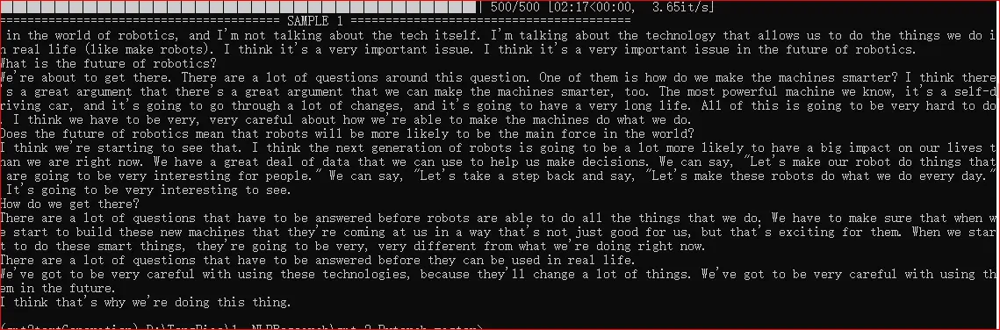

**测试2：“My hometown”**

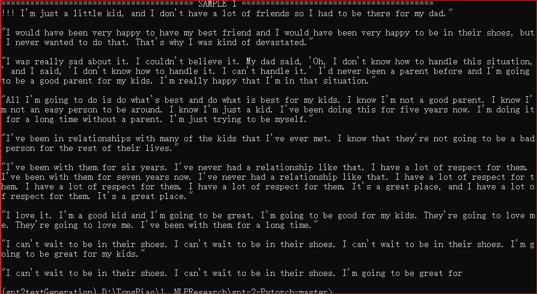

**测试3：“My hometown”，设置文本长度为1000**

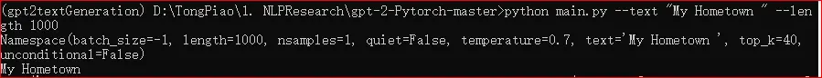

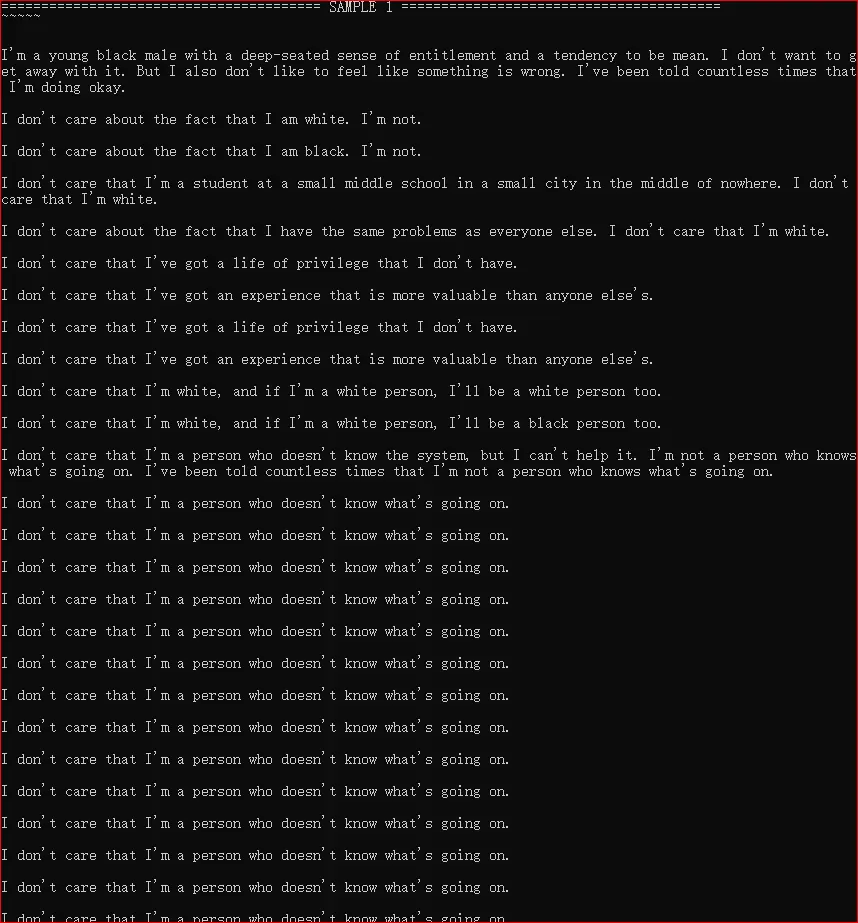

...（后续文本出现重复）

## 三、分析和比较各模型在性能上的优缺点

### 1、模型比较

| 模型                       | 优点                                                         | 缺点                                                         |
| -------------------------- | ------------------------------------------------------------ | ------------------------------------------------------------ |
| Seq2Seq-Attention+RNN/LSTM | 训练所需计算资源较少；符合语法；能够覆盖主题；               | 语义表达不够准确；前后表达一致性弱；逻辑性差。               |
| GPT-2                      | 生成的文本在语法、可读性、语义一致性、语句通顺等方面质量较高。 | 生成的文本会出现缺乏逻辑和关联性不合逻辑的语句；生成的内容不受限，没有办法地敢于朝着自己想要的方向生成文本。 |
| PPLM（基于GPT-2）          | 训练所需计算资源较少；可控性较好。                           | 边训练边生成结果，效率较低；参数对模型的影响较大；逻辑性弱   |
| CoCon（基于GPT-2）         | 训练所需计算资源较少；主题相关性高；文本质量较高；比结构化控制变量模型（以上模型）更加灵活和通用； | 会生成无意义文本；上下逻辑性弱。                             |

### 2、各类模型理解

### Seq2Seq-Attention+RNN/LSTM

**1、TA-seq2seq** Topic Aware seq2seq

《Topic Aware Neural Response Generation》

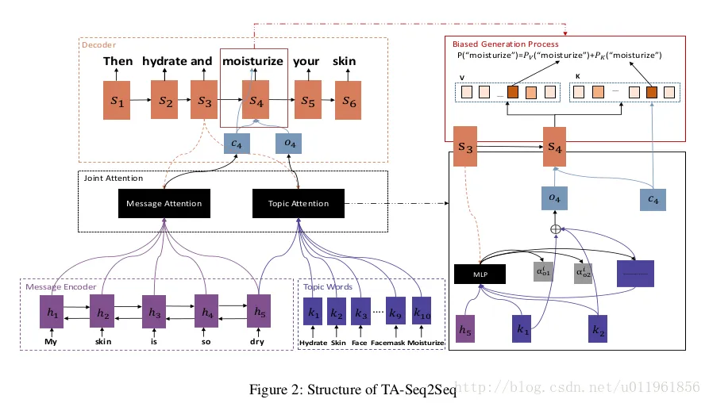

思路：

从topic中获取输入信息(如主题词），将输入信息作为先验知识，并通过联合注意力机制，根据输入信息和话题生成每个单词辅助生成文章。

基于Seq2seq框架，使用LDA模型从给定的topic中获取输入信息的主题单词，在编码时，将输入信息表示成隐向量；

在解码阶段，通过**联合注意力机制**，根据**输入信息**和**话题**，生成每个单词，如此循环往复得到生成的文本。联合注意力机制将输入信息的隐向量通过attention机制表示成语境向量，然后将话题单词的embedding通过话题注意力机制合成为话题向量。与现存的注意力机制不同，本文为了加强话题和输入信息的联系，话题会额外注意到划入输出信息的最终状态，计算话题单词的权重。

**仅限一个话题，由该话题的代表词构成，使用话题注意力进行编码。输入序列也使用另外一支自注意力进行编码。解码使用 RNN / LSTM，生成下一个 token 的过程需要注入上一时间步长的隐藏状态，以及语境向量和话题向量。**

2、**Topic-to-essay**

《Topic to easy generation with neural networks》

针对围绕多个话题词输出一段文本或段落级文章的问题，本文能够实现接受多个话题词的控制，生成包含这些语义的一段文本，并且篇幅较长。

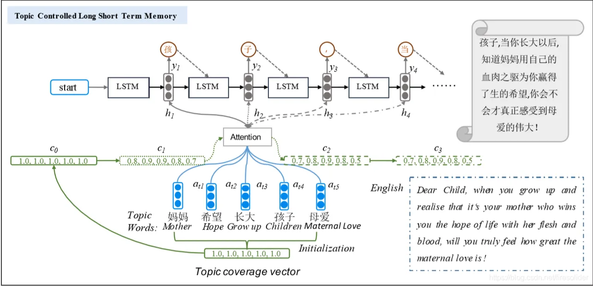

思路：

本文基于Seq2seq框架构建模型，将LSTM模型作为生成器的解码器。

首先，本文通过构建一个多主题的Coverage向量，学习每个话题词的权重，并且在生成过程中不断更新；然后，将coverage向量输入到注意力网络中，用于指导文本生成。（这篇文章会预先对多个话题词进行估计，找到一个最核心的词作为整个段落的主题，用来保证模型生成的段落可以覆盖所有的话题也能够保持一个较为明确的主题）

具体做法：

把话题词的词向量之间的平均表示话题词集的语义，通过这一向量来控制文本生成。

1. 对话题词引入注意力机制达到充分利用话题词语义信息的目的，并来实现对生成文本的控制（注意力机制可以刻画话题词和生成文本之间的局部相关性）：在生成每个词时，attention结构会对话题词自动分配不同权重（考虑到当人类完成一大段文章写作时，显然某些局是围绕一个话题词，而其他句是味道别的话题词，不可能每一句话都是包含整个话题词集的语义，这样使得文章具有一定层次感和逻辑关系，更加符合人类的写作规律），即当前生成的这部分文本内容是由权重较高的一个话题词决定的；
2. 文本生成过程中需要保证整个文本对多个话题的覆盖性，在传统的attention机制上引入coverage机制，即对attention的权重添加一个衰减系数，保证输出的文本在某个时刻关注这个话题较多同时在下一时刻对这个话题关注会减少，而对其他话题关注会增加，从而避免了话题考虑不全，重复地关注某一个话题，导致重复出现一些词的情况。

**可用于多个主题，由多主题 Coverage 向量构成，包括每个主题的权重。在对生成序列概率分布做注意力之后，会生成新的 Coverage 向量，重新调整主题的权重分布。一般来说一个句子不会对多个主题给予高权重，而是逐句给予高权重，上一次高权重的话题会被抑制，而其他话题会被鼓励。解码器使用 LSTM 用于文章生成。**

### GPT-2

模型简介：

GPT-2 模型在训练的时候，使用了更大的训练集训练，拥更多的参数，训练集为数量有 8 百万的网页，共有 40 GB 的文本数据，并对数据内容做质量筛选，覆盖的主题范围非常广。其通用性好，覆盖几乎任何领域的内容，可以用于任意领域的下游任务。训练任务为给出上文，使模型预测下一个单词。

GPT-2 是基于单向 Transformer 构建的，使用字节对编码（Byte Pair Encoding, BPE）的方法进行数据预处理，通过预测下一个词任务进行预训练的语言模型。

具体实现：

**GPT-2采用BPE的方法解决了未登陆词问题；GPT-2模型由多层单向transformer的解码器部分构成**，在每次产生新单词后，将新单词加到源输入句后面，作为新的输入句，以如此循环往复的机制来生成文本。在每个步骤中，模型在生成下一个输出时，将前面生成的符号作为额外的输入使用。为了避免模型陷入循环，不断生成同一个单词，GPT-2设置了一个参数top-k，模型会从概率前top-k个单词中随机选择，作为一下一个单词。

文本结束：如果出现文本结束标志，就结束文本生成

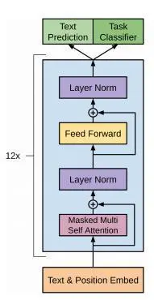

注：

OpenAI 团队由于安全考虑，目前没有开源全部训练参数。

### PPLM

PPLM是一种即插即用的语言模型，在一定程度上解决文本可控性和可扩展性的问题。

PPLM的构成：一个预训练模型（GPT-2或者其他语言模型）

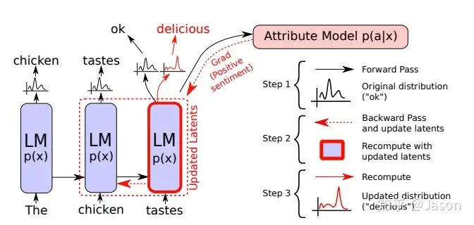

思路：

在构建好预训练模型后，对该模型生成的文本进行微调，基于条件概率：

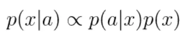

实现文本可控生成。

如果想要得到基于属性a生成的文本，首先通过已有的语言模型p(x)生成文本，然后通过分类器判断生成的文本的具体属性，即可获得p(x|a)

具体实现：

通过分类器预测语言模型生成的文本属性分类，根据属性判别回传梯度，更新语言模型的内部历史参数，增加模型预测接近想要属性的可能性；然后性更新后的参数中进行采样，生成新的词。更新参数的过程在每一个时间步都重复一次，从而逐步过渡到所需的属性。

Ot+1, Ht+1 = LM(Xt, Ht)

通过修改历史即 Ht，从而生成符合要求的 Ot+1.

Ht 包括 第 0时间步长一直到第 t 时间步长的历史信息，主要是每一层的 K, V。（对 Transformer 而言）

再计算 deltaH 时，引入超参数强度参数 alpha，belta，确保生成的内容满足 p(a|x) 的需求（属性需求）。

同时要求符合语言模型 p(X) 的句子，采取了两个**保证生成句子的语言模型尽量与原语言模型接近的方法**.

- **Kullback–Leibler(KL) 散度**：在计算历史 H 更新值时，向其中加入一个 KL 散度损失，**最小化改变前语言模型和改变后的预测概率分布的 KL 散度**；
- **Post-norm Geometric Mean Fusion（后范数几何平均融合？）**：其实就在上面训练时改变的同时，加入一个类似输出后处理的过程，直接让实际预测从下面式子中采样，**让生成分布和语言模型直接绑定起来**：

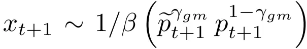

通过上面这些步骤实际上相当于完成了一个下图中的过程：

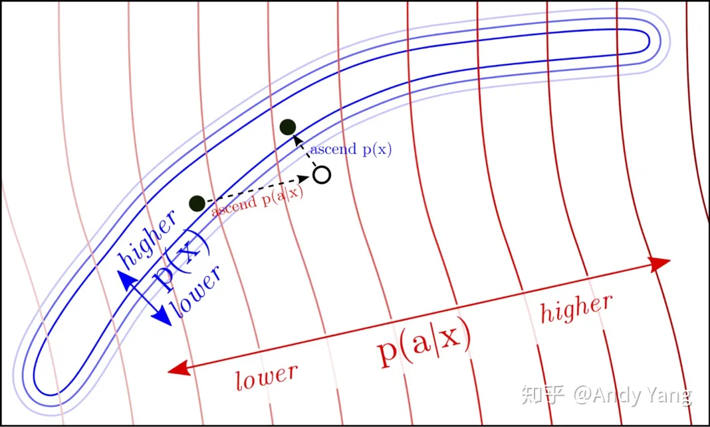

**先通过 p(a|x) 让生成结果具有属性，之后让它生成接近自然语言的流畅 p(x).**

### CoCon

CoCon的目标是在给定的一些话题、属性后，模型生成的文本更符合需求。

CoCon基于Seq2Seq模型，添加了一个轻量级模块CoCon，可插入在各种模型的encoder和decoder间，用于控制文本生成。编码器编码源句子，解码器接受编码特征和给定条件，CoCon用于融合控制文本和输入文本的信息。

思路：

考虑到一方面，一般人们给出的一些句子来表达想要控制的内容（如高考作文中给出的题目要求），而非多个词；另一方面，给出的控制变量范围很狭隘，而文本生成的空间理论上是无线大的；所以采用文本为控制变量指导文本生成。

CoCon采用了自监督的方式，根据其提出的三种自监督损失在预训练的语言模型上GPT-2上继续训练，从而取得好的in-domain效果。这种方式的好处在于，文本不需要进行结构化，让模型自行学会控制，而且可以输入若干控制文本，只需要把它们拼接成一段文本即可，这比结构化的变量更加灵活。

具体实现：

首先**用一个编码器分别编码给定的引导文本 和控制文本** ，将得到它们的特征后和送到CoCon模块中，通过自注意力让它们交互，得到对应的新的特征 ，然后再像语言模型一样通过去预测下一个词，如此循环往复 。

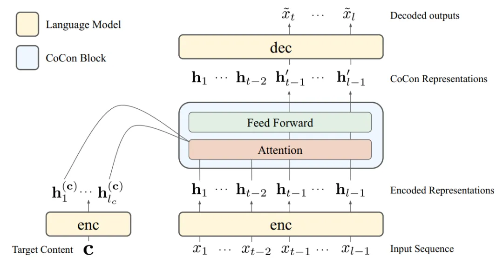

如上图所示，（target Content是控制文本，Input Sequence是引导文本）

CoCon是一个单层Transformer Block，Self-Attention->FFN的模式。首先得到引导文本和控制文本的Q,K,V：然后把它们的K和V分别拼接起来，再经过自注意力（引导文本产生的，因为控制文本只用于K和V），再经过一个FFN，就得到了CoCon的输出，再把这个输出作为解码器的输入，就可以像语言模型一样一个词一个词地生成了。还可以在注意力权重区镇上添加一些偏置项，以调整对控制文本的关注度。

**K = [Kc, K_input] , (lc + t -1, d)**

**V = [Vc, V_input] , (lc + t -1, d)**

**Q = [Q_inptut], (t-1, d)**

**Attention + FFNN**

## 参考：

[1]《Topic aware neural response Generation》

[https://arxiv.org/pdf/1606.08340.pdf](https://link.zhihu.com/?target=https%3A//arxiv.org/pdf/1606.08340.pdf)

[2]《Topic to easy generation with neural networks》

[https://doi.org/https://d4mucfpksywv.cloudfront.net/better-language-models/language-models.pdf10.24963/ijcai.2018/567](https://link.zhihu.com/?target=https%3A//doi.org/10.24963/ijcai.2018/567)

[3] GPT-2 《[Language Models are Unsupervised Multitask Learners》](https://link.zhihu.com/?target=https%3A//d4mucfpksywv.cloudfront.net/better-language-models/language-models.pdf)

论文链接：[https://d4mucfpksywv.cloudfront.net/better-language-models/language-models.pdf](https://link.zhihu.com/?target=https%3A//d4mucfpksywv.cloudfront.net/better-language-models/language-models.pdf)

[https://terrifyzhao.github.io/2019/02/18/GPT2.0%E8%AE%BA%E6%96%87%E8%A7%A3%E8%AF%BB.html](https://link.zhihu.com/?target=https%3A//terrifyzhao.github.io/2019/02/18/GPT2.0%E8%AE%BA%E6%96%87%E8%A7%A3%E8%AF%BB.html)

*[https://jalammar.github.io/illustrated-gpt2/](https://link.zhihu.com/?target=https%3A//jalammar.github.io/illustrated-gpt2/)*

[4] PPLM《Plug and Play Language Models: A Simple Approach to Controlled Text Generation》

论文链接：[https://arxiv.org/abs/1912.02164](https://link.zhihu.com/?target=https%3A//arxiv.org/abs/1912.02164)

代码链接：[https://eng.uber.com/pplm/](https://link.zhihu.com/?target=https%3A//eng.uber.com/pplm/)

[5] CoCon 《CoCon: A Self-Supervised Approach for Controlled Text Generation》
