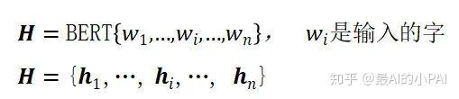
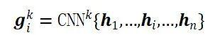
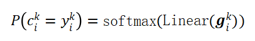
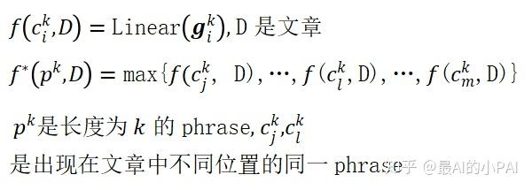

### **1.SIFRank – a good baseline**

传统的关键短语抽取方法，主要利用统计、语法等信息。ExpandRank[4], AutoPhrase[18]等算法被提出，通过引入相关的文章，或者利用外部知识图谱等不同方式，引入外部信息。

近来，预训练模型的快速发展给关键短语抽取也带来了新的引入外部知识和信息的方法。SIFRank通过引入预训练模型ELMo[19]，对文章和短语得到动态的sentence embedding和phrase embedding，从字、词、语法、上下文等多层次表达文章和短语，从而实现了高质量的关键短语抽取。该方法在不同的数据集上，均能取得很好的表现，可以作为一个不错的基准模型，应用于各种不同应用下的关键短语抽取。

- Candidate generation: 利用POS tags，抽取得到NP (noun phrases)，作为候选短语。
- Keyphrase scoring: 使用smooth inverse frequency (SIF)[20] 计算文章和短语中各个词语的权重。然后通过ELMo得到每个词的embeddings，相应地加权得到sentence embedding, phrase embedding。最后计算cosine similarity对候选短语进行排序。

### **2.BERT-KPE**

BERT-KPE是最近由thunlp提出的方法，在OpenKP和KP20K上都达到了state-of-the-art和良好的鲁棒性。BERT-KPE使用预训练模型BERT，采用多任务学习范式，同时训练chunking network和ranking network，分别完成candidate chunking和ranking两个任务。此外，该方法也非常灵活，可以根据需要，删除任意一个子网络，仅训练另外一个子网络。该算法主要分为以下几步：

- Token embedding

- N-gram representation: 使用CNN融合窗口大小为k 的字对应的token embeddings，得到相应的n-gram representation

- Multi-task
  ▫ Chunking network：预测该n-gram是否是关键短语候选

▫ Ranking network: 对n-gram进行排序

