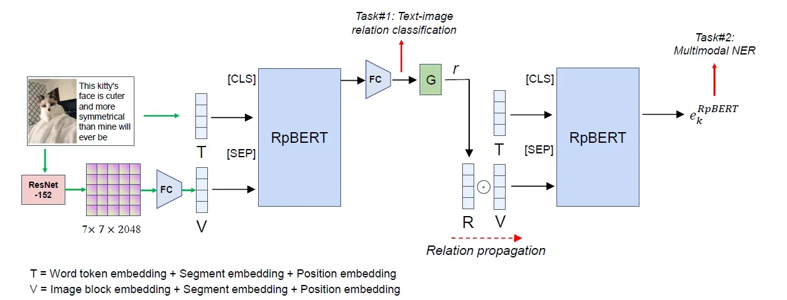
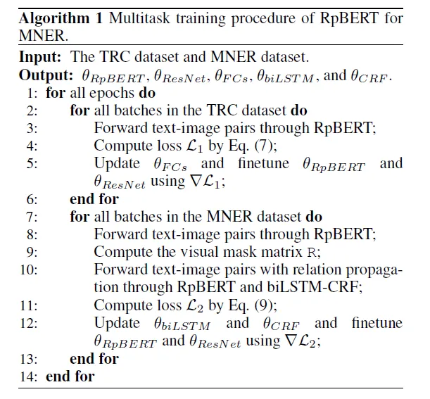

# 多模态命名实体识别

## Reference

RpBERT: A Text-image Relation Propagation-based BERT Model for Multimodal NER  2021-2

## 1 文章来源

- 文章：

[RpBERT: A Text-image Relation Propagation-based BERT Model for Multimodal NER (arxiv.org)arxiv.org/abs/2102.02967v1](https://link.zhihu.com/?target=https%3A//arxiv.org/abs/2102.02967v1)

- 代码：

[https://github.com/Multimodal-NER/RpBERTgithub.com/Multimodal-NER/RpBERT](https://link.zhihu.com/?target=https%3A//github.com/Multimodal-NER/RpBERT)

## 2 算法特点

**自身的特点**：

- 基于 BERT 模型，完成**多模态命名实体识别** (MNER) 任务：借助多模态信息，从文本中识别出实体，并为之添加相应的标注信息（即实体类型）。
- 提出 **Relation Propagation** (关系传播) 机制，通过提取图片文本之间的**相关性**，利用视觉信息完成 NER 任务。

**与其他算法的对比**：

- 在很多 MNER 模型中，都假设标题数据集中的文本-图像对高度相关（但这并不一定，比如我们发朋友圈or微博时候的配图，并不一定包含博文中提到的实体），将视觉特征直接与语言特征融合在一起，导致任务错误。
- 对于不相关的文本-图像对，多模态模型提取到的视觉上下文线索，与文本并不匹配。因此，作者认为， MNER 模型需包含对于图文相关度的判断。

## 3 模型结构

- 两个 RpBERT 模块结构相同、共享参数。
- 两个 RpBERT 模块均使用了预训练好的 BERT-base 结构。

个人理解，整个模型的主要目的，就是给送入 NER 任务的文本，添加从图片中学习到的实体信息。

第一个 RpBERT 用来训练并提取图文关联度。“关系传播”到第二个 RpBERT ，实际上就是推理过程，用来给文本加上与图片关联的信息，并送入 NER 模型进行处理。

## 4 模态编码过程

### 4.1 图文嵌入表示

**文本模态**：

直接使用 BERT tokenizer 进行 embedding。

**图像模态**：

直接将视觉特征表示为 **block region** 形式，而非通过 Faster-RCNN 生成的 RoI（感兴趣区域）。原因是：作者认为，对于不相关的图像-文本对，通过 RoI 的视觉特征，会加深对语言特征的干扰。

1. 通过 **ResNet** 生成视觉特征，输出尺寸为 ( 使用 ResNet-152 时， ）；
2. 将各视觉区域 *表示为* embedding 序列： 。 其中， ， ，以匹配 BERT 的 embedding size 。 

**最终表示**：

将文本和视觉序列拼接为：

其中，[CLS] 表示图文关系分类，[SEP] 表示文本和图像模态的分隔。 

embedding 的组成与 BERT 相似，分别包含：(1) word token embedding 或 image block embedding；(2) segment embedding：从两种类型中学习 —— A 表示文本 token，B 表示图像块；(3) position embedding：文本token 按位置编码。对于视觉 token，所有位置都是**相同**的。

### 4.2 任务#1 图文关系分类

任务目的是，判断图片内容是否可以为文本提供更多信息。

[CLS] 经过 RpBERT 的输出 token，作为**二分类器**（判断图文是否相关），输入到全连接层。

### 4.3 任务#2 命名实体识别

首先，分类任务的结果，通过**概率门** G ，产生概率 。这里引入了一个**文本相关分数** r，表达样本为正样本的概率： 。 

随后，基于 7x7 的 block region，建立视觉 mask 矩阵 R：

接下来，通过 （ 表示矩阵**元素相乘**），将 R 与视觉元素融合，然后传入 RpBERT。（这里的 R 应该是表达图文关联的权重值 —— 即，如果 ，则意味着图文完全不相关，所有视觉特征需被丢弃。） 

最后，将文本 T 一同传入 RpBERT，输出**包含图文线索的文本 token**： ，然后传入 NER 模型，以进行命名实体识别任务。

## 5 关系传播过程

关系传播的方法，是 RpBERT 算法的重点所在。作者提出了两种**概率门 G**，用来表达不同的关系传播过程。

- **Soft relation propagation**

使用 softmax 函数，将 G 的输出视为**连续分布**。根据图文关系的强度，过滤视觉特征。

- **Hard relation propagation**

将 G 的输出视为分类问题，视觉特征只存在被选取（1）或被舍弃（0）两种结果。

这里，作者给出了两种不同的概率门表示方法。

其一为直接添加一个判定函数： 。[ ] 即为判定函数，若参数为真，则  ，反之为 0 。

但这里需要注意一点：这样的 是**不可导**的，在训练时无法直接进行梯度传播！因此，作者提出使用 straight-through estimator 的方式，进行梯度传播。（对于 straight-through estimator 的详细解释，可以看这篇文章：https://zhuanlan.zhihu.com/p/72681647）

另一种方法，则是直接构建一个可导的近似判定函数 。作者使用了 Gumbel-Softmax 函数，得到分类分布的连续近似值：

其中，g 为 Gumbel 分布引入的噪声， 为温度参数。当温度参数趋近 0 ，样本变为 one-hot 形式，且整体与分类分布相同。在训练阶段，使用从 1 到 0.1 的温度参数退火流程。

## 6 训练过程

### 6.1 任务#1 图文关系分类

使用了现存的 Text-image relation classification (TRC) 数据集中，与图像任务相关的部分进行训练。

在 TRC 训练任务中，将图像-文本对表示为：

使用交叉熵损失，作为二元关系分类的损失函数：

其中， 是正确分类的概率，使用 softmax 计算。

### 6.2 任务#2 命名实体识别

作者使用了 biLSTM-CRF 模型，构建了 NER 任务。

值得注意的是，向 biLSTM-CRF 模型输入的，是原始输入 和经过 RpBERT 的输出 的**拼接**： 

训练目标为最小化训练数据的负对数似然。

### 整体训练流程

## 参考文献

[1] [https://blog.csdn.net/qq_41887799/article/details/123109540](https://link.zhihu.com/?target=https%3A//blog.csdn.net/qq_41887799/article/details/123109540)

[2] https://zhuanlan.zhihu.com/p/72681647
