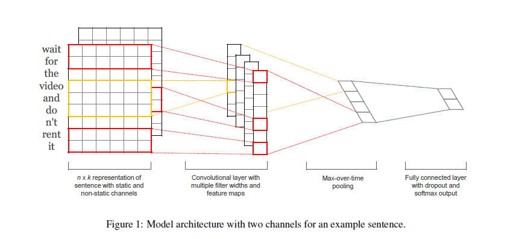
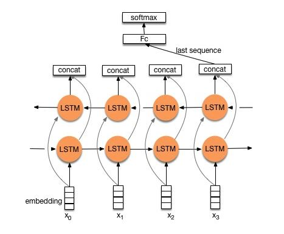
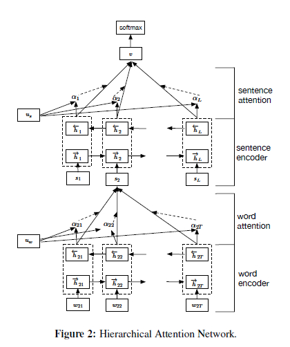

# 文本分类模型

tags: 博客文章

---

[TOC]

## 1. TextCNN[1]

 $x_i \in R^k$ 表示一个第$i$ 个词其 $k$ 维的词向量表示， 对于一个长度为 $n$ 的句子，有：$X = \{x_1, \cdots, x_n\} \in R^{n \times k}$， 我们通过对向量矩阵 $X$ 进行卷积操作来提取特征， 其中， $x_{i:i+j}$ 表示第 $i$ 个词到第 $i+j$ 个词，共 $j+1$ 个词。

对于一个窗口大小为 $h$ 的卷积核， 其 shape 为 $w \in R^{h \times k}$ ， 其提取特征的过程为：
$$
c_i = f(w \cdot x_{i:i+h-1} + b); \quad b \in R， c_i \in R
$$
1个卷积核对 $X$ 一次卷积的过程需要对 $\{x_{1:h}, x_{2:h+1}, \cdots, x_{n-h+1:n}  \}$ 分别进行卷积操作， 我们得到最终的特征表示： 
$$
c = [c_1, c_2, \cdots, c_{n-h+1}]  ; \quad c \in R^{n-h+1}
$$
然后，文章对特征向量 $c$ 采用最大池化操作来提取最重要特征：
$$
\hat{c} = Maxpool(c); \quad \hat{c} \in R
$$
上述的过程描述的是一个卷积核对$X$ 提取特征的过程，而实际中，我们往往要采用多种窗口大小的卷积核，且每种窗口的卷积核有很多个，这里假设卷积核的窗口大小为 3， 4， 5， 卷积核的shape分别为 $3 \times k , 4 \times k, 5 \times k $， 其对应的卷积核数量为 $m_1, m_2, m_3$ 。

对于窗口大小为 3 的卷积核， 我们在一次卷积过后获得一个$C = (n-h+1) \times 1 \times m_1$的矩阵， 然后对该矩阵进行最大池化得到一个 $ 1 \times 1 \times m_1$  的向量， 该向量就是窗口为3 的卷积核所提取的全部特征。

同样的道理，窗口为 4 的卷积核所提取的特征为一个 $1 \times 1 \times m_2$ 的向量， 窗口为 5 的卷积核所提取的特征为一个 $1 \times 1 \times m_3$ 的向量。

最后我们将这三个向量拼接起来形成一个 $z \in R^{1 \times (m_1 + m_2 + m_3) }$ 的向量， 然后将该向量送入输出层：
$$
y = w \cdot (z \circ r) + b; \quad r \in R^{m_1+m_2+m_3} \quad \text{r为 dropout}
$$

## 2. 对TextCNN 的分析 [3]

文章 [3] 对CNN 用于文本分类时的超参进行分析，这些超参包括： 词向量的选择，Filter 的大小， 卷积核的数量， 激活函数的选择， Pooling 策略， 正则化方法。

**Word Embedding**  

文章比较了三种情况： Word2vec， Glove， Word2vec + Glove， 而实际上，三者的性能相差无几， 具体的依旧要看任务数据集，并没有定论，因此在实际的开发中，分别采用不同的预训练词向量来帮助我们更好的选择。

**Filter Size**

不同的数据集有其适合的 Filter Size， 文章建议区域大小为 **1-10** 内进行线性搜索， 但如果数据集中的句子长度较大(100+)， 那么可以考虑设置较大的 Filter Size。

不同size的 Filter 进行结合会对结果产生影响，当把与**最优 Filter size 相近的Filter 结合时**会提升效果，但如果与较远的Filter 结合会损害性能。因此，文章建议最初采用一个 Filter ， 调节 size 来找到最优的 Filter size， 然后探索最优Filter size的周围的各种 size 的组合。

**卷积核数量**

对于不同的数据集而言，卷积核的设置也有所不同，最好不要超过600，超过600可能会导致过拟合， 推荐范围为100-600。同时，卷积核数量增多，训练时间会变长，因此需要对训练效率做一个权衡。

**激活函数**

尽量多尝试激活函数， 实验表明，Relu， tanh 表现较佳。

**Pooling 策略**

实验分析得出， 1-max pooling 始终优于其他池化策略，这可能是因为在分类任务中，上下文的位置并不重要，且句子中的 n-granms 信息可能要比整个句子更具预测性。

**正则化方法**

实验表明，在输出层加上L2正则化并没有改善性能，dropout是有用的，虽然作用不明显，这可能是因为参数量很少，难以过拟合的原因所致。文章建议不要轻易的去掉正则化项，可以将 dropout 设置为一个较小值 (0-0.5)，推荐0.5 ， 对于L2， 使用一个相对较大的约束。 当我们增加卷积核数量时，可能会导致过拟合，此时就要考虑添加适当的正则项了。

## 3. TextRNN

以双向LSTM 或GRU来获取句子的信息表征， 以最后一时刻的 h 作为句子特征输入到 softmax 中进行预测， 很简单的模型，就不详细介绍了。

## 4. TextRCNN [4]

说实话，这篇论文写的真乱，一个很简单的思想，看起来比 Transformer 还复杂，真的是有点醉， 不推荐看原论文，写的真的很冗余。 

文章的思想很简单：

- 首先，对于单词 $w_i$ ， 获得其词向量表示 $e(w_i)$
- 然后， 采用双向 GRU 来获取每个词的上下文向量表示 $c_l(w_i), c_r(w_i)$ 
- 为了更好的表示词的信息，文章将原始词向量 $e(w_i)$， 上下文表示$c_l(w_i), c_r(w_i)$  结合起来，形成词的新的向量表示，这里作者采用一个全连接网络来聚合这些信息：

$$
x_i = [c_l(w_i); e(w_i); c_r(w_i)] \\
y^{(2)} = tanh(W^{(2)} x_i + b^{(2)})
$$

- 采用最大池化来获取句子的最终表示：
  $$
  y^{(3)} = max_{i=1}^n y_i^{(2)}
  $$

- 最后，采用一个softmax 来做分类：

$$
y^{(4)} = W^{(4)} y^{(3)} + b^{(4)} \\
p_i = \frac{exp(y_i^{(4)})}{\sum_{k=1}^n exp (y_k^{(4)})}
$$

## 5. HAN [5]

**问题定义**

HAN 主要针对 document-level 的分类， 假定document 中有L个句子：$\{s_1, ... s_L\}$， 对于句子 $s_i$， 其包含有 $T_i$ 个单词：$\{ w_{i1}, \cdots, w_{it}, \cdots w_{iT}\}$  。

**Word Encoder**

对于一个句子$s_i$ ，文章采用词向量矩阵将其做 Embedding， 然后采用双向 GRU 来获得该句子的上下文表示， 以第 $i$ 个句子中的第 $t$ 个单词为例：
$$
x_{it} = W_e w_{it}, t \in [1,T] \\
\overrightarrow{h}_{it} = \overrightarrow{GRU}_{(x_{it})},  t \in [1,T] \\
\overleftarrow{h}_{it} = \overleftarrow{GRU}_{(x_{it})},  t \in [T,1] \\
h_{it} = [\overrightarrow{h}_{it}, \overleftarrow{h}_{it}]
$$
**Word Attention**

考虑到在每个句子中，各个词对句子信息的贡献不同，因此此处引入一个注意力机制来提取语义信息，更好的获得句子的表示。
$$
u_{it} = tanh(W_w h_{it} + b_w) \\
\alpha_{it} = \frac{exp(u_{it}^Tu_w)}{\sum_t exp(u_{it}^Tu_w)}; \quad  u_w \text{是随机初始化的，并参与训练} \\
s_i = \sum_t \alpha_{it}h_{it}
$$
**Sentence Encoder**

一个 document 中有L个句子，我们需要对这L个句子的信息进行整合，但很明显，句子之间的信息是由关联的，因此文章采用双向GRU对句子信息进行综合来获得每个句子新的表示：
$$
\overrightarrow{h}_{i} = \overrightarrow{GRU}_{(s_i)}, i \in [1, L] \\
\overleftarrow{h}_{i} = \overleftarrow{GRU}_{(s_i)}, i \in [L, 1] \\
h_i = [\overrightarrow{h}_i, \overleftarrow{h}_i]
$$
**Sentence Attention**

考虑到在一个document中，各个句子的重要程度并不同，因此采用一个Attention 来对句子信息进行整合最终形成 document 的最终信息：
$$
u_i = tanh(W_sh_i + b_s) \\
\alpha_i = \frac{exp(u_i^T u_s)}{\sum_i exp(u_i^T u_s)}; \quad  u_s \text{是随机初始化的，并参与训练} \\
v = \sum_i \alpha_i h_i
$$
**Document Classification**
$$
p = softmax(W_c v + b_c) \\
L = -\sum_d log p_{dj}
$$
## DPCNN

 

## 最后

虽然文本分类是最简单的任务，但其在企业中应用最为广泛，十分适合初学者入门学习。

## Reference

[1] TextCNN： Convolutional Neural Networks for Sentence Classification

[3] A Sensitivity Analysis of (and Practitioners' Guide to) Convolutional Neural Networks for Sentence Classification

[4] Recurrent Convolutional Neural Network for Text Classification

[5] Hierarchical Attention Networks for Document Classification

[n] Large Scale Multi-label Text Classification With Deep Learning

https://mp.weixin.qq.com/s?__biz=MzAxMTk4NDkwNw==&mid=2247485854&idx=1&sn=040d51b0424bdee66f96d63d4ecfbe7e&chksm=9bb980faacce09ec069afa79c903b1e3a5c0d3679c41092e16b2fdd6949aa059883474d0c2af&token=793481651&lang=zh_CN&scene=21#wechat_redirect