# 预训练语言模型 - GPT 系列

## GPT 1.0 [1]

GPT 1.0 与 Bert 很相似，同样是作为二阶段的模型，只是在细节处可能相差较大。

预训练训练数据：8亿词的BooksCorpus ， transformer层数：12层，参数量与bert差不多，1.1亿

### 1， 语言模型

对于给定的 tokens $U = \{u_1, \cdots, u_n \}$ ， GPT 1.0 的语言模型的目标函数如下：
$$
P(s) = P（w_i |w_{i-k}, \cdots, w_{i-1} ）\\
$$

$$
L_1(U) = \sum_i log P(u_i| u_{i-k}, \cdots, u_{i-1}; \Theta); \, \, \text{k为窗口大小}
$$
从上式可以看出， GPT 1.0 是具有句子的生成能力的， 可惜 GPT 1.0 没有关于生成方面的实验。

### 2， 单向Transformer

GPT 1.0 采用单向的 Transformer 来作为特征抓取器，这是由于语言模型本身决定的，因为是从前往后生成单词的。 采用 transformer 的整个过程如下
$$
h_0 = UW_e + W_p， \\
W_e 为 \, token \, embedding ; W_P 为 \, position \, embedding \\
h_l = transformer\_block(h_{l-1})  \,\,  \forall \in [1,n]，n为层数 \\
P(u) = softmax(h_n W_e^T)
$$

### 3. 微调

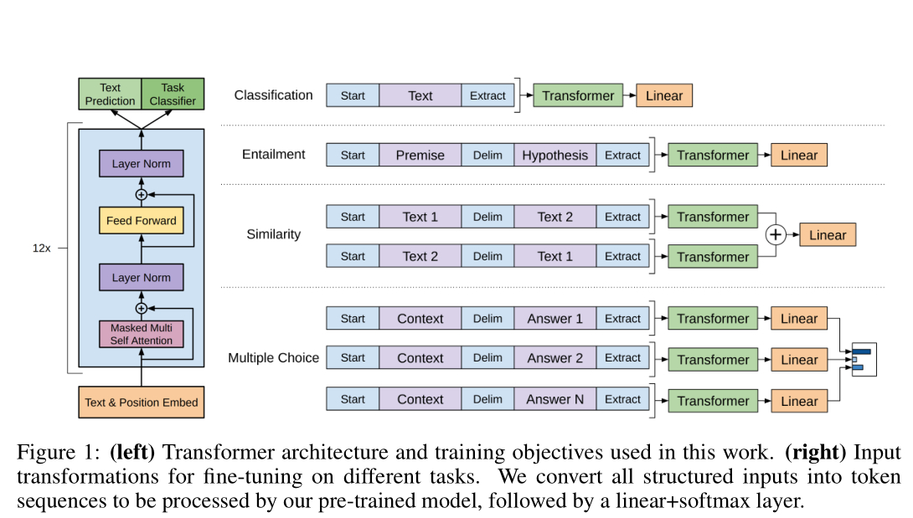

## GPT 2.0

采用800w高质量网页文档，40GB数据；48层单向transformer；参数量15亿。

### 1. 语言模型

$$
P(s) = P（w_i |w_{i-k}, \cdots, w_{i-1} ）
$$

GPT 2.0 的语言模型与 GPT 1.0 很相似， 变化很少，

### 2. 单向 transformer

与GPT 1.0 几乎相同，有一些微小的改动，

- Layer Normalization 的转移和添加
- 扩大字典，输入序列长度等
- 48层的transformer

这部分也不是文章的主要创新点，因此我略过了。

### 3. GPT 1.0 vs GPT 2.0 - 大就完事了

GPT 2.0 相较 1.0 来说，在数据方面的改动很大，主要包括以下几个方面： 

- 大规模，高质量，跨领域数据：WebText
- 更深的 Transoformer 模型（15亿参数），48层

GPT 2.0 验证了数据的重要性，即使单纯的从数据角度入手，效果就可以获得巨大的提升。GPT 2.0 采用800w 互联网网页数据，这样训练出来的语言模型，能够覆盖几乎所有领域的内容。

### 4.如何适配下游任务 - zero shot

对于下游任务来说， GPT 2.0 认为可以不采用微调的方式来做，而是直接用训好的语言模型来做，那么它怎么就能够又能做分类，又能做翻译，还能做文本摘要的呢？

答案很风骚： GPT 2.0 在做下游任务时，添加了一些引导字符来预测目标，它的输出与语言模型一样，都是一个单词。 

那么 GPT 2.0 是如何做生成类任务的呢？ 那就是连续不断的进行预测，预测 n 次(设定)， 然后把这 n 个token 连在一起，取其中的几句话来做为生成的文本。

### 5. 最大的转变 - 思想

GPT 2.0 相较GPT 1.0 而言，改变最大的思想，具体来说， GPT 2.0 依旧是二阶段的框架，但对于下游任务，不再采用有监督的进行微调，而是采用无监督的方式直接去做。

作者认为，通过大模型，大规模数据，GPT 2.0 能够学习到很多通用知识，直接拿这些通用知识去做下游任务就可以获得很好的结果。 这其实就是**证明预训练语言模型这条道路的正确性，预训练语言模型的确能够学习到语言的很多信息，并具有很强的泛化能力。** 

但， 真的不需要微调吗？ 我认为接下来一段时间的预训练语言模型的发展依旧会是二阶段或三阶段的框架： **预训练语言模型 + [多任务学习] + [在特定数据集上预训练] + 下游任务微调。**

不可否认的是， GPT 2.0 同样打开了一个新思路， **如果有一天， 模型足够大，数据足够多，我们还需要微调吗？**

### 6. GPT 2.0 告诉了我们什么

- 预训练数据与网络深度的重要性，目前也没有到极限。
- GPT 2.0 的生成效果非常惊艳，至少语法，流畅度等方面是没有问题的，就是没有灵魂
- zero-flot 也不是不可以

## GPT 3.0

### 0. zero-shot,few-shot, fine-tuning

- FT，fine-tuning：就是微调啦
- FS，few-shot：允许输入数条范例和一则任务说明
- One-shot：只允许输入一条范例和一则任务说明
- Zero-shot：不允许输入任何范例，只允许输入一则任务说明

### 1. 模型与语言模型

预训练时采用的模型，训练目标，语言模型与 GPT 2.0没有差别。

此处为了对比不同size 下的结果，GPT 3 预训练了8个不同参数量的模型：

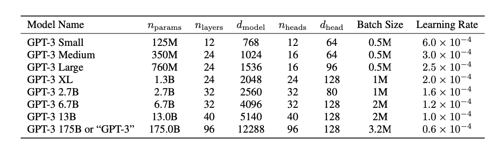

>
> ChatGPT
>
> 当然，这张表格列出了不同版本的GPT-3模型的一些关键参数和设置：
>
> 1. **Model Name**: 这列展示了各个模型的名称，通常以其参数数量命名。
> 2. **n_params**: 指的是模型中的参数数量。这些参数在训练过程中学习并存储模型学到的知识。参数的数量通常与模型的容量和复杂性成正比。
> 3. **n_layers**: 这代表了模型中的层的数量。在变换器（Transformer）架构中，这些层是处理输入数据的堆叠的编码器层。更多的层可以增加模型处理复杂信息的能力。
> 4. **d_model**: 这是模型中每一层的宽度，或者说是每一层中的特征数。这直接影响了模型在每一层中可以并行处理的信息量。
> 5. **n_heads**: 指的是多头注意力机制中的“头”数量。多头注意力允许模型在不同的表示子空间中并行地关注不同位置的信息。
> 6. **d_head**: 这是每个注意力“头”中的维度。它是`d_model`除以`n_heads`的结果，代表每个头处理的特征的维数。
> 7. **Batch Size**: 批处理大小是指在模型训练时一次性处理的数据项数。较大的批处理大小可以提高训练的速度，但也需要更多的内存。
> 8. **Learning Rate**: 学习率是在训练神经网络时用于更新网络权重的参数。它决定了每次迭代后权重调整的幅度。通常，较大的网络需要较小的学习率来稳定训练过程。

### 2. 数据集

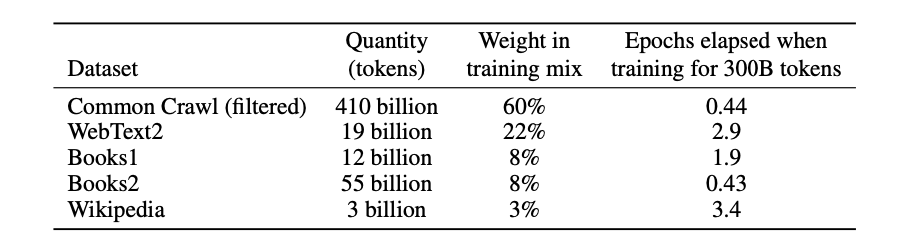

### 3. GPT 3.0 的意义

GPT 3.0 本质上是探索超大型预训练语言模型在 zero-shot上的可能性，这是延续之前 GPT 2.0 的研究，整体上，GPT 3.0 在 zero-shot 下能获得相当不错的结果。

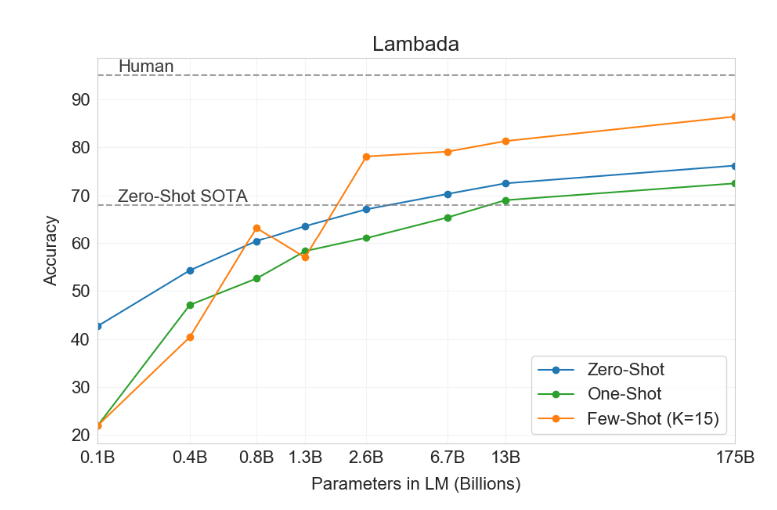

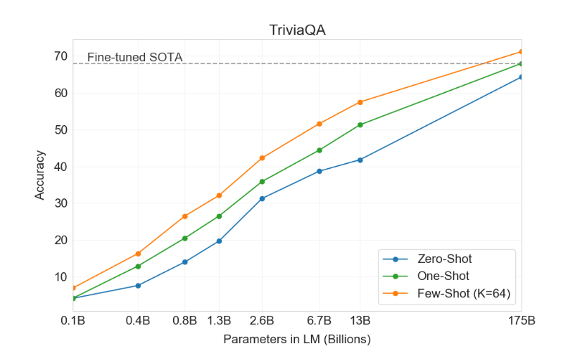

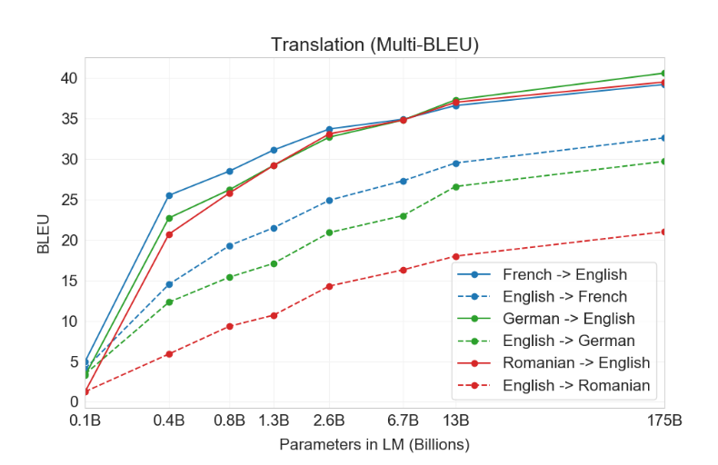

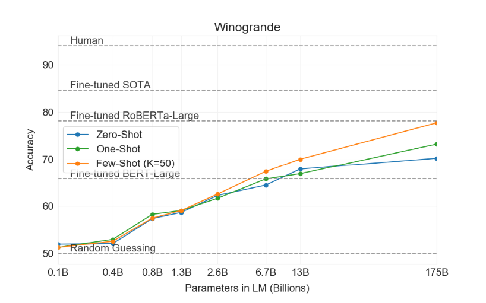

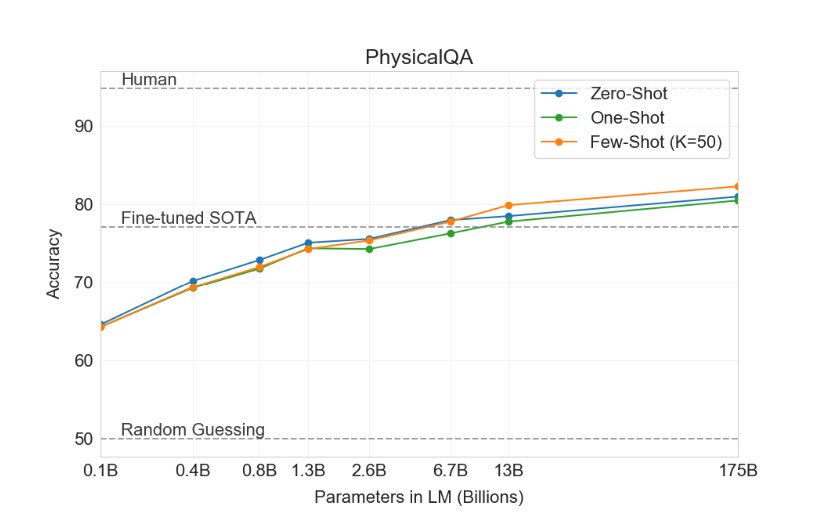

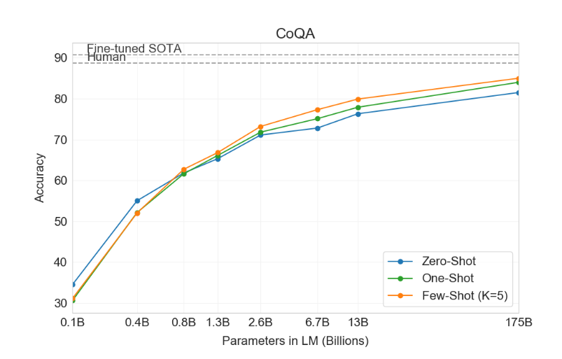

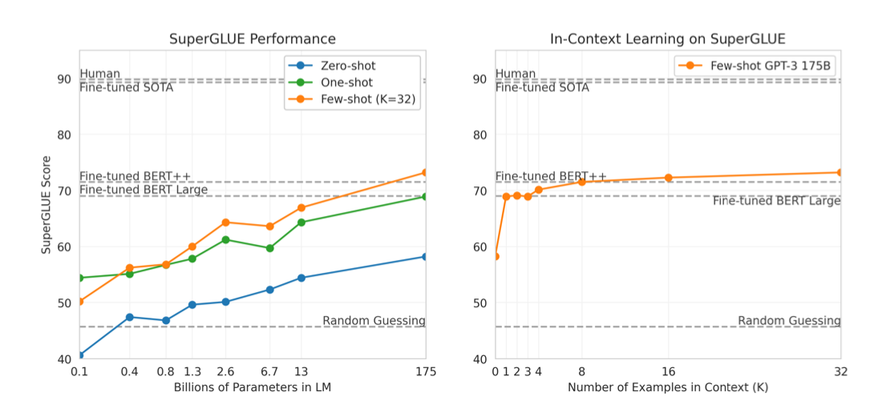

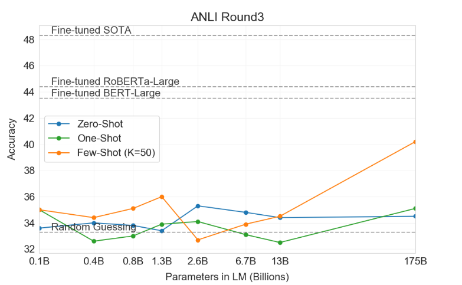

### 4. GPT 3.0 告诉了我们什么？

1. 通过 TriviaQA 与CoQA的结果，我们知道，扩大模型与数据量能够帮助 knowledge intensive tasks 和 reading comprehension
2. few-shot 存在一定可能性
3. language model 预训练任务能够学习到上下文内容

## Questions

## Reference

[1] GPT 1.0: Improving Language Understanding by Generative Pre-Training

[2] GPT 2.0: Language Models are Unsupervised Multitask Learners

[3] GPT 3.0: Language Models are Few-Shot Learners

