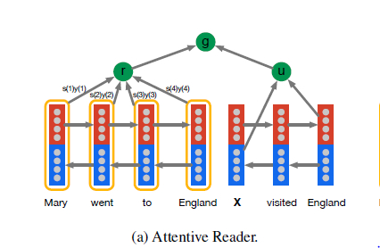
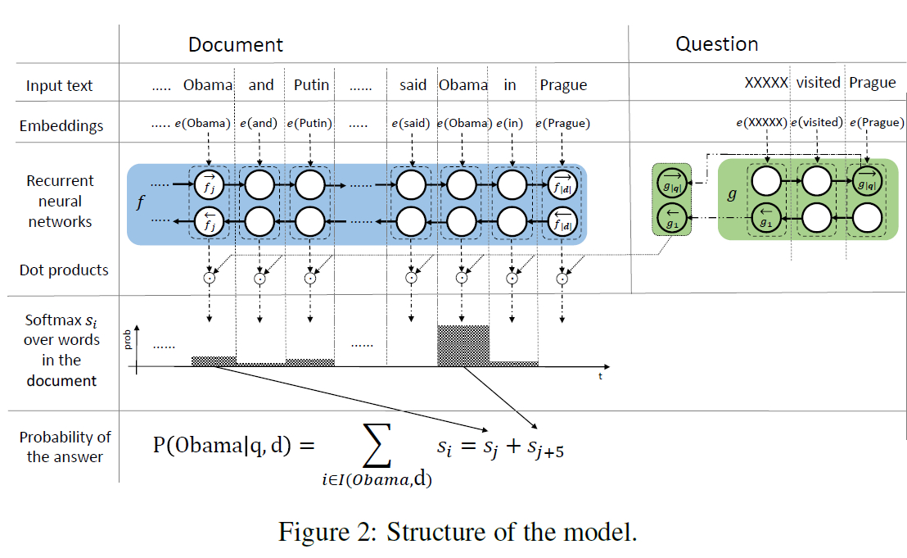
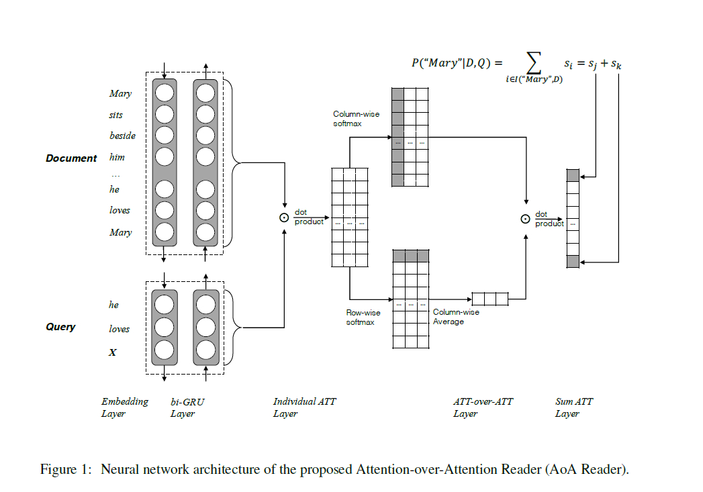
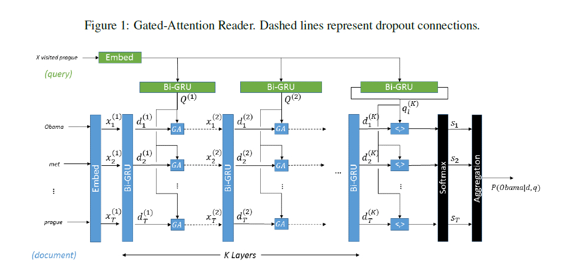

# 上游任务 - 阅读理解

---

[TOC]

## 1. Attentive Reader [1]

Attentive Reader 就有点常规模型的样子了。 

- 首先，采用**双向LSTM**分别对 passage 与 query 进行 Embedding 来获得上下文表示；

  其中，对于 passage  而言，其获得的是一个矩阵 y，矩阵的每一列是 passage 中词的上下文表示； 

  对于 query， 其将整个信息压缩为一个向量 u。 

- 其次是注意力机制的使用，这里的 Q 为 passage的表示 y， Key 为 query的表示 u， 这里的注意力机制计算公式为：
  $$
  相似度/相关度计算公式： m(t) = tanh(W_{ym} y(t) + W_{um} u)    \\
  注意力权重值计算： s(t) = \frac{e^{W^T_{ms} m(t)}}{\sum_{t=1}^{|p|} e^{W^T_{ms} m(t)}} \\
  最终表示： r = ys
  $$

- 最后是以 r， u 作为接下来模型 output layer 的输入来进行预测。

但可能会存在一个问题，如果 query 的长度也很长，那么压缩成一个向量，其信息的损失不得不考虑进去。

## 2. Standford Reader[2]

该模型是 **Attentive Reader** 延伸， 但在 Attention 的部分又有所不同。

- 首先，模型通过 **双向LSTM** 分别对 Passage 与 Query 进行Embedding， 对于 Passage， 我们获得一个词的上下文信息矩阵：$\tilde{p} \in R^h $； 而对于 Query， 我们获得一个句子级别的向量表示： $q \in R^h$。  

- 接下来，我们需要计算 Passage 中每个词与 Query的相关度， 然后获得最终输出到output layer 的输出表示：
  $$
  \alpha_i = softmax_i \, q^T W_s \tilde{p}_i ; \quad W_s \in R^{h \times h } \\
  o = \sum_i \alpha_i \tilde{p}_i
  $$

- 最后，我们将 $o$  输入到 output layer， 然后进行预测：
  $$
  a = argmax \, W^T_a o
  $$

很明显，该模型更加干净，简洁，且获得的效果是要比 **Attentive Reader** 好 8-10% 个点的。 我们来简单介绍一下二者的不同：

- 首先，在score部分计算相关度时， Attentive Reader 采用的是 tanh， 而该模型中采用的是MLP， 这样不仅仅效果更好，也更高效。 
- 其次， 在 output layer 部分，Attentive Reader 在最终预测之前，采用 tanh 将 $r$ 与 $u$ 结合起来； 而Standford Reader 仅仅采用 $o$ 作为最终预测的输入， 这种用法更加高效。
- 考虑到预测的结果是一个会出现在 Passage 中的实体，因此 Standford Reader 仅在出现的实体范围内进行预测。而 Attentive Reader 会在Passage， Question 中出现所有单词中进行预测。

## 3. Attention Sum Reader [3]

其实，该模型与上面的Standford Reader 很像，但加了一个小 trick。

- 首先，采用双向 GRU 分别对 Document 与 Question 进行 Embedding； 对于Document， 我们获得了一个上下文Embedding 矩阵 $f$ ；对于 Question， 我们获得了一个 sentence-level 句子向量$g$。

- 然后，计算 Document 中每个词与 Question 的相关度，这里采用点积的方式来做：
  $$
  s_i = softmax(f_i \cdot g)
  $$

- 最后，考虑到 Document 中同一个词可能会出现多次，因此这里将相同词的注意力权重相加得到该词最终的注意力权重。
  $$
  Attention \, weight(word) = \sum_{i \in I(w,d)} s_i \\
  I(w,d) \, 是 \, word \, 出现在 \, document \, 中位置的集合
  $$

- 最后，我们从实体选项中选择 Attention weight 最高的作为答案。

 但是，分析一下那个Attention Sum 操作， 其源于作者观察到答案更多偏爱出现次数较多的词，这说明，该 trick 是任务偏好的，并没有很广泛的应用价值， trick 有取巧的嫌疑。

## 4. Attention-over-Attention [4]

Attention-over-Attention 这篇文章质量很高，在后续的很多模型中都有使用，创新度也很高，**值得精读。**

- 首先， 依旧是使用**双向RNN（LSTM or GRU)** 来获得 Document 与 Query 的上下文表示矩阵： $h_{doc} \in R^{|D| * 2d}; \quad h_{query} \in R^{|Q| * 2d}$。 

- 然后，我们计算 **Pair-wise Matching Score**，其实就是计算 Document 中**第 i 个词** 与 Query 中的**第 j 个词**的相似度或相关度：
  $$
  M(i, j) = h_{doc}(i)^T \cdot h_{query}(j) 
  $$

- 再然后，进行 **Individual Attentions**， 其实就是对**矩阵 M 的每一列**做 softmax， 其中，M的一列代表的是**对于 Query 中的某个词与所有 Document 中词的相关度**， 那么对每一列进行 softmax 的意思就是对于给定的一个 Query 词， 对 Document 中的每个词进行 Attention，这里称之为 **query-to-document  attention**， 公式如下：
  $$
  \alpha(t) = softmax(M(1,t), \cdots, M(|D|, t)); \quad a(t) \in R^{|D|}  \\
  \alpha = [\alpha(1), \alpha(2), \cdots, \alpha(|Q|) ]；\quad \alpha \in R^{|Q|\times |D|}
  $$

- 然后，进行 **Attention-over-Attention**， 其实就是对**矩阵M的每一行做 softmax**， 而 **M 的一行表示的是对于 Document 中的某个词与所有 Query 中词的相关度**，那么对每一行进行softmax 的意思就是对于给定的一个Document 词，对Query 中的每个词进行Attention， 这里称为 **document-to-query attention**， 公式如下：
  $$
  \beta(t) = softmax(M(t,1), ... M(t, |Q|)); \quad \beta(t) \in R^{|Q|}
  $$
  然后， 对 $\beta(t)$ 求和平均来得到 query-level attention $\beta$， 从直观上而言，这里是获得对于整个document，每个query的Attention value:
  $$
  \beta = \frac{1}{n} \sum_{t=1}^{|D|} \beta(t); \quad \beta \in R^{|Q|}
  $$
  最后，我们将 $\alpha$ 与 $\beta$ 做点乘得到 **attention document-level attention**:
  $$
  s = \alpha^T \cdot \beta \quad ; \quad s \in R^{|D|}
  $$

- 最终，Final Predictions 将相同词的score 合并，得到每个词的score， 其实就是Attention-Sum里面提出的创新部分：
  $$
  P(w | D, Q) = \sum_{i \in I(w,D)} s_i, \quad w \in V
  $$

本模型可以说是花式Attention的一个典型代表了，其不仅仅考虑了query到document的attention，而且考虑了document 到 query 的attention，于是称为 attention over attention。 虽然无法解释其内部的玄学，但的确该机制在很多后续的模型中都有应用，效果也不错。

## 5. Gated-Attention Reader [5]

- 首先，采用双向RNN（GRU） 来获得 Document 与query的上下文表示矩阵，表示如下：
  $$
  Document : X^{(0)} = [x_1^{(0)}, x_2^{(0)}, \cdots ,  x_{|D|}^{(0)}] \\
  Query: Y = [y_1, y_2, \cdots , y_{|Q|}] \\
  Document: D^{(1)} =  \overleftrightarrow{GRU}_D^{(1)}(X^{(0)}) \\
  Query: Q^{(k)} =  \overleftrightarrow{GRU}_Q^{(k)}(Y)
  $$
  原论文中的图好像画错了，$D^{(k)}$ 前不应该是 $X^{(k-1)}$ 吗？不过倒是不影响理解。

- 然后，在接下来计算中，我们要不断的迭代 D 与 X：
  $$
  D^{(k)} =  \overleftrightarrow{GRU}_D^{(k)}(X^{(k-1)}) \\
  X^{(k)} = GA(D^{(k)}, Q^{(k)})
  $$
  其中， GA Attention 的计算公式如下：
  $$
  \alpha_i = softmax(Q^T d_i) \\
  \tilde{q_i} = Q \alpha_i \\
  x_i = d_i \odot \tilde{q_i} \quad or \quad  x_i = d_i + \tilde{q}_i \quad or \quad  x_i = d_i || \tilde{q}_i \\
  $$
  从直观上看，其实还是不断的融入 query 信息来获得在 document 中与 query 最相关的实体词 。与上述几个模型来比较，该模型是多层的，更能够把握这种相关语义。

  这个过程，我们迭代了K次，最终得到了 $D^{(k)}$ 。 

- 在Answer Prediction 阶段，先找到空白处位置的词的表示， 然后与 $D^{(k)}$ 做内积，再进行softmax：
  $$
  q_l^{(K)} = q_l^f || q_{T-L+1}^b \quad ?? \quad  这个不太懂\\
  s = softmax((q_l^{(K)})^T D^{(K)})
  $$

- 最后，再将相同词的概率合并：
  $$
  Pr(c | d,q ) = \sum_{i \in I(c,d)} s_i
  $$

## 6. BiDAF [6]

- 首先，采用char-level 与 word-level 信息，通过 Highway Networks 融合信息来分别获得 Context 与 Query 的矩阵表示：
  $$
  X \in R^{d \times T} ; \text{T 为 context 中的单词数}\\
  Q \in R^{d \times J} ; \text{J 为 Query 中的单词数}
  $$

- 然后，通过双向 LSTM 来获得每个词的上下文表示：
  $$
  H \in R^{2d × T} ; \text{Context 的上下文表示}\\
  U \in R^{2d × J} ；\text{Query 的上下文表示}
  $$

### 核心点： 双向注意力机制

双向注意力机制包括 Context-to-Query 与 Query-to-Context 两大部分：

- 首先，我们先计算 H 与 U 的相似矩阵：$S\in R^{T × J}$， 对于context 中的第 $t$ 个单词与 query 中的第 $j$ 个单词，有：
  $$
  S_{tj} = \alpha({H_{:t}, U_{:j}}) = \alpha(h,u) = W_{(S)}^T[h;u;h \circ u] \\
  H_{:t}：\text{context 的第 t 列} \\
  U_{:j}：\text{Query 的第 j 列}
  $$

- **Context-to-query Attention（C2Q）：**其含义是对于 Context 中的第 $t$ 个单词， 我们计算 Query 中的每个单词与该词的相关度，然后进行加权求和将 Query 的信息融合入 Context。 

  我们用 $a_t \in R^J$ 来表示对于单词 $t$ 的这种相关度：
  $$
  a_t = softmax(S_{t:}) \in R^J ; \quad S_{t:}: \text{S 的第t行}\\
  $$
  然后我们通过这些相关度信息来将计算 Context 中每个词的新表示：
  $$
  \hat{U}_{:t} = \sum_j a_{tj}U_{:j} \in R^{2d \times T} \\
  \hat{U}_{:t}: \hat{U} 的第 t 列 \\
  U_{:j}: U 的第j列
  $$

- **Query-to-context Attention（Q2C）**：其本质是计算对于 Query 中的词， Context 中的每个词与它的相关度， 然后通过加权求和将 Context 的信息融入到 Query 中。 而此段中的计算与上述有所不同：
  $$
  b = softmax(max_{col}(S)) \in R^T; \quad
  $$
  上式的含义是先取 S 中每一列的最大值形成一个新的向量 ， 然后对这个新的向量求相关度， 其实意思对于 Query 的整体信息， Context 中每个词对其的相似度分配， 然后我们计算对于Query来说，Context 中的word信息：
  $$
  \hat{h} = \sum_t b_t H_{:t} \in R^{2d}
  $$

  然后 $\hat{h}$ 重复 T 次形成 T 列， 形成 $\hat{H} \in R^{2d \times T}$， 其实就是类似 Q2C 矩阵。 这里有一点疑问的是，为何不像上文一样计算， 是考虑到计算复杂度吗？

- 此时，我们将这些信息综合， 其实就我看来就是将 Query 的信息融入到 Context 中，如下：
  $$
  G_{:t} = \beta(H_{:t}, \hat{U}_{:t}, \hat{H}_{:t}) \in R^{d_G}
  $$
  其中， $\beta$ 可以选择多种方式，如多层感知机或者仅仅简单的将各个向量连接。 

## 7. DCN [7]

- 同样先通过 LSTM 来分别获得 Context 与 Query 的表示：
  $$
  D = LSTM(Context) \in R^{|D| \times dim}\\
  Q' = LSTM(Query);  \in R^{|Q| \times dim}\\ 
  Q = tanh(Q^{(Q)}Q' + b^{(Q)}) \in R^{|Q| \times dim} ; 可忽略
  $$

### 核心： CoAttention Encoder

$$
L = D^TQ \in R^{|D| \times |Q|}\\
A^Q = softmax(L) \in R^{|D| \times |Q|}; \quad C^Q = DA^Q \in R^{dim \times |Q|} \ ..Q2Doc \\
A^D = softmax(L^T) \in R^{|Q| \times |D|}; \quad C^D = [Q; C^Q]A^D \in R^{2dim \times |D|} \ ..Doc2Q\\
U = LSTM([D; C^D])
$$

## 8. QANet [8]

- 首先，采用char-level 与 word-level 信息，通过 Highway Networks 融合信息来分别获得 Context 与 Query 的矩阵表示：
  $$
  X \in R^{d \times T} ; \text{T 为 context 中的单词数}\\
  Q \in R^{d \times J} ; \text{J 为 Query 中的单词数}
  $$

### 核心点： 多维信息融合

与 BIDAF 中不同， 其在信息的表示层面做了一个很精巧的融合，采用多个如下图的 Encoder Block 来获得文本的表示：

整个 Encoder Block 的结构是： 卷积层 + Self-Attention 层 + Feed-forward 层。 作者认为，卷积能够捕获文本的局部结构，而 Self-Attention 能够学习到全局的相互特征， 且最大的优点在于二者皆可并行。

最终得到 Context 与 query 的矩阵表示：$C$ 与 $Q$。 

### Context-Query Attention Layer

$$
S = f(C,Q) \in R^{n \times m} \\
S_列 = softmax(S) \in R^{n \times m} \\
\text{context-to-query attention:} \qquad A = \overline{S} \cdot Q^T \in R^{n \times d} \\
S_行 = softmax(S) \in R^{n \times m} \\
\text{query-to-context attention:} \qquad B = S_列 \cdot S_行^T \cdot C^T \\

U = [C, A, C \odot A, C \odot B]
$$

## Reference

[1]  Teaching Machines to Read and Comprehend

[2]  A thorough examination of the cnn/dailymail reading comprehension task.

[3]  Text understanding with the attention sum reader network

[4]  Attention-over-Attention Neural Networks for Reading Comprehension

[5]  Gated-attention readers for text comprehension

[6] BI-DIRECTIONAL ATTENTION FLOWFOR MACHINE COMPREHENSION

[7] Dynamic coattention networks for question answering

[8] QANET: COMBINING LOCAL CONVOLUTION WITH GLOBAL SELF-ATTENTION FOR READING COMPREHENSION

