# 1. 前言

LangChain是一个用来构建LLM应用的开源框架，主要是为基于大语言模型的应用提供一系列的构建工具包。这个短课程的主要内容有：

- 模型、提示和解析器：调用LLM，提供提示并解析响应。
- LLM的记忆：用于存储对话和管理有限上下文空间的记忆。
- 链式操作：创建操作序列。
- 文档问答：将LLM应用于您的专有数据和用例需求。
- 代理：探索将LLM作为**推理代理**的新兴发展趋势。

原课程地址：https://www.deeplearning.ai/short-courses/langchain-for-llm-application-development/

B站转载：https://www.bilibili.com/video/BV1zu4y1Z7mc?p=1&vd_source=c2a322357481107ab7f418b1ae9ce618

建议使用Cousera，限时免费，还可以免费使用它们提供的jupyter notebook进行操作。

 

[回到顶部](https://www.cnblogs.com/harrymore/p/17547479.html#_labelTop)

# 2. 课程笔记

## 2.1. 模型、提示和解析器

https://www.bilibili.com/video/BV1zu4y1Z7mc?p=2&vd_source=c2a322357481107ab7f418b1ae9ce618

这节课的要点有两个：

a. 使用Langchain的模板功能，将需要改动的部分抽象成变量，在具体的情况下替换成需要的内，达到一次定义，多次使用的效果。

书中提到的一个例子是，使用模板，去转化表达的风格。这种方式比fstring要更灵活，特别是模板很长的时候。

[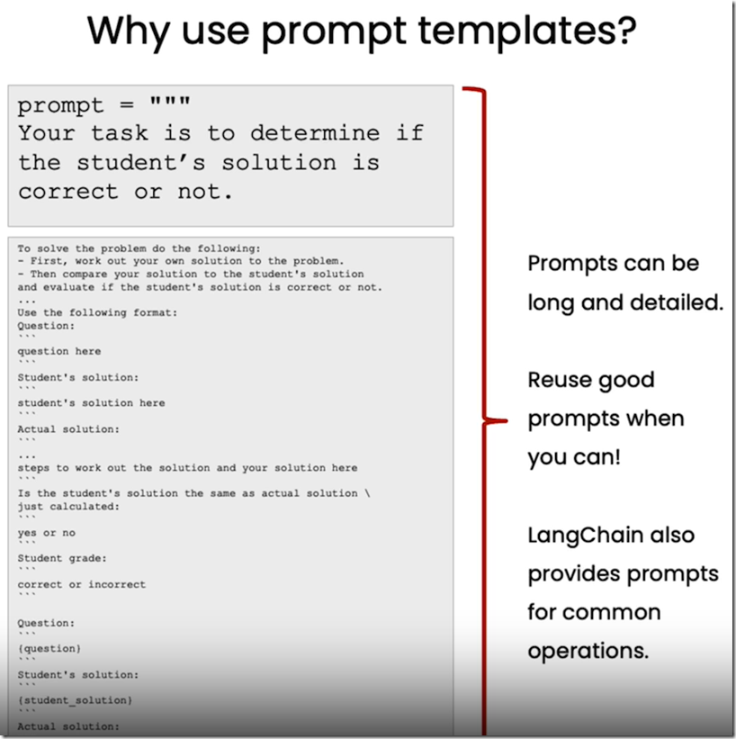](https://img2023.cnblogs.com/blog/741682/202307/741682-20230712153829685-1825121303.png)

b. 使用一个解析器，将LLM的输出解析成你需要的格式，如字典。

[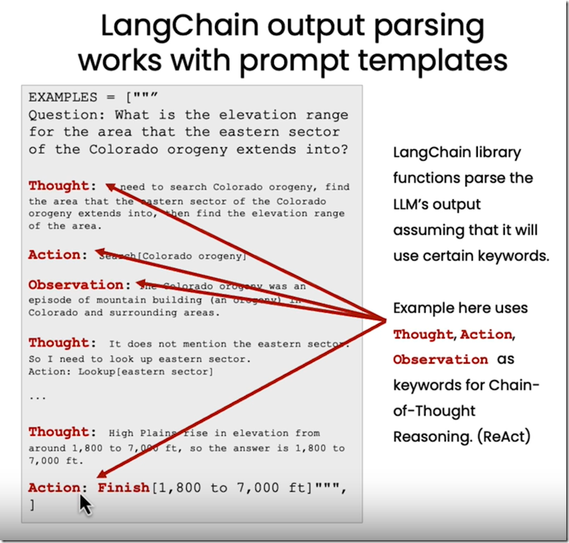](https://img2023.cnblogs.com/blog/741682/202307/741682-20230712153831032-2061963900.png)

 

## 2.2. LLM记忆，上下文管理

这节课主要如何使用不同的内存类来管理与LLM的对话上下文。

[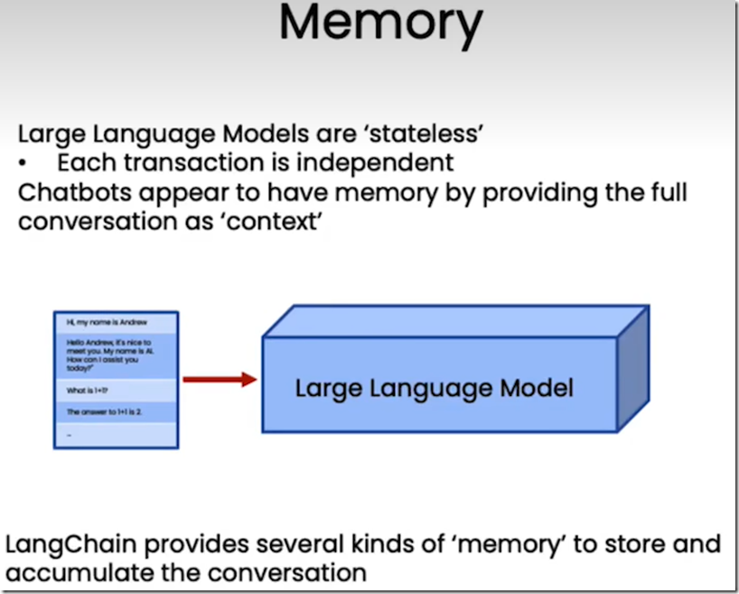](https://img2023.cnblogs.com/blog/741682/202307/741682-20230712153832277-865653467.png)

- ConversationBufferMemory：保存所有上下文。
- ConversationBufferWindowMemory：以对话轮数为单位，设置最大轮数限制。
- ConversationTokenBufferMemory：以token的个数为单位，设置最大个数限制。
- ConversationSummaryBufferMemory：可以设置对话token最大个数，但使用llm来总结之前的对话内容。

## 2.3. 链式操作

链式操作有点像工作流，基本单元是Chain，通过与LLM和提示词结合，可以构建出各种结构的链式操作，对文本及数据执行一系列操作。

a. 基础链

LLMChain，结合提示词，组成一个基本的单位，对输入进行相应，输出结果，是构建复合链的基本单位。

b. 顺序链

将基础链按照顺序前后组合起来，上一个基础链的输出是下一个基础链的输入，又包括以下两种细类：

SimpleSequentialChain：单输入/输出。

[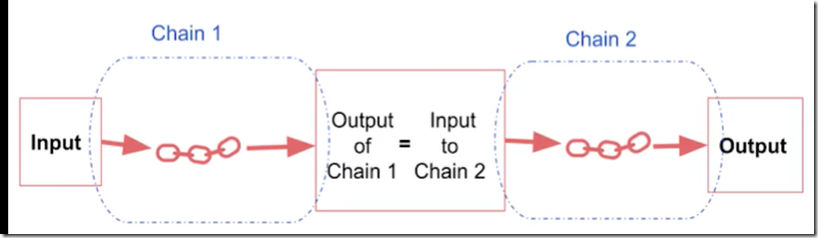](https://img2023.cnblogs.com/blog/741682/202307/741682-20230712153833418-1326649165.png)

SequentialChain：多输入/输出，通过输入/输出键进行指定。

[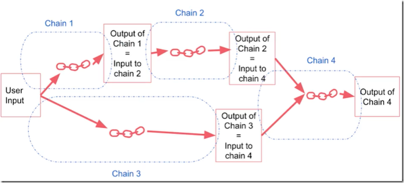](https://img2023.cnblogs.com/blog/741682/202307/741682-20230712153834522-1383277351.png)

c. 路由链

LLMRouterChain，根据输入的内容，将其路由到不同的链中。

[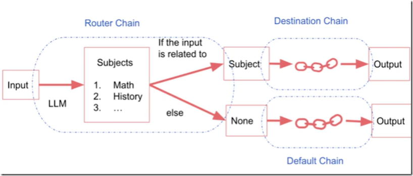](https://img2023.cnblogs.com/blog/741682/202307/741682-20230712153835737-1419714661.png)

## 2.4. 文档问答

给定文档，让LLM根据文档的内容回答问题。

由于LLM一般一次只能处理几千个词，因此基于文档的问答需要使用embedding和向量存储技术。

### 2.4.1. stuff 方法

a. embeddings

所谓embedding（词嵌入）就是将一段文本，转化成一个能够表征文本语义的向量，语义上相近的文本他们的向量也相似。

[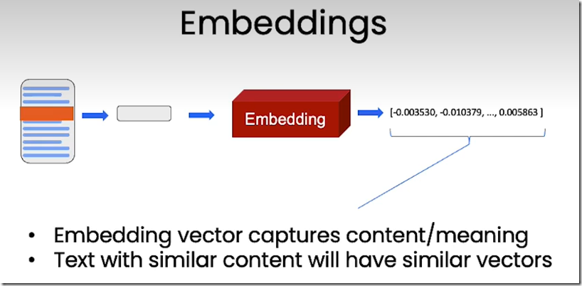](https://img2023.cnblogs.com/blog/741682/202307/741682-20230712153836903-1282529836.png)

b. 向量存储

一般将文本分解成一个个块（chunks），然后将每个块转为embedding，最后将这些embedding存入向量数据库中，相当于建立了索引。

[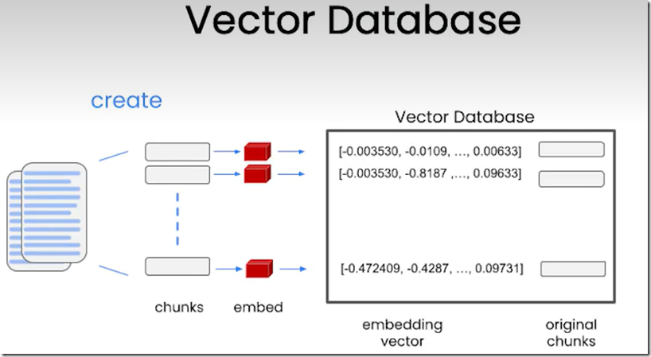](https://img2023.cnblogs.com/blog/741682/202307/741682-20230712231538851-124203842.png)

c. 查询过程

首先将查询文本转为embedding，然后在向量数据库中寻找并返回与这个查询最相似的n个查询。

[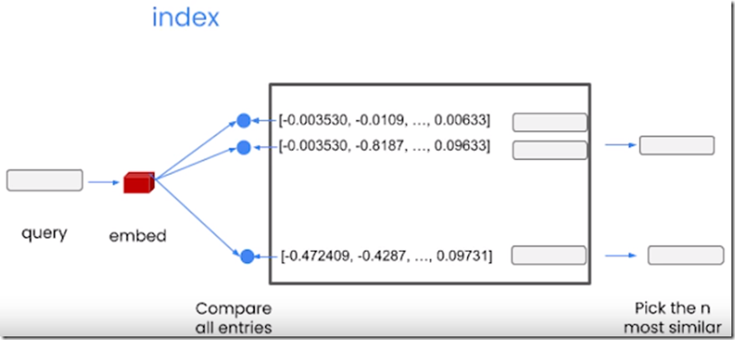](https://img2023.cnblogs.com/blog/741682/202307/741682-20230712231539957-2050226825.png)

d. LLM处理

最后将这n个结果输入LLM进行处理，获得最后的答案。

[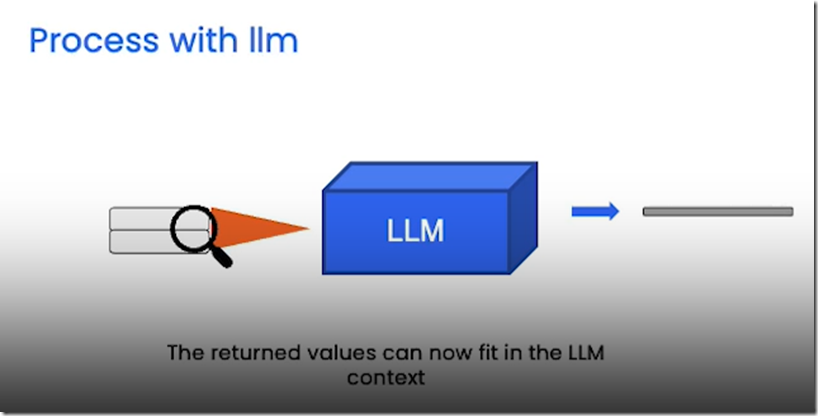](https://img2023.cnblogs.com/blog/741682/202307/741682-20230712231540978-2058597488.png)

这就是文档问答最简单的办法，将所有文档都放入上下文中，并对语音模型进行一次调用，这种方法叫stuff method。

[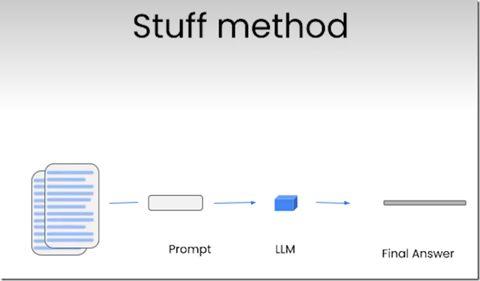](https://img2023.cnblogs.com/blog/741682/202307/741682-20230712231542007-861960638.png)

前面都是针对相同类型的片段进行回答的方法，但是针对不同类型的片段进行相同类型的问题和回答，则需要用到下面的几种方法。

### 2.4.2. 其他方法

**Map_reduce方法：**将每个片段和问题一起传递给LLM，得到各自的回答，然后使用另外一个LLM将所有单独的回答汇总成最后的答案。可以看到每个文档都是独立的，有利于并行执行，缺点是文档与文档之间也没有交互。

[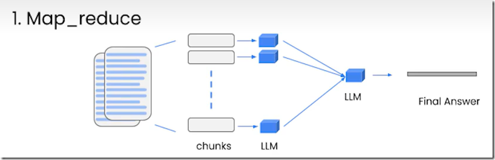](https://img2023.cnblogs.com/blog/741682/202307/741682-20230712231543047-1598361053.png)

**Refine方法：**当前的回答依赖于上一个文档的回答，对于合并信息和逐步构建答案非常有用，最后的答案长度趋于更长，缺点是并行度差，需要更长的处理时间。

[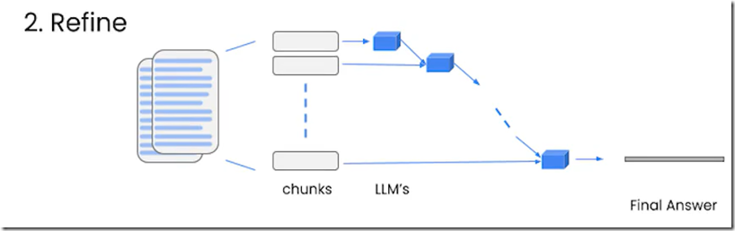](https://img2023.cnblogs.com/blog/741682/202307/741682-20230712231544269-1443859051.png)

**Map_rank方法：**一种实验性的方法，为每个文档执行一次LLM调用，并返回回答与评分，选择分数最高的那个回答。这个方法，依赖于语言模型需要知道如何评分以及你关于评分的指导说明。这个方法并行度和MapReduce方法一样。

[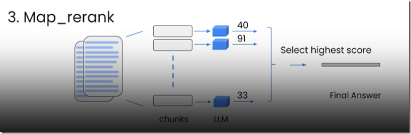](https://img2023.cnblogs.com/blog/741682/202307/741682-20230712231545222-1703107963.png)

## 2.5. LLM应用评估

这节主要深入介绍一些框架，以及帮助进行评估的工具，亮点是使用LLM和链式操作来评估其他LLM、链式操作或者应用程序。

一种做法是，查看数据，提出示例问题，并提供正确答案以便评估，这个过程可以使用QAGenerateChain类来实现自动化。

另外，可以使用QAEvalChain类，来自动评估LLM对问题的回答是否是正确的，这个很重要，因为很多时候，可能正确答案跟回答的意思是一样的，但是表述却区别很大，无法单纯使用字符串匹配或者正则来比较。

为了调试中间过程，可以将langchain.debug = True，这样中间的提示，QA的检索过程，输入输出，token的使用情况等信息都可以打印出来。

另外本节还简单介绍了一下LangChain评估平台，可以将上述过程持久化并在用户界面中展示出来，另外还可以查看中间的调试信息，并且可以将生成的问答整理成新的数据集。

## 2.6. 代理

代理的目的，是将LLM视为一个推理引擎，你可以提供文本块或者其他信息源给它，然后这个LLM可以利用互联网上学到的背景知识，帮助回答问题和推理内容。

本节主要内容包括如何创建和使用代理，如何为其配备内在LangChain中的搜索引擎等不同类型的工具，让代理可以与任何数据存储，任何API和函数进行交互。

### 2.6.1. 预定义工具

- llm-math：实际是个Chain，使用语言模型和计算器来解决数学问题。
- wikipedia：维基百科工具，连接到维基百科的API，允许对维基百科进行搜索查询并返回结果。
- PythonREPLTool：python执行环境，根据输入提示，使用python进行推理，并对推理结果进行相应处理，如打印出来。

初始化代理后，代理能够自动根据问题的类型，选择合适的工具进行推理，开了verbose标志后，可以看到代理每一步的推理过程。

[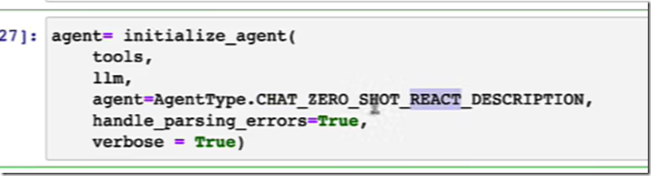](https://img2023.cnblogs.com/blog/741682/202307/741682-20230712231546845-1327358694.png)

[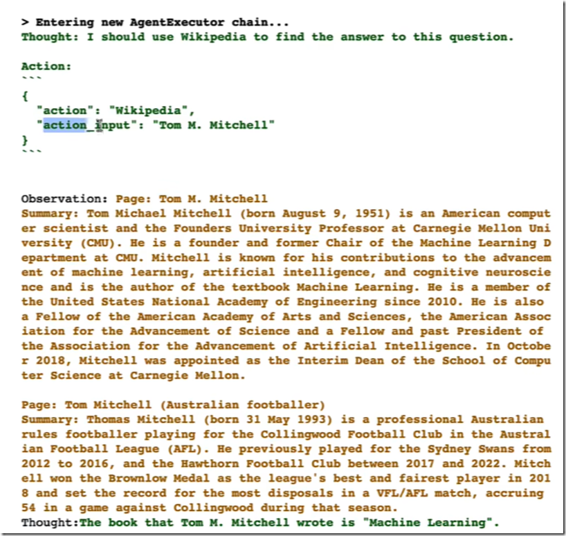](https://img2023.cnblogs.com/blog/741682/202307/741682-20230712231548515-1822793195.png)

### 2.6.2. 自定义工具

另外，还可以将代理连接到自己的信息源、API和数据，需要自定义自己的工具，操作步骤：

在自己的工具函数前加上LangChain库中的@tool装饰器，然后写一个非常详细的文档，用来让代理了解一些约束及如何调用该工具。

[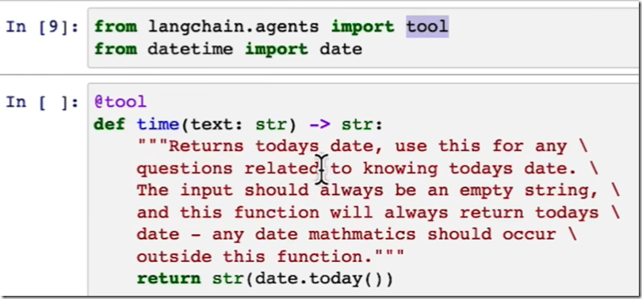](https://img2023.cnblogs.com/blog/741682/202307/741682-20230712231550386-1820113229.png)