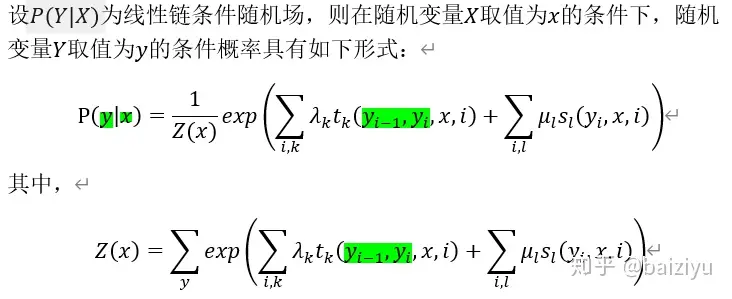
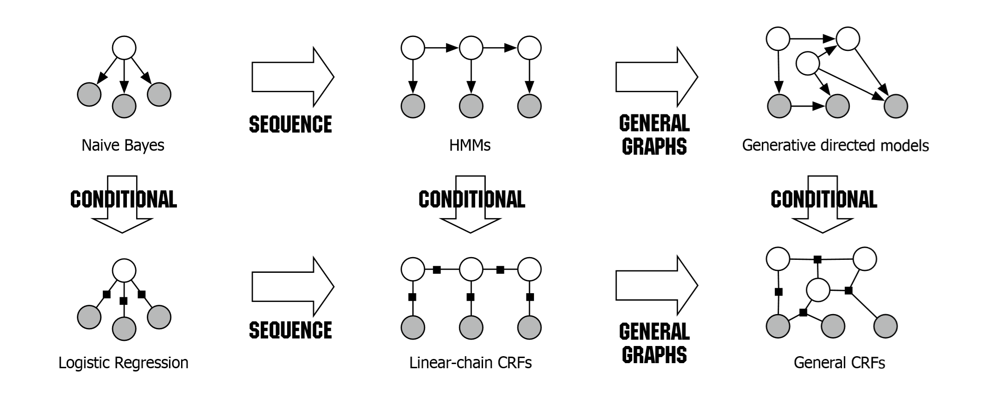

# 条件随机场 CRF




其中 Z(x) 是归一化因子， K 是特征函数的数量， λk 是与特征函数 fk 相关联的权重， fk 是定义在输入序列 *x* 和输出序列的某个特定位置 *i* 上的函数。


```python
log_likelihood, transition_matrix = tf.contrib.crf.crf_log_likelihood(logits_seq, self.outputs_seq, inputs_seq_len) # B * (S+2) * V, B * (S+2), B

		#  B * (S+2), 
preds_seq, crf_scores = tf.contrib.crf.crf_decode(logits_seq, transition_matrix, inputs_seq_len) 
				
```


  	

[](https://watermelon-1253263790.cos.ap-shanghai.myqcloud.com/ex_14_5.png)