# 谷歌无限长度注意力机制 Infini-attention

## 一、导读

随着大模型的发展，agent应用以及长上下文解读能力的重要性凸显出来，大模型也从最初的4k-->8k-->32k-->128k-->200k，各家厂商都有自己的一套解决方案，其中kimi的长度比较出众，当然这种闭源大模型我们没办法知道到底用了什么技术，大部分开源方案是Flash Attention、Multi-Query Attention、Group-Query Attention用降低显存的方式来提高输入长度，还有在位置编码上处理的[动态NTK 插值法](https://link.zhihu.com/?target=https%3A//blog.csdn.net/qq_40427481/article/details/133705685)对位置编码进行扩展，比较出名的位置编码主要是ROPE和Alibi 也都可以结合动态NTK来扩展，做到长上下文。

随着输入长度的显存巨幅增加和位置编码长距离衰减问题，也出过不少解决办法，我们往下面看看谷歌是如何处理无限长度的上下文呢？

## 二、Infini-attention

之前也有工作说能够实现无限长度输入的文章**StreamingLLM**，但是StreamingLLM是一种伪无限长度的方式，其实还是局部窗口注意力机制，只不过发现和解决了**Attention Sink**问题，因为softmax所有注意力分数和都是为1，导致注意力分数是前面几个字符很高后面的注意力分数低，在窗口注意力的时候融入初始特殊标识符缓解这种问题。但是这还是窗口注意力机制，丢失了前面的信息，只关注了局部的信息。所以这个方法只是能够无限输入，但是对全部内容解读是不太行的，这也是这个方法没有得到推广的原因。

之前我也写了关于**StreamingLLM**的文章：

[归来仍是少年：streaming-llm(无需微调无限扩展大模型输入)论文笔记22 赞同 · 5 评论文章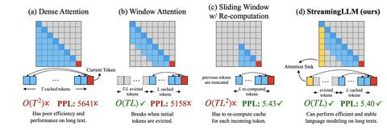](https://zhuanlan.zhihu.com/p/661059116)

Infini-attention 包含将压缩记忆融入普通注意力机制并构建在屏蔽局部注意力和长期线性注意力机制中在单个 Transformer 块中。

压缩记忆系统有望成为比注意力更具可扩展性和效极长序列的机制。 反而使用随输入序列长度而增长的数组，主要是压缩存储器维护固定数量的参数来存储并通过有限存储调用信息和计算成本。 在压缩记忆中，新的信息被添加到记忆中通过改变其参数来达到目标该信息可以后面检索到。 然而，LLM目前的状态尚未找到一种有效、实用的压缩存储技术，可以平衡简单性和质量。

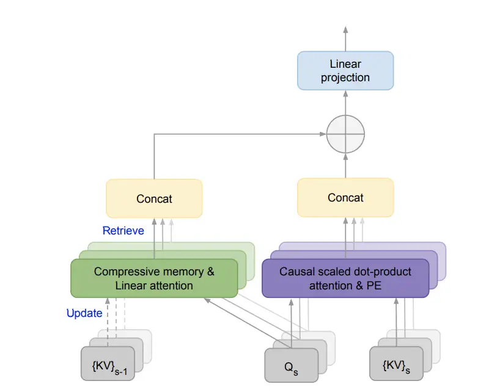

Infini-attention

从上面这张图我们可以很清晰的了解，这个Infini-attention是怎么样实现无限长度的上下文，而不导致信息丢失很严重。

当我们当前字符的Q矩阵信息除了和窗口的KV矩阵信息计算attention分数，而且还会去保存下来的前一状态的KV矩阵信息算注意力分数，然后得到当前Token在之前状态的**注意力分数**以及现在状态的**注意力分数**，前一状态的分数代表之前与当前Token信息，前一状态这个KV方式很像我们目前用来加速的方式**KV Cache**，当我们计算完当前窗口信息之后，更新历史KV矩阵信息。不得不说谷歌这个想法是真的很妙，弥补了局部窗口注意力丢失前文信息的缺点。

谷歌这篇文章主要工作点：

1.引入一种实用且强大的注意力机制——**Infini-attention**

具有长期压缩记忆和局部因果注意力，可以有效地建模长期和短期上下文依赖关系。

2. **Infini-attention** 对标准缩放点积注意力进行了最小的改变，并支持即插即用的持续预训练和长上下文适应

通过设计。

3. 使 Transformer LLM 能够扩展到无限长的上下文通过流式方式处理极长的输入来减少对内存和计算资源的消耗。

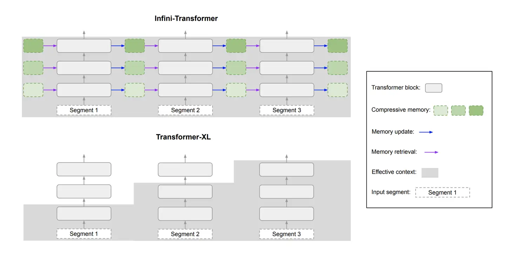

Infini-Transformers和Transformer-XL对比

Infini-Transformer和Transformer-XL有类似的地方，Infini-Transformer 对一系列片段进行操作。 计算每个分段内的标准因果点积注意力上下文。 所以点积注意力计算在某种意义上是局部的，它涵盖了总共 N 个当前段的标记，索引为 S（N 是段长度）。

然而，局部注意力丢弃了先前的注意力状态处理下一个片段时。 在 Infini-Transformers 中，而不是忽略旧的 KV 注意力状态，而是重用它们来维护整个上下文历史具有压缩记忆。 因此 Infini-Transformers 的每个注意力层都具有全局的压缩和局部细粒度状态。

Infini-Transformer具有完整的上下文历史记录，而 Transformer-XL丢弃旧上下文，因为它仅缓存最后一段的 KV 状态。

## 三、缩放注意力

普通 MHA 中的单个头计算其注意力上下文 Adot ∈ IRN×dvalue，输入段 X ∈ IRN×dmodel 的序列如下。

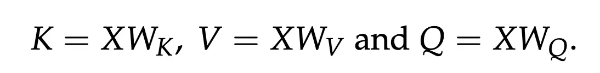

这里，WK ∈ IRdmodel×dkey，WV ∈ IRdmodel×dvalue 和 WQ ∈ IRdmodel×dkey 是可训练投影矩阵。 然后，注意力上下文被计算为所有其他值的加权平均值作为

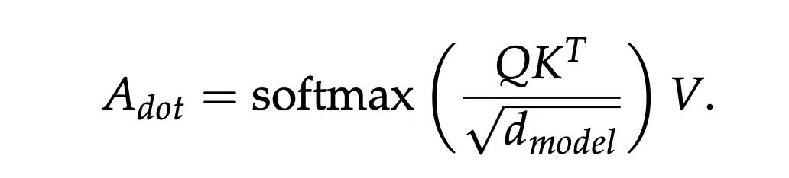

这篇文章没有解释d(model)是什么，我个人推测，d model 有可能是H个头做平均，之前是除根号dk，为了归一化到均值为零方差为一，但是没有考虑到头的数量，这里用头的数量来平均，降低整个attention分数，尤其是现在大模型的attention 头都是非常多的。

## 四、压缩历史信息

计算效率，在这项工作中，我们用关联参数化内存矩阵（Schlag 等人，2020）。 这种方法进一步允许投射内存更新和检索过程作为线性注意机制（Shen et al., 2018）并利用来自相关方法的稳定训练技术。 特别地，采用更新规则Katharopoulos 等人的检索机制。 主要是因为它的简单性和有竞争力的表现。

### **Memory retrieval**

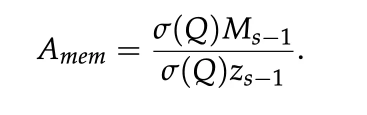

σ 和 zs−1 ∈ IRdkey 是非线性激活函数和归一化项，分别。 由于非线性和范数方法的选择对于训练至关重要

稳定性。记录所有键的总和作为归一化项 zs−1 并使用 ELU 作为激活函数。

### **Memory update**

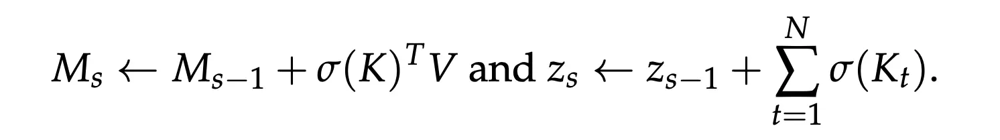

这就是历史KV矩阵的更新方法，不得不说很像KV Cache

### **Long-term context injection**

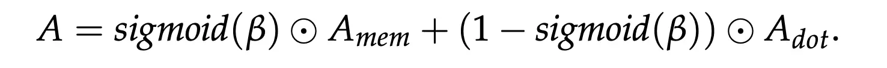

通过一个sigmoid函数来进行权重的注意力分数融合，类似于门控方式β作为一个可学习参数，自己调节权重。

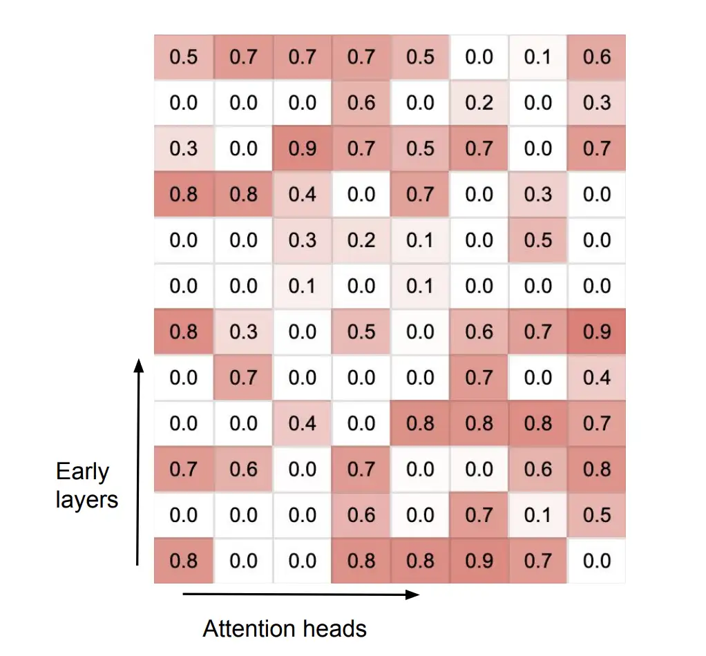

从上面权重分数可以看出来，门控网络起了比较大的作用，有些头是没有负责历史信息的融合，有些的头则是历史信息权重很大，能够让模型自己在数据中学习到是否需要调用历史信息效果更佳。

## 五、效果对比

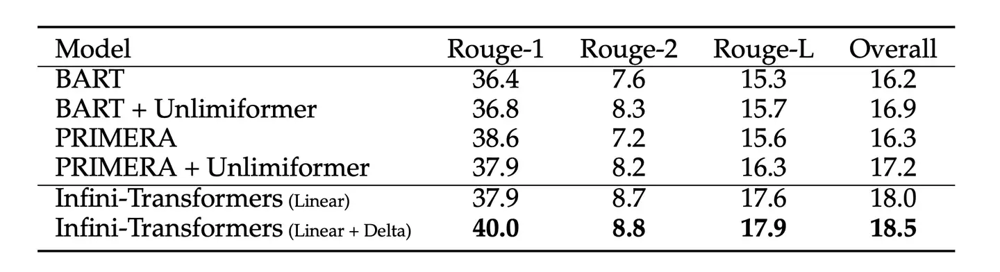

500k输入长度效果对比，Rouge效果领先，当然这个也不能一定说Infini-Transformer效果好，rouge计算毕竟很呆板，但是可以作为一个参考。

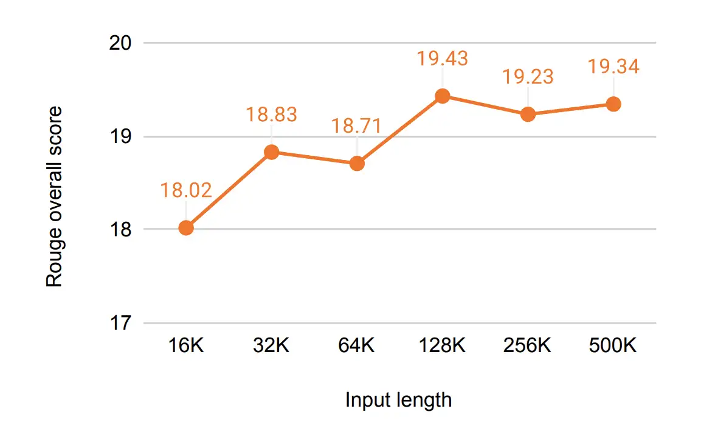

随着长度的增加，Infini-Transformer的rouge不衰退，反而有些增长，所以此方法还是能够work的，不过我好奇为啥不测试下PPL呢，可能真实效果还得经过大量数据和实验检验了。

| Comments: | 9 pages, 4 figures, 4 tables                                 |
| --------- | ------------------------------------------------------------ |
| Subjects: | **Computation and Language (cs.CL)**; Artificial Intelligence (cs.AI); Machine Learning (cs.LG); Neural and Evolutionary Computing (cs.NE) |
| Cite as:  | **[arXiv:2404.07143](https://arxiv.org/abs/2404.07143) [cs.CL]** |
|           | (or **[arXiv:2404.07143v1](https://arxiv.org/abs/2404.07143v1) [cs.CL]** for this version) |
|           | https://doi.org/10.48550/arXiv.2404.07143Focus to learn more |