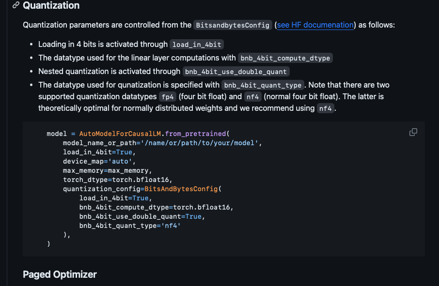

# QLora

https://huggingface.co/blog/4bit-transformers-bitsandbytes

您的理解是正确的。QLoRA结合了LoRA微调技术和量化策略，以实现在保持模型性能的同时大幅减少模型的内存占用：

- **线性层和激活函数输出**：由于这些部分的数据通常接近正态分布，因此使用NF4类型进行量化，即使使用低位宽，也能在很大程度上保持模型性能【43†source】【44†source】。

- **LoRA微调的权重**：与下游任务密切相关的权重模块，采用全精度（32位浮点数）存储，以保证微调任务的性能【43†source】【44†source】。

- **词嵌入和归一化层**：这些部分通常保留为16位浮点数存储，以保持较高的精度【43†source】【44†source】。

- **计算时的统一精度**：在计算过程中，所有层的计算通常需要统一到16位或32位进行，这可能涉及到对NF4量化的权重进行反量化【43†source】【44†source】。

因此，QLoRA通过结合LoRA和量化策略，实现了在单个GPU上微调大型模型的能力，同时保持了与全精度微调相当的性能【43†source】【44†source】。

更多关于QLoRA的详细信息，您可以参考[QLoRA的GitHub仓库](https://github.com/artidoro/qlora)和[arXiv上的QLoRA论文](https://arxiv.org/abs/2305.14314)。

二次量化的确是针对第一次量化中出现的缩放因子。在量化神经网络的权重时，通常会使用缩放因子（scaling factor）来将权重从浮点数映射到整数。这些缩放因子本身是浮点数，通常以32位存储。在QLoRA中，为了进一步节省内存，会对这些缩放因子进行第二次量化，将它们量化为8位整数。这种二次量化的过程称为双重量化（Double Quantization）。

更多关于双重量化和QLoRA的信息，您可以参考[QLoRA的GitHub仓库](https://github.com/artidoro/qlora)和arXiv上的QLoRA论文。