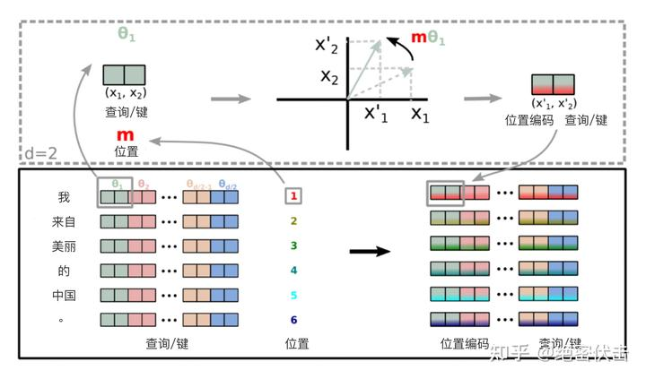

https://www.zhihu.com/tardis/zm/art/647109286?source_id=1003

十分钟读懂旋转编码（RoPE）


绝密伏击

《推荐系统技术原理与实践》作者，欢迎知友京东购买。

545 赞同

22 评论

953 收藏

旋转位置编码（Rotary Position Embedding，RoPE）是论文[Roformer: Enhanced Transformer With Rotray Position Embedding](https://link.zhihu.com/?target=https%3A//arxiv.org/pdf/2104.09864.pdf) 提出的一种能够将相对位置信息依赖集成到 self-attention 中并提升 transformer 架构性能的位置编码方式。而目前很火的 LLaMA、GLM 模型也是采用该位置编码方式。

和相对位置编码相比，RoPE 具有更好的**外推性**，目前是大模型相对位置编码中应用最广的方式之一。

**备注：什么是大模型外推性？**

外推性是指大模型在训练时和预测时的输入长度不一致，导致模型的泛化能力下降的问题。例如，如果一个模型在训练时只使用了512个 token 的文本，那么在预测时如果输入超过512个 token，模型可能无法正确处理。这就限制了大模型在处理长文本或多轮对话等任务时的效果。

**备注：下一篇文章将详细介绍如何基于RoPE提升大模型的外推能力（2k推8k，甚至更长）**

[绝密伏击：再论大模型位置编码及其外推性（万字长文）](https://zhuanlan.zhihu.com/p/675243992)

## 1. 旋转编码 RoPE

### 1.1 基本概念

在介绍 RoPE 之前，先给出一些符号定义，以及基本背景。

首先定义一个长度为  的输入序列为：


其中  表示输入序列中第  个 token，而输入序列  对应的 embedding 表示为：


其中  表示第  个 token  对应的  维词嵌入向量。

接着在做 self-attention 之前，会用词嵌入向量计算  向量同时加入位置信息，函数公式表达如下：


其中  表示第  个 token 对应的词向量  集成位置信息  之后的 query 向量。而  和  则表示第  个 token 对应的词向量  集成位置信息  之后的 key 和 value 向量。

而基于 transformer 的位置编码方法都是着重于构造一个合适的  函数形式。

而计算第  个词嵌入向量  对应的 self-attention 输出结果，就是  和其他  都计算一个 attention score ，然后再将 attention score 乘以对应的  再求和得到输出向量  ：


### 1.2 绝对位置编码

对于位置编码，常规的做法是在计算 query, key 和 value 向量之前，会计算一个位置编码向量  加到词嵌入  上，位置编码向量  同样也是  维向量，然后再乘以对应的变换矩阵 ：


而经典的位置编码向量  的计算方式是使用 Sinusoidal 函数：


其中  表示位置  维度向量  中的第  位置分量也就是偶数索引位置的计算公式，而就对应第  位置分量也就是奇数索引位置的计算公式。

### 1.3 2维旋转位置编码

论文中提出为了能利用上 token 之间的相对位置信息，假定 query 向量  和 key 向量  之间的内积操作可以被一个函数  表示，该函数  的输入是词嵌入向量  ，  和它们之间的相对位置  ：


接下来的目标就是找到一个等价的位置编码方式，从而使得上述关系成立。

假定现在词嵌入向量的维度是两维  ，这样就可以利用上2维度平面上的向量的几何性质，然后论文中提出了一个满足上述关系的  和  的形式如下：

![f_q(\bm{x}_m,m)=\left(\bm{W}_q\bm{x}_m\right)e^{im\theta} \\ f_k(\bm{x}_n,n)=(\bm{W}_k\bm{x}_n)e^{in\theta} \\ g(\bm{x}_m,\bm{x}_n,m-n)=\text{Re}\left[(\bm{W}_q\bm{x}_m)(\bm{W}_k\bm{x}_n)^{*}e^{i(m-n)\theta}\right] \\\tag8](./assets/equation-20240301015746957)

这里面 Re 表示复数的实部。

进一步地，  可以表示成下面的式子：


看到这里会发现，这不就是 query 向量乘以了一个旋转矩阵吗？这就是为什么叫做旋转位置编码的原因。

同理，  可以表示成下面的式子：


最终  可以表示如下：


关于上面公式（8）~（11）的具体推导，可以参见文章最后的**附录**，或者参考文章：[一文看懂 LLaMA 中的旋转式位置编码（Rotary Position Embedding）](https://zhuanlan.zhihu.com/p/642884818)。

### 1.4 扩展到多维

将2维推广到任意维度，可以表示如下：


内积满足线性叠加性，因此任意偶数维的RoPE，我们都可以表示为二维情形的拼接，即

![\bm{R}^d_{\Theta,m}=\begin{equation}\scriptsize{\underbrace{\begin{pmatrix} \cos m\theta_0 & -\sin m\theta_0 & 0 & 0 & \cdots & 0 & 0 \\ \sin m\theta_0 & \cos m\theta_0 & 0 & 0 & \cdots & 0 & 0 \\ 0 & 0 & \cos m\theta_1 & -\sin m\theta_1 & \cdots & 0 & 0 \\ 0 & 0 & \sin m\theta_1 & \cos m\theta_1 & \cdots & 0 & 0 \\ \vdots & \vdots & \vdots & \vdots & \ddots & \vdots & \vdots \\ 0 & 0 & 0 & 0 & \cdots & \cos m\theta_{d/2-1} & -\sin m\theta_{d/2-1} \\ 0 & 0 & 0 & 0 & \cdots & \sin m\theta_{d/2-1} & \cos m\theta_{d/2-1} \\ \end{pmatrix}}_{\boldsymbol{W}_m}}\end{equation}\\\tag{13}](./assets/equation-20240301015747489)

![\Theta=\left\{ \theta_i=10000^{-2(i-1)/d}, i \in [1,2,...,d/2] \right\} \\](./assets/equation?tex=/Theta%253D/left/%7B+/theta_i%253D10000%5E%7B-2(i-1)%252Fd%7D%252C+i+/in+%5B1%252C2%252C..-20240301015747352.%252Cd%252F2%5D+/right/%7D+/&consumer=ZHI_MENG)

将 RoPE 应用到前面公式（4）的 Self-Attention 计算，可以得到**包含相对位置信息的Self-Attetion**：

 其中，  。

值得指出的是，由于是一个正交矩阵，它不会改变向量的模长，因此通常来说它不会改变原模型的稳定性。

### 1.5 RoPE 的高效计算

由于的稀疏性，所以直接用矩阵乘法来实现会很浪费算力，**推荐通过下述方式来实现 RoPE**：

![\bm{R}^d_{\Theta,m}\bm{x}=\begin{equation}\begin{pmatrix}x_0 \\ x_1 \\ x_2 \\ x_3 \\ \vdots \\ x_{d-2} \\ x_{d-1}  \end{pmatrix}\otimes\begin{pmatrix}\cos m\theta_0 \\ \cos m\theta_0 \\ \cos m\theta_1 \\ \cos m\theta_1 \\ \vdots \\ \cos m\theta_{d/2-1} \\ \cos m\theta_{d/2-1} \end{pmatrix} + \begin{pmatrix}-x_1 \\ x_0 \\ -x_3 \\ x_2 \\ \vdots \\ -x_{d-1} \\ x_{d-2}  \end{pmatrix}\otimes\begin{pmatrix}\sin m\theta_0 \\ \sin m\theta_0 \\ \sin m\theta_1 \\ \sin m\theta_1 \\ \vdots \\ \sin m\theta_{d/2-1} \\ \sin m\theta_{d/2-1} \end{pmatrix}\end{equation}\\\tag{15}](./assets/equation-20240301015747696)

其中是逐位对应相乘，即计算框架中的运算。从这个实现也可以看到，RoPE 可以视为是乘性位置编码的变体。

总结来说，RoPE 的 self-attention 操作的流程是：对于 token 序列中的每个词嵌入向量，首先计算其对应的 query 和 key 向量，然后对每个 token 位置都计算对应的旋转位置编码，接着对每个 token 位置的 query 和 key 向量的元素按照 **两两一组** 应用旋转变换，最后再计算 query 和 key 之间的内积得到 self-attention 的计算结果。

论文中有个很直观的图片展示了旋转变换的过程：



### 1.6 远程衰减

可以看到，RoPE 形式上和前面公式（6） Sinusoidal 位置编码有点相似，只不过 Sinusoidal 位置编码是加性的，而 RoPE 可以视为乘性的。在  的选择上，RoPE 同样沿用了 Sinusoidal 位置编码的方案，即，它可以带来一定的远程衰减性。

具体证明如下：将  两两分组后，它们加上 RoPE 后的内积可以用复数乘法表示为：

![\begin{equation}  \left( \bm{R}^d_{\Theta,m}\bm{W}_q\bm{x}_m \right)^{\textbf{T}}\left( \bm{R}^d_{\Theta,n}\bm{W}_k\bm{x}_n \right)= \text{Re}\left[\sum_{i=0}^{d/2-1}\boldsymbol{q}_{[2i:2i+1]}\boldsymbol{k}_{[2i:2i+1]}^* e^{\text{i}(m-n)\theta_i}\right]\end{equation}\\\tag{16}](https://www.zhihu.com/equation?tex=%5Cbegin%7Bequation%7D++%5Cleft%28+%5Cbm%7BR%7D%5Ed_%7B%5CTheta%2Cm%7D%5Cbm%7BW%7D_q%5Cbm%7Bx%7D_m+%5Cright%29%5E%7B%5Ctextbf%7BT%7D%7D%5Cleft%28+%5Cbm%7BR%7D%5Ed_%7B%5CTheta%2Cn%7D%5Cbm%7BW%7D_k%5Cbm%7Bx%7D_n+%5Cright%29%3D+%5Ctext%7BRe%7D%5Cleft%5B%5Csum_%7Bi%3D0%7D%5E%7Bd%2F2-1%7D%5Cboldsymbol%7Bq%7D_%7B%5B2i%3A2i%2B1%5D%7D%5Cboldsymbol%7Bk%7D_%7B%5B2i%3A2i%2B1%5D%7D%5E%2A+e%5E%7B%5Ctext%7Bi%7D%28m-n%29%5Ctheta_i%7D%5Cright%5D%5Cend%7Bequation%7D%5C%5C%5Ctag%7B16%7D&consumer=ZHI_MENG)

记 ![h_i = \boldsymbol{q}_{[2i:2i+1]}\boldsymbol{k}_{[2i:2i+1]}^*, S_j = \sum\limits_{i=0}^{j-1} e^{\text{i}(m-n)\theta_i}](./assets/equation-20240301015747990)，并约定，那么由**[Abel变换（分部求和法）](https://link.zhihu.com/?target=https%3A//zh.wikipedia.org/wiki/%E5%88%86%E9%83%A8%E6%B1%82%E5%92%8C%E6%B3%95)**可以得到：

![\begin{equation}\sum_{i=0}^{d/2-1}\boldsymbol{q}_{[2i:2i+1]}\boldsymbol{k}_{[2i:2i+1]}^* e^{\text{i}(m-n)\theta_i} = \sum_{i=0}^{d/2-1} h_i (S_{i +1} - S_i)  = \sum_{i=0}^{d/2-1} S_{i+1}(h_{i+1} - h_i)\end{equation}\\\tag{17}](./assets/equation-20240301015748112)

所以

![\begin{equation}\begin{aligned} \left|\sum_{i=0}^{d/2-1}\boldsymbol{q}_{[2i:2i+1]}\boldsymbol{k}_{[2i:2i+1]}^* e^{\text{i}(m-n)\theta_i}\right| =&\, \left|\sum_{i=0}^{d/2-1} S_{i+1}(h_{i+1} - h_i)\right| \\ \leq&\, \sum_{i=0}^{d/2-1} |S_{i+1}| |h_{i+1} - h_i| \\ \leq&\, \left(\max_i |h_{i+1} - h_i|\right)\sum_{i=0}^{d/2-1} |S_{i+1}|  \end{aligned}\end{equation}\\\tag{18}](./assets/equation-20240301015747990-9218667.)

因此我们可以考察  随着相对距离的变化情况来作为衰减性的体现：


从图中我们可以看到**随着相对距离的变大，内积结果有衰减趋势**的出现。因此，选择 ，确实能带来一定的远程衰减性。论文中还试过以  为初始化，将  视为可训练参数，然后训练一段时间后发现  并没有显著更新，因此干脆就直接固定了。

## 2. RoPE实验

我们看一下 RoPE 在预训练阶段的实验效果：

| Stage | Max seq length | Batch size | Training steps | Loss | Accuracy |
| ----- | -------------- | ---------- | -------------- | ---- | -------- |
| 1     | 512            | 256        | 200k           | 1.73 | 65.0%    |
| 2     | 1536           | 256        | 12.5k          | 1.61 | 66.8%    |
| 3     | 256            | 256        | 120k           | 1.75 | 64.6%    |
| 4     | 128            | 512        | 80k            | 1.83 | 63.4%    |
| 5     | 1536           | 256        | 10k            | 1.58 | 67.4%    |
| 6     | 512            | 512        | 30k            | 1.66 | 66.2%    |

从上面可以看出，增大序列长度，预训练的准确率反而有所提升，这体现了 **RoPE 具有良好的外推能力**。

下面是在下游任务上的实验结果：

| Model         | Validation | Test   |
| ------------- | ---------- | ------ |
| BERT-512      | 64.13%     | 67.77% |
| WoBERT-512    | 64.07%     | 68.10% |
| RoFormer-512  | 64.13%     | 68.29% |
| RoFormer-1024 | 66.07%     | 69.79% |

其中 RoFormer 是一个绝对位置编码替换为 RoPE 的**[WoBERT](https://link.zhihu.com/?target=https%3A//github.com/ZhuiyiTechnology/WoBERT)**模型，后面的参数（512）是微调时截断的maxlen，可以看到 RoPE 确实能较好地处理长文本语义。

## 3. RoPE代码实现

Meta 的 LLAMA 和 清华的 ChatGLM 都使用了 RoPE 编码，下面看一下具体实现。

### 3.1 在LLAMA中的实现

```python3
# 生成旋转矩阵
def precompute_freqs_cis(dim: int, seq_len: int, theta: float = 10000.0):
    # 计算词向量元素两两分组之后，每组元素对应的旋转角度\theta_i
    freqs = 1.0 / (theta ** (torch.arange(0, dim, 2)[: (dim // 2)].float() / dim))
    # 生成 token 序列索引 t = [0, 1,..., seq_len-1]
    t = torch.arange(seq_len, device=freqs.device)
    # freqs.shape = [seq_len, dim // 2] 
    freqs = torch.outer(t, freqs).float()  # 计算m * \theta

    # 计算结果是个复数向量
    # 假设 freqs = [x, y]
    # 则 freqs_cis = [cos(x) + sin(x)i, cos(y) + sin(y)i]
    freqs_cis = torch.polar(torch.ones_like(freqs), freqs) 
    return freqs_cis

# 旋转位置编码计算
def apply_rotary_emb(
    xq: torch.Tensor,
    xk: torch.Tensor,
    freqs_cis: torch.Tensor,
) -> Tuple[torch.Tensor, torch.Tensor]:
    # xq.shape = [batch_size, seq_len, dim]
    # xq_.shape = [batch_size, seq_len, dim // 2, 2]
    xq_ = xq.float().reshape(*xq.shape[:-1], -1, 2)
    xk_ = xk.float().reshape(*xk.shape[:-1], -1, 2)
    
    # 转为复数域
    xq_ = torch.view_as_complex(xq_)
    xk_ = torch.view_as_complex(xk_)
    
    # 应用旋转操作，然后将结果转回实数域
    # xq_out.shape = [batch_size, seq_len, dim]
    xq_out = torch.view_as_real(xq_ * freqs_cis).flatten(2)
    xk_out = torch.view_as_real(xk_ * freqs_cis).flatten(2)
    return xq_out.type_as(xq), xk_out.type_as(xk)

class Attention(nn.Module):
    def __init__(self, args: ModelArgs):
        super().__init__()

        self.wq = Linear(...)
        self.wk = Linear(...)
        self.wv = Linear(...)
        
        self.freqs_cis = precompute_freqs_cis(dim, max_seq_len * 2)

    def forward(self, x: torch.Tensor):
        bsz, seqlen, _ = x.shape
        xq, xk, xv = self.wq(x), self.wk(x), self.wv(x)

        xq = xq.view(batch_size, seq_len, dim)
        xk = xk.view(batch_size, seq_len, dim)
        xv = xv.view(batch_size, seq_len, dim)

        # attention 操作之前，应用旋转位置编码
        xq, xk = apply_rotary_emb(xq, xk, freqs_cis=freqs_cis)
        
        # scores.shape = (bs, seqlen, seqlen)
        scores = torch.matmul(xq, xk.transpose(1, 2)) / math.sqrt(dim)
        scores = F.softmax(scores.float(), dim=-1)
        output = torch.matmul(scores, xv)  # (batch_size, seq_len, dim)
  # ......
```

这里举一个例子，假设batch_size=10, seq_len=3, d=8，则调用函数precompute_freqs_cis(d, seq_len)后，生成结果为：

```python3
In [239]: freqs_cis
Out[239]: 
tensor([[ 1.0000+0.0000j,  1.0000+0.0000j,  1.0000+0.0000j,  1.0000+0.0000j],
        [ 0.5403+0.8415j,  0.9950+0.0998j,  0.9999+0.0100j,  1.0000+0.0010j],
        [-0.4161+0.9093j,  0.9801+0.1987j,  0.9998+0.0200j,  1.0000+0.0020j]])
```

以结果中的第二行为例（对应的 m = 1），也就是：

![\begin{align} cos\left( 1*\theta_0 \right)&=cos\left( 1 \right)=0.5403,&sin\left( 1*\theta_0 \right)=sin\left( 1 \right)=0.8415\\ cos\left( 1*\theta_1\right)&=cos\left( 0.1 \right)=0.9950,&sin\left( 1*\theta_1 \right)=sin\left( 0.1 \right)=0.0998\\ cos\left( 1*\theta_2 \right)&=cos\left( 0.01 \right)=0.9999,&sin\left( 1*\theta_2 \right)=sin\left( 0.01 \right)=0.0100\\ cos\left( 1*\theta_3 \right)&=cos\left( 0.001 \right)=1.0000,&sin\left( 1*\theta_3 \right)=sin\left( 0.001 \right)=0.0010 \end{align}\tag{19}](https://www.zhihu.com/equation?tex=%5Cbegin%7Balign%7D+cos%5Cleft%28+1%2A%5Ctheta_0+%5Cright%29%26%3Dcos%5Cleft%28+1+%5Cright%29%3D0.5403%2C%26sin%5Cleft%28+1%2A%5Ctheta_0+%5Cright%29%3Dsin%5Cleft%28+1+%5Cright%29%3D0.8415%5C%5C+cos%5Cleft%28+1%2A%5Ctheta_1%5Cright%29%26%3Dcos%5Cleft%28+0.1+%5Cright%29%3D0.9950%2C%26sin%5Cleft%28+1%2A%5Ctheta_1+%5Cright%29%3Dsin%5Cleft%28+0.1+%5Cright%29%3D0.0998%5C%5C+cos%5Cleft%28+1%2A%5Ctheta_2+%5Cright%29%26%3Dcos%5Cleft%28+0.01+%5Cright%29%3D0.9999%2C%26sin%5Cleft%28+1%2A%5Ctheta_2+%5Cright%29%3Dsin%5Cleft%28+0.01+%5Cright%29%3D0.0100%5C%5C+cos%5Cleft%28+1%2A%5Ctheta_3+%5Cright%29%26%3Dcos%5Cleft%28+0.001+%5Cright%29%3D1.0000%2C%26sin%5Cleft%28+1%2A%5Ctheta_3+%5Cright%29%3Dsin%5Cleft%28+0.001+%5Cright%29%3D0.0010+%5Cend%7Balign%7D%5Ctag%7B19%7D&consumer=ZHI_MENG)

最终按照公式（12）可以得到编码之后的  。

**注意：**在代码中是直接用freqs_cis[0] * xq_[0]的结果表示第一个 token 对应的旋转编码（和公式12计算方式有所区别）。其中将原始的 query 向量  转换为了复数形式。

```python3
In [351]: q_ = q.float().reshape(*q.shape[:-1], -1, 2)

In [352]: q_[0]
Out[352]: 
tensor([[[ 1.0247,  0.4782],
         [ 1.5593,  0.2119],
         [ 0.4175,  0.5309],
         [ 0.4858,  0.1850]],

        [[-1.7456,  0.6849],
         [ 0.3844,  1.1492],
         [ 0.1700,  0.2106],
         [ 0.5433,  0.2261]],

        [[-1.1206,  0.6969],
         [ 0.8371, -0.7765],
         [-0.3076,  0.1704],
         [-0.5999, -1.7029]]])

In [353]: xq = torch.view_as_complex(q_)

In [354]: xq[0]
Out[354]: 
tensor([[ 1.0247+0.4782j,  1.5593+0.2119j,  0.4175+0.5309j,  0.4858+0.1850j],
        [-1.7456+0.6849j,  0.3844+1.1492j,  0.1700+0.2106j,  0.5433+0.2261j],
        [-1.1206+0.6969j,  0.8371-0.7765j, -0.3076+0.1704j, -0.5999-1.7029j]])
```

**这里为什么可以这样计算？**

主要是利用了复数的乘法性质。

我们首先来复习一下复数乘法的性质：


因此要计算：


可以转化为计算：


所以可以将公式（12）转化为两个复数的乘法运算。

### 3.2 在ChatGLM中的实现

和 LLAMA 的实现方式相差不大。代码如下：

```python3
class RotaryEmbedding(torch.nn.Module):
    def __init__(self, dim, base=10000, precision=torch.half, learnable=False):
        super().__init__()
         # 计算 \theta_i
        inv_freq = 1. / (base ** (torch.arange(0, dim, 2).float() / dim))
        inv_freq = inv_freq.half()
        
        self.learnable = learnable
        if learnable:
            self.inv_freq = torch.nn.Parameter(inv_freq)
            self.max_seq_len_cached = None
        else:
            self.register_buffer('inv_freq', inv_freq)
            self.max_seq_len_cached = None
            self.cos_cached = None
            self.sin_cached = None
        self.precision = precision

    def forward(self, x, seq_dim=1, seq_len=None):
        if seq_len is None:
            seq_len = x.shape[seq_dim]
        if self.max_seq_len_cached is None or (seq_len > self.max_seq_len_cached):
            self.max_seq_len_cached = None if self.learnable else seq_len
            # 生成 token 序列索引 t = [0, 1,..., seq_len-1]
            t = torch.arange(seq_len, device=x.device, dtype=self.inv_freq.dtype)
            # 对应m * \theta
            freqs = torch.einsum('i,j->ij', t, self.inv_freq)
            # 将 m * \theta 拼接两次，对应复数的实部和虚部
            emb = torch.cat((freqs, freqs), dim=-1).to(x.device)
            if self.precision == torch.bfloat16:
                emb = emb.float()

            # [sx, 1 (b * np), hn]
            cos_cached = emb.cos()[:, None, :]  # 计算得到cos(m*\theta)
            sin_cached = emb.sin()[:, None, :]  # 计算得到cos(m*\theta)
            if self.precision == torch.bfloat16:
                cos_cached = cos_cached.bfloat16()
                sin_cached = sin_cached.bfloat16()
            if self.learnable:
                return cos_cached, sin_cached
            self.cos_cached, self.sin_cached = cos_cached, sin_cached
        return self.cos_cached[:seq_len, ...], self.sin_cached[:seq_len, ...]

    def _apply(self, fn):
        if self.cos_cached is not None:
            self.cos_cached = fn(self.cos_cached)
        if self.sin_cached is not None:
            self.sin_cached = fn(self.sin_cached)
        return super()._apply(fn)

def rotate_half(x):
    x1, x2 = x[..., :x.shape[-1] // 2], x[..., x.shape[-1] // 2:]
    return torch.cat((-x2, x1), dim=x1.ndim - 1)  
```

## 4. RoPE的外推性

我们都知道 RoPE 具有很好的外推性，前面的实验结果也证明了这一点。这里解释下具体原因。

RoPE 可以通过旋转矩阵来实现位置编码的外推，即可以通过旋转矩阵来生成超过预期训练长度的位置编码。这样可以提高模型的泛化能力和鲁棒性。

我们回顾一下 RoPE 的工作原理：假设我们有一个  维的绝对位置编码  ，其中  是位置索引。我们可以将  看成一个  维空间中的一个点。我们可以定义一个  维空间中的一个旋转矩阵  ，它可以将任意一个点沿着某个轴旋转一定的角度。我们可以用  来变换  ，得到一个新的点  。我们可以发现，  和  的距离是相等的，即  。这意味着  和  的相对关系没有改变。但是，  和  的距离可能发生改变，即 。这意味着  和  的相对关系有所改变。因此，我们可以用  来调整不同位置之间的相对关系。

如果我们想要生成超过预训练长度的位置编码，我们只需要用  来重复变换最后一个预训练位置编码  ，得到新的位置编码  ，依此类推。这样就可以得到任意长度的位置编码序列  ，其中  可以大于  。由于  是一个正交矩阵，它保证了  和  的距离不会无限增大或缩小，而是在一个有限范围内波动。这样就可以避免数值溢出或下溢的问题。同时，由于  是一个可逆矩阵，它保证了 和  的距离可以通过  的逆矩阵  还原到  和  的距离，即  。这样就可以保证位置编码的可逆性和可解释性。

总结而言：

**旋转编码 RoPE 可以有效地保持位置信息的相对关系**，即相邻位置的编码之间有一定的相似性，而远离位置的编码之间有一定的差异性。这样可以增强模型对位置信息的感知和利用。这一点是其他绝对位置编码方式（如正弦位置编码、学习的位置编码等）所不具备的，因为它们只能表示绝对位置，而不能表示相对位置。

**旋转编码 RoPE 可以通过旋转矩阵来实现位置编码的外推**，即可以通过旋转矩阵来生成超过预训练长度的位置编码。这样可以提高模型的泛化能力和鲁棒性。这一点是其他固定位置编码方式（如正弦位置编码、固定相对位置编码等）所不具备的，因为它们只能表示预训练长度内的位置，而不能表示超过预训练长度的位置。

**旋转编码 RoPE 可以与线性注意力机制兼容**，即不需要额外的计算或参数来实现相对位置编码。这样可以降低模型的计算复杂度和内存消耗。这一点是其他混合位置编码方式（如Transformer-XL、XLNet等）所不具备的，因为它们需要额外的计算或参数来实现相对位置编码。

## 总结

最近一直听到旋转编码这个词，但是一直没有仔细看具体原理。今天花时间仔细看了一遍，确实理论写的比较完备，而且实验效果也不错。目前很多的大模型，都选择了使用了这种编码方式（LLAMA、GLM等）。

## 附录

这里补充一下前面公式1.3.2节中，公式（8）~（11）是怎么推导出来的。

回到之前的公式（8），编码之后的  以及内积  的形式如下：

![f_q(\bm{x}_m,m)=(\bm{W}_q\bm{x}_m)e^{im\theta} \\ f_k(\bm{x}_n,n)=(\bm{W}_kx_n)e^{in\theta} \\ g(\bm{x}_m,x_n,m-n)=Re[(\bm{W}_\bm{q}x_m)(\bm{W}_k\bm{x}_n)^{*}e^{i(m-n)\theta}] \\](./assets/equation-20240301015749944)

上面的公式为什么满足：  。

首先我们得先了解一下基本的复数相关知识。

首先看到上述  和  公式中有个指数函数： 

这个其实是欧拉公式，其中  表示任意实数，  是自然对数的底数，  是复数中的虚数单位，则根据欧拉公式有：


则是上述指数函数可以表示为实部为  ，虚部为  的一个复数，欧拉公式建立了指数函数、三角函数和复数之间的桥梁。

则上述  和  公式的


然后我们看回公式：


其中  是个二维矩阵，  是个二维向量，相乘的结果也是一个二维向量，这里用  表示：


然后首先将  表示成复数形式：

![\bm{q}_m = [q_m^{(1)}, q_m^{(2)}] = [q_m^{(1)} + iq_m^{(2)}] \\](./assets/equation-20240301015750609)

接着


其实就是两个复数相乘：


然后就有：


将结果重新表达成实数向量形式就是：

![ \bm{q}_me^{im\theta}=[q_m^{(1)} \cos (m\theta) -  q_m^{(2)} \sin (m\theta), q_m^{(2)}\cos (m\theta) + q_m^{(1)}\sin (m\theta)] \\](./assets/equation-20240301015750648)

**这里不难发现就是 query 向量乘以了一个旋转矩阵**。

![f_q(\bm{x}_m,m)=(\bm{W}_q\bm{x}_m)e^{im\theta}=\bm{q}_me^{im\theta}\\ =[q_m^{(1)} \cos (m\theta) -  q_m^{(2)} \sin (m\theta), q_m^{(2)}\cos (m\theta) + q_m^{(1)}\sin (m\theta)] \\ = \begin{pmatrix}  \cos (m\theta) & -\sin (m\theta) \\  \sin (m\theta) & \cos (m\theta)    \end{pmatrix} \begin{pmatrix}  q_m^{(1)}  \\  q_m^{(2)}    \end{pmatrix} \\](./assets/equation-20240301015750820)

**这就是为什么叫做旋转式位置编码的原因。**

同理可得 key 向量  ：

![f_k(\bm{x}_n,n)=(\bm{W}_k\bm{x}_n)e^{in\theta}=\bm{k}_ne^{in\theta}\\ =[k_n^{(1)} \cos (n\theta) -  k_n^{(2)} \sin (n\theta), k_n^{(2)}\cos (n\theta) + k_n^{(1)}\sin (n\theta)] \\ = \begin{pmatrix}  \cos (n\theta) & -\sin (n\theta) \\  \sin (n\theta) & \cos (n\theta)    \end{pmatrix} \begin{pmatrix}  k_n^{(1)}  \\  k_n^{(2)}    \end{pmatrix} \\](./assets/equation-20240301015750977)

最后还有个函数  ：

![g(\bm{x}_m,\bm{x}_n,m-n)=Re[(\bm{W}_q\bm{x}_m)(\bm{W}_k\bm{x}_n)^{*}e^{i(m-n)\theta}] \\](./assets/equation-20240301015750886)

其中  表示一个复数  的实部部分，而  则表示复数  的共轭。

复习一下共轭复数的定义：

所以可得：


继续可得：

![\begin{align} g(\bm{x}_m,\bm{x}_n,m-n) &=Re[(\bm{W}_q\bm{x}_m)(\bm{W}_k\bm{x}_n)^{*}e^{i(m n)\theta}] \\ & = Re[(q_m^{(1)} + iq_m^{(2)})(k_n^{(1)} - ik_n^{(2)})(\cos((m-n)\theta) + i \sin((m-n)\theta))] \\  &= Re[((q_m^{(1)}k_n^{(1)} + q_m^{(2)}k_n^{(2)}) + i(q_m^{(2)}k_n^{(1)} - q_m^{(1)}k_n^{(2)}))(\cos((m-n)\theta) + i \sin((m-n)\theta))] \\  &= (q_m^{(1)}k_n^{(1)} + q_m^{(2)}k_n^{(2)})\cos((m-n)\theta) - (q_m^{(2)}k_n^{(1)} - q_m^{(1)}k_n^{(2)})\sin((m-n)\theta)  \end{align}](./assets/equation-20240301015751229)

接下来我们就要证明函数  的计算公式是成立的。

首先回顾一下 attention 操作， 位置  的 query 和位置  的 key 会做一个内积操作：

![\begin{align} f_q(x_m,m)&=[q_m^{(1)} \cos (m\theta) -  q_m^{(2)} \sin (m\theta), q_m^{(2)}\cos (m\theta) + q_m^{(1)}\sin (m\theta)] \\  f_k(x_n,n)& =[k_n^{(1)} \cos (n\theta) -  k_n^{(2)} \sin (n\theta), k_n^{(2)}\cos (n\theta) + k_n^{(1)}\sin (n\theta)] \\  <f_q(x_m,m),f_k(x_n,n)> &=  (q_m^{(1)} \cos (m\theta) -  q_m^{(2)} \sin (m\theta))(k_n^{(1)} \cos (n\theta) -  k_n^{(2)} \sin (n\theta)) \\ &+ (q_m^{(2)}\cos (m\theta) + q_m^{(1)}\sin (m\theta))(k_n^{(2)}\cos (n\theta) + k_n^{(1)}\sin (n\theta))\\ & =q_m^{(1)} \cos (m\theta) k_n^{(1)} \cos (n\theta) - q_m^{(1)} \cos (m\theta)k_n^{(2)} \sin (n\theta)\\ & - q_m^{(2)} \sin (m\theta)k_n^{(1)} \cos (n\theta) + q_m^{(2)} \sin (m\theta)k_n^{(2)} \sin (n\theta) \\ & + q_m^{(2)}\cos (m\theta)k_n^{(2)}\cos (n\theta) + q_m^{(2)}\cos (m\theta)k_n^{(1)}\sin (n\theta) \ + q_m^{(1)}\sin (m\theta)k_n^{(2)}\cos (n\theta) + q_m^{(1)}\sin (m\theta)k_n^{(1)}\sin (n\theta)  \end{align}](./assets/equation-20240301015751258)

接着进行推导，我们整理一下：

![\begin{align} <f_q(\bm{x}_m,m),f_k(\bm{x}_n,n)>  &=  {q}_m^{(1)}{k}_n^{(1)}(\cos(m\theta)\cos(n\theta) + \sin(m\theta)\sin(n\theta) ) \\  &+ {q}_m^{(1)}{k}_n^{(2)}(-\cos(m\theta)\sin(n\theta) + \sin(m\theta)\cos(n\theta) ) \\ & + {q}_m^{(2)}{k}_n^{(1)}(-\sin(m\theta)\cos(n\theta) + \cos(m\theta)\sin(n\theta) ) \\  &+ {q}_m^{(2)}{k}_n^{(2)}(\sin(m\theta)\sin(n\theta) + \cos(m\theta)\cos(n\theta) ) \\ & = q_m^{(1)}k_n^{(1)}\cos((m-n)\theta) \\  &+ q_m^{(1)}k_n^{(2)}\sin((m-n)\theta) \\  &- q_m^{(2)}k_n^{(1)}\sin((m-n)\theta) \\ & + q_m^{(2)}k_n^{(2)}\cos((m-n)\theta) \\  &= (q_m^{(1)}k_n^{(1)} + q_m^{(2)}k_n^{(2)})\cos((m-n)\theta) + (q_m^{(1)}k_n^{(2)}- q_m^{(2)}k_n^{(1)})\sin((m-n)\theta) \\ & = (q_m^{(1)}k_n^{(1)} + q_m^{(2)}k_n^{(2)})\cos((m-n)\theta) - (q_m^{(2)}k_n^{(1)} - q_m^{(1)}k_n^{(2)})\sin((m-n)\theta) \\ &=g(x_m,x_n,m-n)  \end{align}](./assets/equation-20240301015751262)

这就证明上述关系是成立的，位置  的 query 和位置  的 key 的内积就是函数  。

把上面的式子用矩阵向量乘的形式来表达就是：

![<f_q(\bm{x}_m,m),f_k(\bm{x}_n,n)> \\ =\begin{pmatrix} \begin{pmatrix}  \cos (m\theta) & -\sin (m\theta) \\  \sin (m\theta) & \cos (m\theta)    \end{pmatrix} \begin{pmatrix}  q_m^{(1)}  \\  q_m^{(2)}    \end{pmatrix} \end{pmatrix}^T  \begin{pmatrix}  \begin{pmatrix}  \cos (n\theta) & -\sin (n\theta) \\  \sin (n\theta) & \cos (n\theta)    \end{pmatrix} \begin{pmatrix}  k_n^{(1)}  \\  k_n^{(2)}    \end{pmatrix} \end{pmatrix}  \\ = \begin{pmatrix}  q_m^{(1)} &  q_m^{(2)}  \\ \end{pmatrix}  \begin{pmatrix}  \cos (m\theta) & \sin (m\theta) \\  -\sin (m\theta) & \cos (m\theta)    \end{pmatrix}    \begin{pmatrix}  \cos (n\theta) & -\sin (n\theta) \\  \sin (n\theta) & \cos (n\theta)    \end{pmatrix} \begin{pmatrix}  k_n^{(1)}  \\  k_n^{(2)}    \end{pmatrix} \\ = \begin{pmatrix}  q_m^{(1)} &  q_m^{(2)}  \\ \end{pmatrix}   \begin{pmatrix}  \cos(m\theta)\cos(n\theta) + \sin(m\theta)\sin(n\theta) & -\cos(m\theta)\sin(n\theta) + \sin(m\theta)\cos(n\theta) \\  -\sin(m\theta)\cos(n\theta) + \cos(m\theta)\sin(n\theta) & \sin(m\theta)\sin(n\theta) + \cos(m\theta)\cos(n\theta) \end{pmatrix}   \begin{pmatrix}  k_n^{(1)}  \\  k_n^{(2)}    \end{pmatrix} \\ =\begin{pmatrix}  q_m^{(1)} &  q_m^{(2)}  \\ \end{pmatrix}   \begin{pmatrix}  \cos((m-n)\theta) & -\sin((m-n)\theta) \\  \sin((m-n)\theta) &  \cos((m-n)\theta) \end{pmatrix}   \begin{pmatrix}  k_n^{(1)}  \\  k_n^{(2)}    \end{pmatrix} \\](./assets/equation-20240301015751386)

## 参考

[ROFORMER: ENHANCED TRANSFORMER WITH ROTARY POSITION EMBEDDING](https://link.zhihu.com/?target=https%3A//arxiv.org/pdf/2104.09864.pdf)

[梁德澎：一文看懂 LLaMA 中的旋转式位置编码（Rotary Position Embedding）](https://zhuanlan.zhihu.com/p/642884818)

[马梦之：一步一步，推导旋转位置编码 (Rotary Position Embedding, RoPE)](https://zhuanlan.zhihu.com/p/644585013)

[苏剑林：Transformer升级之路：2、博采众长的旋转式位置编码](https://zhuanlan.zhihu.com/p/359502624)