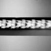
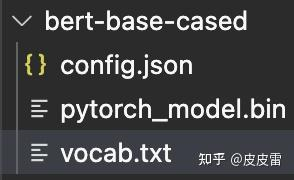
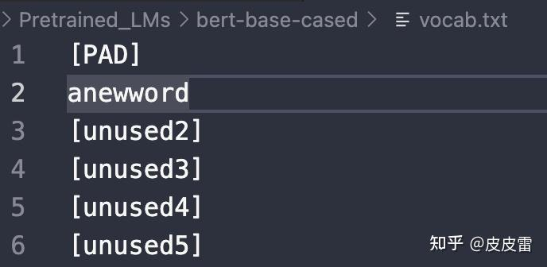

# 在BERT模型中添加自己的词汇（pytorch版）

https://zhuanlan.zhihu.com/p/391814780

[](https://www.zhihu.com/people/wx594ef9ef880c5fda)

[皮皮雷](https://www.zhihu.com/people/wx594ef9ef880c5fda)

中文系转码，来向大家学习

111 人赞同了该文章


参考文章：[NLP | How to add a domain-specific vocabulary (new tokens) to a subword tokenizer already trained like BERT WordPiece | by Pierre Guillou | Medium](https://link.zhihu.com/?target=https%3A//medium.com/@pierre_guillou/nlp-how-to-add-a-domain-specific-vocabulary-new-tokens-to-a-subword-tokenizer-already-trained-33ab15613a41)

中文BERT-base是以字为单位的，基本上已经涵盖了现代汉语所有的常用字。而且汉字是一个比较稳定的封闭集合，生活中不会随时造出新字来。新词倒是很常见，但是在中文BERT里直接就被tokenizer切成字了，因此一般没有多大的扩充词（字）表的需要。（本人在古汉语语料上调用古汉语BERT确实遇到很多生僻字被分词器当成[UNK]的情况，还没有尝试增加新字，不过理论上是一样的）。

但是英文不一样，英文预训练BERT（对，就是它，bert-base-uncased 和 bert-base-cased）以词为单位。社会生活中总是会有新词产生，而且在专业领域（如医疗、金融）有一些不常用的词语是英文预训练BERT-base没有涵盖到的。这就需要扩充词表。

此外，在英文模型中，添加自定义词的作用不仅是**增加新词或者专业领域的词汇**，而且可以**防止词语被自动拆成词根词缀**。如果不添加自定义词汇，“COVID”和“hospitalization”虽然不会被分词器直接当成[UNK]，但是会被bert-base-cased的分词器拆分成：

```text
['co', '##vid']
['hospital', '##ization']
```


### 方法1： 直接在BERT词表vocab.txt中替换[unused]



找到pytorch版本的bert-base-cased的文件夹中的vocab.txt文件。最前面的100行都是[unused]（[PAD]除外），直接用需要添加的词替换进去。比如我这里需要添加一个原来词表里没有的词“anewword”（现造的），这时候就把[unused1]改成我们的新词“anewword”




在未添加新词前，在python里面调用BERT模型的分词器：

```python3
from transformers import BertForMaskedLM, BertTokenizer
model = "Pretrained_LMs/bert-base-cased"  #自己的bert模型路径
tokenizer = BertTokenizer.from_pretrained(model, use_fast=True)
model = BertForMaskedLM.from_pretrained(model)
print(tokenizer.tokenize('anewword'))  
```

打印结果：
['an', '##ew', '##word']

当在vocab中把[unused1]改成anewword后：

```text
model = "Pretrained_LMs/bert-base-cased"  #还是自己的bert模型路径
tokenizer = BertTokenizer.from_pretrained(model, use_fast=True)
model = BertForMaskedLM.from_pretrained(model) #重新加载分词器
print(tokenizer.tokenize('anewword'))
```

打印结果：
['anewword']


### 方法2：通过重构词汇矩阵来增加新词

```text
from transformers import BertForMaskedLM, BertTokenizer

model = "Pretrained_LMs/bert-base-cased" 
tokenizer = BertTokenizer.from_pretrained(model, use_fast=True)
model = BertForMaskedLM.from_pretrained(model)

print(tokenizer.tokenize('COVID'))
print(tokenizer.tokenize('hospitalization'))
```

未加入新词时，打印'COVID'和'hospitalization'的分词结果为：
['co', '##vid']
['hospital', '##ization']


如果想让这些词保持完整的形式，可以通过重构BERT初始权重矩阵的方式将他们加入词表。

```python3
new_tokens = ['COVID', 'hospitalization']
num_added_toks = tokenizer.add_tokens(new_tokens) #返回一个数，表示加入的新词数量，在这里是2

#关键步骤，resize_token_embeddings输入的参数是tokenizer的新长度
model.resize_token_embeddings(len(tokenizer)) 
```

添加后的词汇，通过model.resize_token_embeddings方法，随机初始化了一个权重。

```text
print(tokenizer.tokenize('COVID'))
print(tokenizer.tokenize('hospitalization'))

tokenizer.save_pretrained("Pretrained_LMs/bert-base-cased") #还是保存到原来的bert文件夹下，这时候文件夹下多了三个文件
```


打印结果为：

['covid'] 

['hospitalization']


保存添加后的词汇：tokenizer.savepretrained

再次加载模型就会自动读取增加后的词汇。


新建一个python文件查看添加词汇后的结果：

```text
from transformers import BertForMaskedLM, BertTokenizer
model = "Pretrained_LMs/bert-base-cased"
tokenizer = BertTokenizer.from_pretrained(model, use_fast=True)
model = BertForMaskedLM.from_pretrained(model)

print(tokenizer.tokenize('anewword'))
print(tokenizer.tokenize('COVID'))
print(tokenizer.tokenize('hospitalization'))
```

['anewword']

['covid'] 

['hospitalization']


可见我们之前使用的两种不同的方法都起到了同样的效果。


在具体使用的时候，如果有大量领域内专业词汇，建议用方法1直接批量替换。缺点是有个数限制，cased模型只有99个空位，uncased模型是999个。只是添加的是大写COVID，bert的tokenizer给我们都转成小写了。