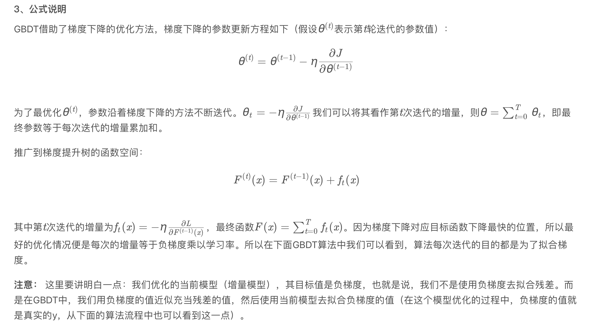
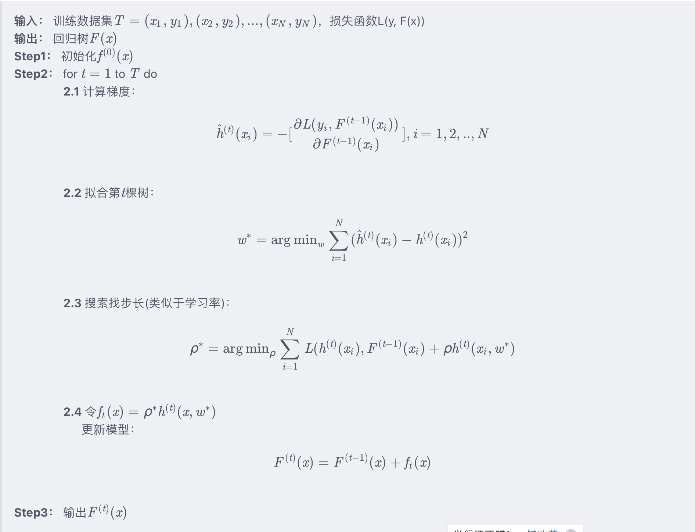

# 集成学习 - GBDT

---

[TOC]

## 1. Boosting 思想

Boosting 基于串行策略， 各个基分类器之间有依赖。

1. 先从初始训练集训练一个弱学习器，初始训练集各个样本权重相同
2. 根据上一个弱学习器的表现，调整样本权重，是的分类错误的样本得到更多关注
3. 基于调整后的样本分布，训练下一个弱学习器、
4. 测试时，对各基学习器**加权**得到最终结果

## 2. GBDT

GBDT ， Gradient Boosting  Decision Tree， 叫 梯度提升决策树。

### 1. GBDT 思想

# AdaBoost、GBDT 和 XGBoost 的联系与区别[¶](https://fengchao.pro/blog/adaboost-gbdt-xgboost/#adaboostgbdt-和-xgboost-的联系与区别)

各类 Boost 方法是基于树模型的集成模型，理解它们的联系与区别有助于理解各个算法的优劣。

## 整体思路[¶](https://fengchao.pro/blog/adaboost-gbdt-xgboost/#整体思路)

Adaboost

- 基本思想：通过不断修改样本权重（增大分错样本的权重，降低分对样本的权重），达到自适应调整样本权重的效果。
- 将弱分类器组合成一个强分类器：加权多数表决（加大分类误差率小的弱分类器的权值，减小分类误差率大的弱分类器的权值）。

GBDT

- 以决策树作为基函数，可以用一般的损失函数，而不是限定的损失函数。

- 基本思想：采用梯度下降法，每一次迭代都是为了优化当前损失函数，进而在损失函数减少（**负梯度**，即一阶导数的反方向）的方向上建立一个新的模型。

- 当损失函数选择为“均方损失”时候，其沿着负梯度方向拟合，实质上就是拟合残差（选择其他损失函数不一定表现出拟合残差的性质）。

  > 为什么已经有了基于残差的回归树，还提出基于负梯度来替代残差的替代提升树？
  >
  > 《统计学习方法》中给出的解释是：当损失函数是平方损失和对数损失时，每一步的优化是很简单的，但是对于一般的损失函数而言，往往每一步的优化不是那么容易，使用负梯度代替残差。kaggle blog给出的解释是：Although we can minimize this function directly， gradient descent will let us minimize more complicated loss functions that we can‘t minimize directly。
  >
  > 
  >
  > 
  >
  > 

XGBoost

- 基本思想：XGBoost 的 boosting 策略则与 GBDT 类似，均是在新加入的基分类器进一步拟合预测值与真实值之间的差异（不一定是残差），**只不过 GBDT 是沿着负梯度的方向进行拟合，只用到了一阶梯度信息，而 XGBoost 则是对损失函数进行二阶泰勒展开，相比于 GBDT，其拟合方向更准、速度更快。**

## 联系[¶](https://fengchao.pro/blog/adaboost-gbdt-xgboost/#联系)

1. 都是基于决策树的集成学习方法；
2. 都是通过将多颗简单决策树的预测结果进行加和，来形成最终的模型预测结果；
3. 都是通过串行迭代的方式来提高模型的准确率。

## 区别[¶](https://fengchao.pro/blog/adaboost-gbdt-xgboost/#区别)

1. 虽然三者都是加法模型，AdaBoost 是通过加权的方式来提高模型的准确率，即每棵树的权重（Amount of say）不一样；而 GBDT 和 XGBoost 是通过加法的方式来提高模型的准确率，即每棵树的权重（Amount of say）都是一样的；
2. AdaBoost 拟合的是原始数据；而 GBDT 和 XGBoost 拟合的是 Psuedo Residuals，当损失函数是平方损失函数时，Psuedo Residuals 就是残差；
3. AdaBoost 的损失函数是指数损失函数，而 GBDT 和 XGBoost 的损失函数可以是自定义的。
4. GBDT 只考虑了梯度信息，而 XGBoost 考虑了梯度和二阶导数信息。
5. XGBoost 将树模型的复杂度加入到正则项中，来避免过拟合，因此泛化性能会优于 GBDT。
6. GBDT 只支持 CART 作为基分类器，XGBoost 还支持线性分类器，在使用线性分类器的时候可以使用 L1，L2 正则化。
7. XGBoost 引进了特征子采样，像 RandomForest 那样，这种方法既能降低过拟合，还能减少计算。
8. XGBoost 在寻找最佳分割点时，考虑到精确的贪心算法（逐点计算）效率较低，实现了一种近似贪心算法，用来加速和减小内存消耗。除此之外还考虑了稀疏数据集和缺失值的处理，对于特征的值有缺失的样本，XGBoost 依然能自动找到其要分裂的方向。
9. XGBoost 支持并行处理。XGBoost 的并行不是在模型上的并行，而是在特征上的并行，将特征列排序后以 block 的形式存储在内存中，在后面的迭代中重复使用这个结构。这个 block 也使得并行化成为了可能，其次在进行节点分裂时，计算每个特征的增益，最终选择增益最大的那个特征去做分割，那么各个特征的增益计算就可以开多线程进行。

 [GBDT和Xgboost：原理、推导、比较_xgboost是gbdt的一种吗-CSDN博客.pdf](GBDT和Xgboost：原理、推导、比较_xgboost是gbdt的一种吗-CSDN博客.pdf) 
