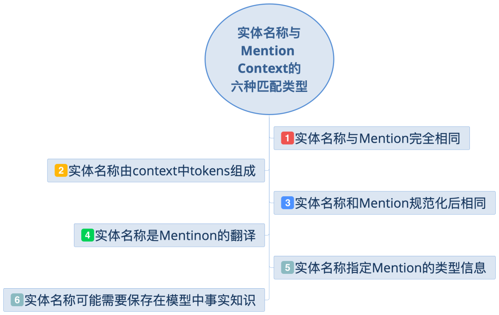
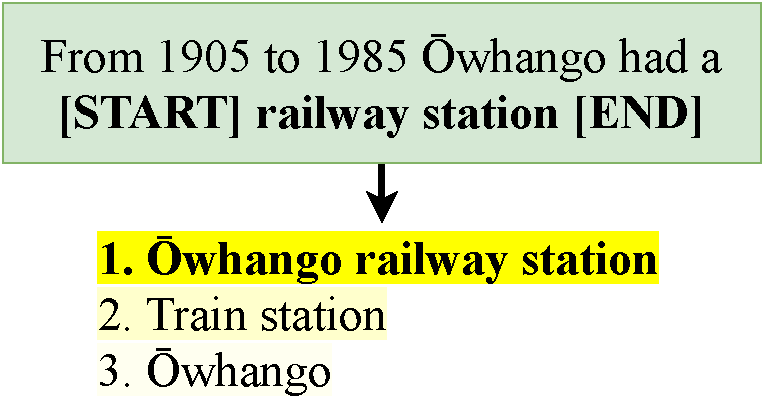
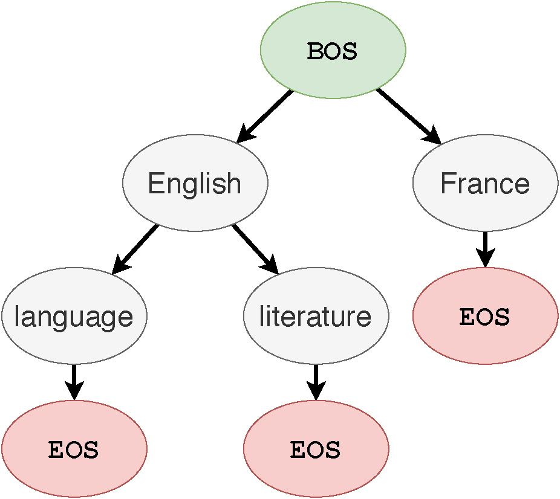
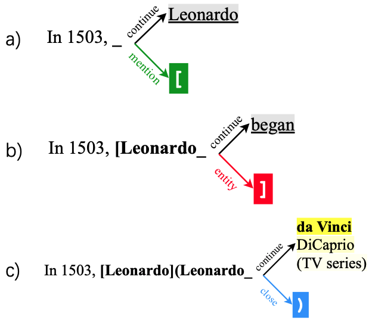
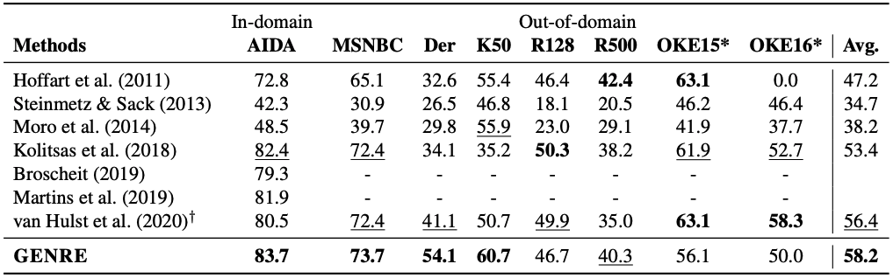
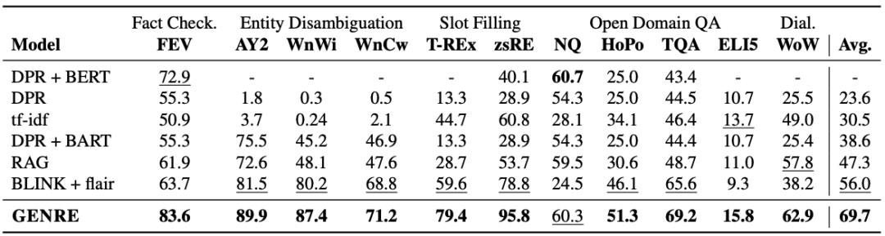
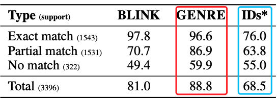
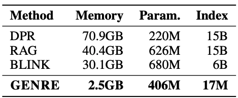

# 实体链接

# 导言

最近ICLR的rebutal 前后分数对比出来了，很多评委都改了分数，有改多的，也有改少的。今天给大家介绍的这篇高分论文竟然在rebuttal前后都保持高分，证明评委们对它的认可程度是很高的。

实体检索任务的定义是：对于一个给定的输入文本，需要模型从一个候选实体集中找到最相关的候选实体。

> 比如说，给定输入 : "In 1503, **Leonardo** began painting the **Mona Lisa**"，实体链接任务需要检索出**Leonardo**指的是知识库中的实体**Leonardo da Vinci**。

与之前研究不同的是，这篇文章是第一个用生成实体名称的方式解决实体检索问题的工作。咦？用生成模型做实体检索？很新鲜吗？跟以往有什么不同嘛？

那我们就在开始介绍正文前，先po下本文所提出的【生成式实体检索】和传统的【分类式实体检索】核心的3点不同吧！

**非常硬核的是，本文提出的模型GENRE在3类实体检索任务，包括20个数据集上几乎都达到了SOTA或者说非常competitive的结果。**

**论文题目**：

*AUTOREGRESSIVE ENTITY RETRIEVAL*

**论文链接**:

*https://openreview.net/pdf?id=5k8F6UU39V*

Arxiv访问慢的小伙伴也可以在 【**夕小瑶的卖萌屋**】订阅号后台回复关键词 【***1230***】 下载论文PDF~

## 生成如何邂逅实体检索？

实体检索任务对于知识图谱中的检索，QA系统，推荐系统都十分重要。在以往的研究中，实体检索任务遵循着一个定式：每个实体伴随着一个唯一原子标签，所以实体检索任务被转换为多分类任务。但是**本文却发现了一个新的范式：除了原子标签外，Wikipedia文章标题，也可当做实体的唯一表示符, 被称作实体名称(Entity Name)**。比如实体**Tool**的两种标识符分别是：

> 原子标签：**4713**实体名称：**Tool (band)**

除唯一性外，实体名称具有高结构性和组合性，而且在内容上可提供更详细的信息。比如band就为Tool提供了额外的实体类型信息。

更重要的发现是，这些实体名称与mention context存在可预测的匹配模式。

> mention 指的是自然语言表示实体的文本片段, 比如"Leonardo"是一个mention，"Mona Lisa"也是一个mention。mention的context指的是mention的上下文， 比如上面例子中的"In 1503"和"began painting" 。

文中总结了六种实体名称和mention+context的匹配类型：

> 举个栗子趴：输入 是下面的句子，高亮部分1是正确的实体名称。

> 这个栗子属于第2种类型，即**实体名称由context中的tokens组成**，此处实体名称是**Ōwhango railway station**，由context中的token **Ōwhango** 与 mention的字符串 **railway station**组成。

**总体而言，这六种类型说明实体名称和带mention的input之间存在着固定形式的映射，因此对于一个mention+context或者输入，是有可能采用**生成的方式**将其中的mention转换为一个唯一的实体名称的。**

那么你能你会问, 实体检索是需要从知识库或者知识图谱中检索已经存在的实体吧，如果生成的实体并不存在知识图谱中，该怎么办呢？

这也是本文主要解决的一个问题（用非常机智的方式），先剧透下，核心idea是采用一种受约束的解码策略，强迫每一个生成的实体属于预先定义的候选集中。

本文最厉害的点就是对问题的重构，下面让我们一起来看看作者是怎么用生成做实体检索的吧！

## 如何生成实体名称？

本文提出GENRE (Generative ENtity REtrieval，生成式实体检索) 模型，生成一个给定输入到实体名称。具体是：对于输入 , 要生成其对应的实体 ，并且 属于知识库中的候选实体集合 。 的实体名称（文本）是一个文本序列 ：

GENRE采用sequence-to-sequence的框架进行生成，利用预训练语言模型(BART[1]) 计算输入与每个候选实体 的log-likelihood分数，然后按照分数取top-N个候选实体。从技术上讲，GENRE通过fine-tune预训练语言模型来生成实体名称。

好了，模型介绍完了！

就这么简单？？？不会吧？从模型来讲确实是如此简单呀。等等，不对呀！我们还有问题没解决呢。我们需要生成的实体是有效的实体吧，换句话说生成的实体是来自知识库KBs中的吧，不能够随意生成。确实如此，接下来我们一起看看是如何实现的吧！

## 如何保证生成的实体属于KBs中呢？

GENRE在解码时并没有在WIkipedia的所有实体(~6M)进行搜索，而是采用了beam search, beams是10，所以只从top10个实体中进行选择。在解码时，传统的方法允许每个位置可以是任何的token，所以无法保证生成的实体一定属于 。为了保证生成的实体名称一定属于 ，所以本文采用了一种**受约束的beam search**来解决该问题。**所谓的约束是通过前缀树 （trie) 定义的，树上的每一个节点是词表中的一个token，节点的孩子表示所有可能的后续tokens**。比如Enligh的后续tokens是language和literature，那么在解码时如果当前词是English, 那么就下一个token只能从language和literature中选择。

文中关于模型的核心部分到这里就结束啦！下面我们看看文中测试GENRE的3类实体检索任务吧！

## 生成式实体消歧、实体链接、文档检索

> 实体消歧：给定一个包含mention的输入，需要生成mention所指代的是KB中的哪一个实体。

> 端到端实体链接：给定一个文档，系统需要检测其中的entity mentions，并将mentions链接到KB中相应的实体。比如输入是 "In 1503, **Leonardo** began painting the **Mona Lisa**", 则需要模型检测出其中的mention是 **Leonardo**和 **Mona Lisa**"，然后将其链接到KB中的实体**Leonardo da Vinci**和**Mona Lisa**。

> 页面级别的文本检索：给定一个包含输入query，找到其所对应的Wikipedia的文章题目。比如输入是“Which Florentine painter 1535-1607 used the name Bronzino after the death of his 'uncle'?"，输出是文章题目名'Bronzino'。

在实体消歧和页面级别的文本检索上，直接将数据集中的输入喂给语言模型就可以。但是生成式的端到端实体链接任务相对复杂，我们下面详细介绍下。这也算是本文的另外一个贡献，将GENRE框架进行了扩展，并用于生成式端到端的实体链接。

### 生成式的端到端实体链接

为了能够同时检测和链接实体，训练时encoder的输入是文本序列，decoder的输入 是在 基础上标注了mention和实体链接信息，从而监督模型的生成这两部分信息。比如：

> encoder输入: In 1503, **Leonardo** began painting the **Mona Lisa**. 
>
> decoder输入 : In 1503, **[Leonardo](Leonardo da Vinci)** began painting the **[Mona Lisa](Mona Lisa)**。

可以看到，decoder输入中mention被 **[]** 标注，且mention对应在KB中的实体被 **()** 标注。

因为mention是free-form的文本，如果定义所有mentions的前缀树trie的话，则搜索空间会非常的大。那要怎么办呢？为解决该问题，**文中采用了动态解码的方式，将解码分为3个阶段，mention的生成，entity的生成，其余tokens的生成**。具体来讲：

> metion的生成: 由 **"["** 激活---->从输入 中复制mention span ----> 生成 **"]"** 结束。ps: 因为mention span的生成是直接从复制的，所以就不需要去进行大量的空间搜索啦~

> entity的生成：由 **"]"** 激活 ----> 利用entities trie生成有效entity ----> 生成 **")"** 结束。

> 其余tokens的生成: 直接从中复制就好。

> 可结合下图中例子加深理解哦：

讲了这么多，GENRE的实验效果如何呢？用实体名称真的比用实体ID要强很多嘛？我们一起来看一看吧~

### Q1: 实体名称的生成到底靠谱不靠谱？

文中在6个实体消歧数据集上进行了评估，GENRE在实体消歧上的整体性能提升较小，Micro F1比之前SOTA高出了0.8。（小花就不放表格了，省的看得心累）

在8个实体链接数据集上的整体Micro F1比之前SOTA高出了1.8。

上图可以看出其实GENRE的很大程度上依赖于 Der和K50两个数据集，别的数据集上其实并没有太大的提升。

这篇文章，最吸引人的是它在页面级别的文本检索任务上的实验结果，杠杠滴！**GENRE在的所有数据集上几乎都取得了SOTA，整体的R-Precision比之前模型高出了13.7**！！！（哇塞🤩 ）

上图给出了论文在页面级别文档检索上的实验结果，具体来讲：

1. GENRE最大的提升来自于Slot Filling任务，在两个数据集分别提升了19.8和17个点。
2. RAG和DPR+BERT都是在单个任务上分别训练的，因此可以在单个数据集上进行调优。但是GENRE只需要训练一个模型，就可以应用到所有任务，而且效果甚好。
3. DPR和BLINK+flair并没有在KILT数据集上进行训练，为了公平比较，作者在附录中提供了GENRE只在DPR和BLINK数据集上训练的结果，作者正文说GENRE仍超过他们。(PS: 但是我仔细check了一下，发现只在DPR上训练时GENRE确实比DPR分别高出11.6，但是只在BLINK数据集上训练时，却比BLINK+flair低了12.2）。(不要被骗了哦，~O(∩_∩)O~）

### Q2: 实体名称究竟比实体ID强多少？

接下来终于要到我们最好奇的问题啦：实体名称到底比实体ID要好多少，能不能有一个更加直观的对比呢？作者在实体消歧任务上对比了**生成实体名称**和**生成实体ID**的区别:上图对比了在3种不同匹配类型(mention和实体名称)下，3种模型的效果区别，我们可以看出：

1. 当mention和实体名称完全匹配时，GENRE取得了非常高的Micro F1，而使用IDs则降低了20.6。
2. 当部分匹配时，GENRE依旧碾压ID，说明实体名称确实是提供了有意义的信息的。这种情况下实体名称的优势是，实体名称可以与mention的cotnext进行更多的细粒度交互，以帮助选择正确的候选实体。
3. 当完全不匹配时，使用实体名称和ID的区别相对较小，这说明：1）GENRE是依赖于文本的，2)即使是生成数值信息，模型也是有一定的实体消歧能力的。

### Q3: GENRE到底多省Memory?

摘要的一开头就argue说，我们的模型极大的减少了memory，那"极大"是多大呢？上图对比了GENRE和其它3个模型的区别，可以看出**GENRE使用的memory比BLINK少了12倍，比DPR省了30倍！** 果然是极大的减少了memory，而且效果还如此好！

那么你可能会好奇，GENRE到底是怎么省下的memory呢？

> **那是因为GENRE只需要保存实体名称的前缀树就好(还记得我们前面的那颗English的树不？），不需要保存实体向量。** 其它的模型则需要为每一个实体保存一个稠密向量。比如保存Wikipedia大约6M的实体，每个实体的向量维度是1024，则需要将近24GB的memory。

### Takeaway

在结束之前，我们再回顾下最开始图中【分类式实体检索】vs【生成式实体检索】 的3点不同吧！

前人研究大多将实体检索定义为多分类的问题，mention context和候选实体ID的得分通过点乘计算。这样的做法有3点不足：

1. **输入和实体ID之间缺乏细粒度交互**：因为实体ID无法提供实体的详细信息。
2. **需要占用大量的磁盘空间**：因为需要存储大规模知识图谱的实体稠密向量。
3. **需要使用负采样**：因为候选词表太大，rank时无法对所有的候选实体计算，需要负采样帮助训练。

而本文将实体检索问题重新定义为生成问题，给定输入，生成其对应的实体名称。那么自然地，本文的优势和主要贡献就在于：

1. **支持输入和实体之间的细粒度交互**：实体名称(文章title)提供更详细的实体描述，使实体与mention context之间的编码可以有更细粒度的交互。
2. **减少了存储空间**：通过生成的方式加上使用前缀树来做beam search，GENRE的memory只和词表大小有关，而和实体的数量无关，从而减少了存储空间。
3. **不需要负采样**：因为exact softmax loss可以直接计算得到，所有的非golden的token都被当做负样本了，所以不需要使用负采样。

（呃😓，不都总结了嘛，咋还这么多！）

那来个简版的吧：**本文最大的亮点是引入文章title来替代实体的ID，并将实体检索问题重新定义为生成问题，“顺手”在20个数据集上证明了它的有效性。**

# 花小花的一点碎碎念

从技术上说，就是fine-tune预训练语言模型来生成实体名称，听起来又是最近"老一套"的fine-tuning。但是本文十分巧妙的将预训练语言模型用在了实体检索任务上，对任务进行了重定义，这就比较好玩了。并且大量的实验也证明了其有效性，这就使得它成为ICLR的评委们钟爱它了（4个评分是：8/8/8/7）。

按照本文的套路的话，是不是分类模型都可以转化为生成模型去做了？虽然本文是第一篇将生成应用到实体检索任务，但其本质是如何将一个分类任务转换为生成任务。这样一想的话，其实NLP圈子里之前就已经有人这样去做了。

> 《DO LANGUAGE MODELS HAVE COMMON SENSE?》[2] 将Winograd Schema Challenge的分类问题转换为使用语言模型生成概率的问题。COMET[3]将知识图谱中的三元组分类任务转化为生成任务：给定首实体和关系，生成尾实体。(小花忽然想到之前COMET的一个"缺点"是会生成不在知识图谱中的实体，如果想让它生成的实体都在知识图谱中的话，可以利用本文用的前缀树呀！）

将分类任务转换为生成任务其中一个核心点是如何挖掘可用的文本信息，比如本文中利用文章的title替代数值ID，比如挖掘句子模板将知识图谱中的关系三元组转化为纯文本的句子。另外在不同的domain会遇到不同的问题，比如本文中面临的问题就是，如何保证生成的是有效实体。

## 不碎碎念啦，下面可以跳过...

> 来小屋有一小阵啦，这也算是第一篇正儿八经写的文，希望有讲清楚哦！终于在小夕姐姐的帮助下确定了笔名“花小花Posy"！✿✿ヽ(°▽°)ノ✿，以后就这样跟大家见面啦！

## Refernece

[Facebook提出生成式实体链接、文档检索，大幅刷新SOTA！](https://mp.weixin.qq.com/s/AIHsI3L57WLqR0D5y-_BTQ)

