# 抽取式摘要

文本摘要的目标是将长文本进行压缩、归纳和总结，从而形成具有概括性含义的短文本。根据文档个数的不同，文本摘要任务可以分为单文档摘要和多文档摘要。根据摘要方法的不同，文本摘要任务又可以分为抽取式方法和生成式方法。由于抽取式方法发展较早，且目前技术较为成熟，因此在业界被广泛的应用。本文首先介绍抽取式方法的发展历史及其最新研究进展，下一篇将介绍生成式方法的历史及进展情况。

抽取式方法（如图1）是一种直接从原文中选择若干条重要的句子，并对它们进行排序和重组而形成摘要的方法。通常而言，抽取式方法可以分为两大类：无监督抽取式方法和有监督抽取式方法。

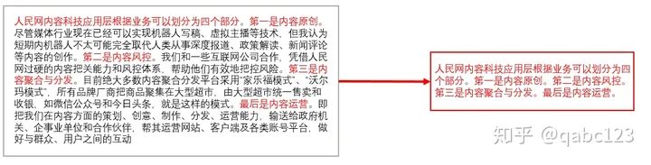

（图1）抽取式摘要

1. 常用数据集：

DUC-2001~2007 ([http://www-nlpir.nist.gov/projects/duc/data.html](https://link.zhihu.com/?target=http%3A//www-nlpir.nist.gov/projects/duc/data.html))

TAC-2008~2015 ([http://tac.nist.gov/data/](https://link.zhihu.com/?target=http%3A//tac.nist.gov/data/))

Gigawords ([https://catalog.ldc.upenn.edu/LDC2012T21](https://link.zhihu.com/?target=https%3A//catalog.ldc.upenn.edu/LDC2012T21))

LCSTS ([http://icrc.hitsz.edu.cn/Article/show/139.html](https://link.zhihu.com/?target=http%3A//icrc.hitsz.edu.cn/Article/show/139.html))

CNN/DailyMail ([https://cs.nyu.edu/~kcho/DMQA/](https://link.zhihu.com/?target=https%3A//cs.nyu.edu/~kcho/DMQA/))

2. 评价指标：

ROUGE-1, Rouge-2, ROUGE-SU4, ROUGE-L

3. 无监督抽取式方法：

无监督抽取式方法不需要平行语料对来进行训练，略去了人工标记语料的繁琐，因此在很多场景下都得到了广泛的应用。早期的无监督抽取式方法有Lead, Centroid, TextRank, ClusterCMRW, ILP以及Submodular。这些方法大多是基于统计层面的，即最大化摘要句子对原始文档的表征能力。在这些方法中，最为著名的是TextRank。

\>>TextRank[1]

TextRank的思想借鉴于网页排序算法——PageRank，是一种用于文本的基于图的排序算法。通过把文本分割成若干组成单元（句子），构建节点连接图，用句子之间的相似度作为边的权重，通过循环迭代计算句子的TextRank值，最后抽取排名高的句子组合成文本摘要。具体迭代公式为：

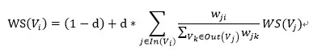

在自动摘要时，TextRank将文本中的每个句子分别看作一个节点，如果两个句子有相似性，那么认为这两个句子对应的节点之间存在一条无向有权边，句子相似度的计算公式为：

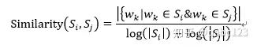

上述这些早期的无监督方法大多产生于2010年之前，之后，由于机器学习和神经网络的发展，无监督方法也发生了一些本质上的变革。在2015年的AAAI和IJCAI会议上，相继有两位研究人员提出使用Sparse Coding无监督方法来进行文本摘要。

\>>Two-Level Sparse Representation[2]

在AAAI 2015的工作（如图2）中，作者将Sparse Coding的思想融入到文本摘要任务中来，将摘要句子看作原文的稀疏编码表示，通过最大化摘要对原文句子的表征能力来学习映射参数。

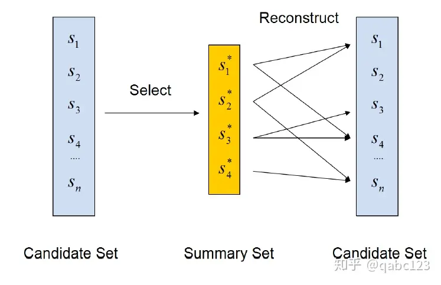

（图2）Two-Level Sparse representation

在学习相关参数时，作者主要考虑了三点，Coverage（覆盖度）、稀疏度（Sparsity）以及Diversity（多样性）。

覆盖度是指摘要句子能够尽可能覆盖原文中的主要思想，公式化定义为：

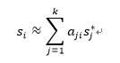

稀疏度是指摘要中句子数要比较少，公式化定义为：

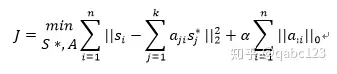

多样性是指摘要中每条句子所表达的意思尽可能的不同，从而避免语义上的重复，公式化定义为：

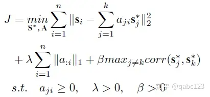

\>>RA-MDS[3]

与上述方法不同的是，本篇论文在使用Sparsed Coding时，融入了更为精细的语法单元，即名词和动词短语来对原文进行压缩；除此之外，为了提高最终生成的摘要的质量，作者还对相关的命名实体进行了改写。作者将本方法(Ours)与AAAI 2015 (MDS-Sparse)中的Spared Coding方法进行了对比（如图3）：

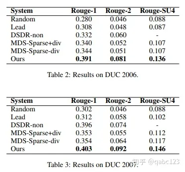

（图3） 对比结果

\>>DAE[4]

这篇论文在处理无监督抽取式摘要问题时分为三个步骤（如图4）：

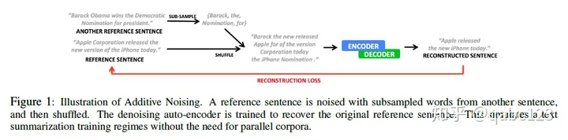

（图4）DAE流程图 Denoising Auto-Encoders

第一步是对现有的句子进行扩增，采用的方法是从语料集中随机采样一部分的短语或单词进行打乱，然后加入到现有的句子中，组成较长的句子；

第二步是按照Encoder-Decoder摘要框架对长句子进行压缩；

第三步是构建损失函数使得第一步中的句子与第二步压缩后的句子尽量相同。

\>>PACSUM (ACL 2019)

这篇论文的整体框架是基于TextRank，Centroid等传统的基于图的摘要方法，但是有两方面的创新：

其一是在句子表示中引入了BERT模型来捕获句子的深层语义信息，其二是图网络中使用位置信息来判断句子之间的指向关系，从而将传统的无向图转换成有向图，提高模型准确率。最后，作者对各个模型的效果进行了对比（如图5）：

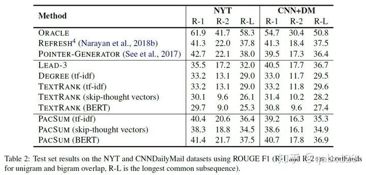

（图5）对比实验

4. 有监督抽取式方法：

随着机器学习和深度学习技术的发展，抽取式摘要的研究逐渐偏向于有监督方向。在有监督方法中，文本摘要被看作**二分类问题**，通过神经网络来学习句子及其标签之间的对应关系。常见的方法包括R2N2，NeuralSum，SummaRuNNer以及REFRESH。

**使用相同结构提取句子信息或构建句子向量，可选地让句子向量之间互相做自注意力，每个句子的位置会生成评分，按照评分从大到小选择句子作为摘要。评分函数可使用回归函数 Regression function**

\>>R2N2[6] 

**利用了 Constituency Parsing 成分句法分析解析树来构建顶层节点向量（句子）和底层节点向量（单词），同时也结合了句子或单词本身的向量编码，以生成评估函数。贪心地，仅选择句子和顶层节点向量构建评估。综合地，使用单词和底层节点向量 以及句子 以一定比例混合生成综合评分。**

作者使用人工定义的14个特征（包含词级、短语级和句子级）来表示句子，同时使用递归神经网络来建模句子向量与其标签之间的映射关系。递归神经网络可以模拟句子内部各元素之间的语义依存关系，更好地学习语义特征。模型框架如图6：

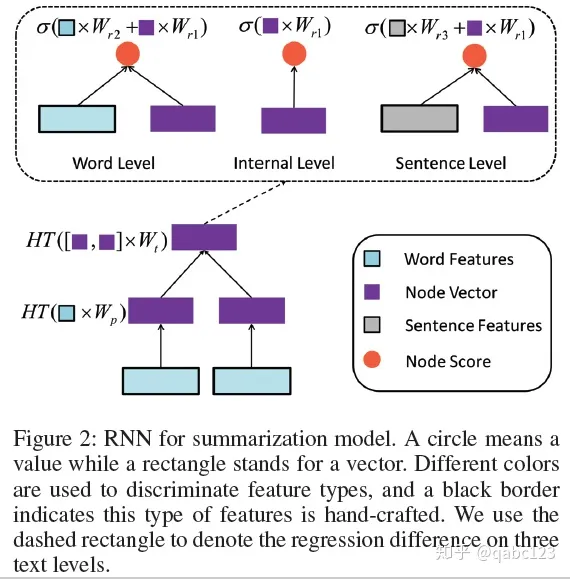

（图6）R2N2结构图

\>>NeuralSum[7]

相比R2N2，NeuralSum方法使用卷积神经网络和循环神经网络来提取句子特征，从而改善了传统人工特征的不准确性。

\>>SummaRuNNer[8]

相比NeuralSum，SummaRuNNer创新点包括两方面：其一是使用分层神经网络提取句子的特征，捕获了单词，句子和文档之间的分层关系。其二是在句子建模过程中引入了位置信息向量，最终每个句子的向量由一下六部分组成：

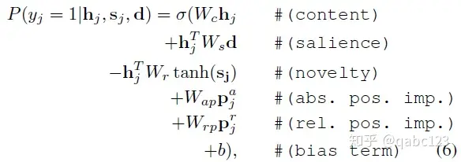

（图7）SummaRuNNer公式

\>>BertSum[9]

第一篇将Bert应用到抽取式摘要中，并在Bert Baseline模型的基础上，在每句话前面都添加了[cls]，以此来得到每句话的特征。最后经过了Summarization层得到摘要。作者在Summarization层采用了三种方法：（1）通过矩阵运算直接得到分类器（2）在分类器前加入Transformer（3）在分类器前加入RNN。各个方法的实验结果如图8：

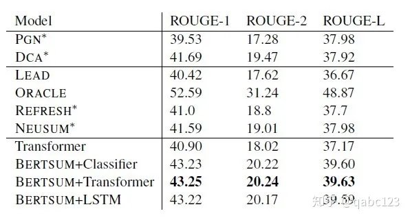

（图8）BertSum实验对比

**关于 BertSUM，我的理解是，它使用 Bert 为每个句子生成句子向量，主要是从 CLS token 提取。然后输入这些句子向量，在为每个句子向量接入分类器前，可以再使用 transformer 或 LSTM（RNN）让这些句子向量做充分的交互，也可以不加这些。最后根据分类器给出的评分选择高评分的句子作为摘要。**

> 您的理解是完全正确的！BertSUM确实是这样工作的：
>
> 1. **句子向量生成**：BertSUM首先使用BERT模型为每个句子生成句子向量，主要是从CLS token提取的。
> 2. **句子向量交互**：然后，可以选择是否在为每个句子向量接入分类器前，使用Transformer或者LSTM（一种RNN）让这些句子向量做充分的交互。这一步是可选的，但可以帮助模型捕捉句子之间的关系。
> 3. **摘要生成**：最后，根据分类器给出的评分选择高评分的句子作为摘要。
>
> 这种方法充分利用了BERT的强大语义表示能力，以及Transformer或者LSTM的句子交互能力，从而能够生成高质量的抽取式摘要。希望这个回答能够帮助您！😊

\>>STRASS

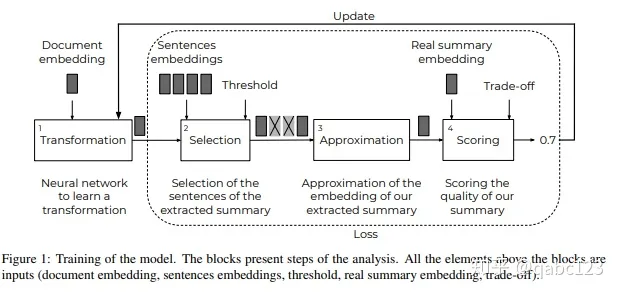

（图9）STRASS结构图

这篇论文（如图9）使用了Transformation层来选择与原文向量最相近的句子向量来组成摘要，通过最小化Extractive Summarization与Groud Truth向量的相似度来学习转义网络参数，由于Transformation只有一层，因此可以在CPU上快速的训练，提高效率。

Transformation: Y = f(X) = W X + b

Selection: similar_cos(f(X), sent2_vec) -> [-1, 1] ,  cos_new = (cos(x, y) + 1) / 2, 

(cos_new - mean) / std + 0.5 ---> ncos_new

sel = sigmoid( ncos+_new - t) -> [0, 1] > theta t, 归一化和以 0.5 为中心的 Cos 相似度。正类即被选中。

Approximation: sum of (sent_emb * word_count * sel)

Scoring with compression ratio. 输出更短的句子。用 lamda 去平衡 （1-lamda）相似性和 lamda 摘要长度（生成摘要长度/全文长度）。

5. 参考文献：

[1]. Mihalcea R, Tarau P. Textrank: Bringing order into text[C]//Proceedings of the 2004 conference on empirical methods in natural language processing. 2004: 404-411.

[2]. Liu H, Yu H, Deng Z H. Multi-document summarization based on two-level sparse representation model[C]//Twenty-ninth AAAI conference on artificial intelligence. 2015.

[3] Li P, Bing L, Lam W, et al. Reader-aware multi-document summarization via sparse coding[C]//Twenty-Fourth International Joint Conference on Artificial Intelligence. 2015.

[4] Fevry T, Phang J. Unsupervised Sentence Compression using Denoising Auto-Encoders[J]. arXiv preprint arXiv:1809.02669, 2018.

[5] Zheng H, Lapata M. Sentence Centrality Revisited for Unsupervised Summarization[J]. arXiv preprint arXiv:1906.03508, 2019.

[6] Cao Z, Wei F, Dong L, et al. Ranking with recursive neural networks and its application to multi-document summarization[C]//Twenty-ninth AAAI conference on artificial intelligence. 2015.

[7] Cheng J, Lapata M. Neural summarization by extracting sentences and words[J]. arXiv preprint arXiv:1603.07252, 2016.

[8] Nallapati R, Zhai F, Zhou B. Summarunner: A recurrent neural network based sequence model for extractive summarization of documents[C]//Thirty-First AAAI Conference on Artificial Intelligence. 2017.

[9] Liu Y. Fine-tune BERT for Extractive Summarization[J]. arXiv preprint arXiv:1903.10318, 2019.

[10] Bouscarrat L, Bonnefoy A, Peel T, et al. STRASS: A Light and Effective Method for Extractive Summarization Based on Sentence Embeddings[J]. arXiv preprint arXiv:1907.07323, 2019.

https://zhuanlan.zhihu.com/p/79223454

Fine-tune BERT for Extractive Summarization

https://github.com/nlpyang/BertSum