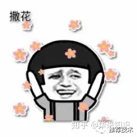

# 知识蒸馏

在离线环境下，会同时训练两个模型：一个学生模型和一个教师模型。其中教师模型额外利用了优势特征，则准确率更高。将教师模型蒸馏出来的知识传递给学生模型，辅助其训练，提升学生的准确率。线上服务时，只用学生模型进行部署，由于输入中不依赖优势特征，则保证了线上线下特征的一致性。本文中的蒸馏知识是通过教师模型中的最后一层输出进行传递。作者给这个**模型起名为PFD**。

和一般的蒸馏模型（MD）不同的是，一般我们在MD中，教师和学生用的是相同的输入特征，而模型复杂度有差异，比如教师模型往往用更深的深度网络，来指导浅层网络的学生模型。在PFD中，**教师和学生的网络模型是一致的，输入特征却不一致**。MD和PFD的对比如下图：

当然啦，作者也尝试了MD+PFD的套餐组合，进一步升级了模型，取得了更好的效果。**叠加大法就是好~**

效果自然是棒棒咯。本模型在手淘的信息流推荐场景，运用在了粗排阶段的CTR预估、和精排阶段的CVR预估两个阶段上。在AB测试下，粗排阶段的CTR有5%的提升，精排阶段的CVR有2.3%的提升。

其实这篇文章的解析到此可以结束了，但不排除有一些积极向上的同学，一定非常想了解模型的细节和更多的奥妙之处，那，那我也只能勉为其难继续啃原文（非常期待以后有中文写作的会议。。。）

**专业版**

好了，下面进入**VIP用户时间**。VIP多了些啥？先给你们画个大饼。

来看，这张图就是手淘推荐的流程框架图。所有的商品从入池到推荐给用户，会经历三个阶段：召回、粗排、精排。这三个阶段待打分的商品数会逐渐减少，模型会越来越复杂。

**粗排：**作为夹心饼干的中间层，粗排其实是有点小尴尬的。粗排的做法是传统的内积模型，把用户侧和商品侧作为双塔，在请求时，把用户侧的向量和候选商品向量进行内积运算，从而对商品池做粗筛。有一些交叉特征是对粗排效果影响明显的，比如用户在过去24个小时内在待预估商品类目下的点击次数。但是复杂的交叉特征会增加线上的推理延时，所以不能作为常规特征来训练。于是**交叉特征就成为了粗排阶段的优势特征**。

**精排：**在精排阶段，用户在商品页的行为对CVR的预估非常有用，但是线上服务时**是无法获取这类后验特征的**。于是在精排CVR预估中，这类特征就是优势特征。

**蒸馏：**下面介绍蒸馏方法。令X表示普通特征，X*表示优势特征，y表示标签，L表示损失函数，则特征蒸馏的目标函数抽象如下：

其中下标s表示student，d表示distillation，t表示teacher。从公式可以看出，教师网络的输入里包含普通特征和优势特征。这个公式下是将教师网络先训练好，然后指导学生网络。也可以同步更新教师网络和学生网络，减少训练时长，则公式如下：

作者提到了**这种方法可能带来训练的不稳定**，尤其是训练初期，教师模型自己还没有学好，就来指导学生模型，是有可能导致训练偏离正常的。因此λ参数就很重要，初期可以设为0。算法流程如下：

**统一蒸馏：**走到这里，可以考虑将MD和PFD合在一起做进一步提升了。更强的教师模型怎么选择呢？这里感觉还是比较巧妙的，本文直接拿精排的CTR模型来做粗排的教师模型，所以**也就是让粗排反向学习精排的打分结果**。

在精排阶段的蒸馏，还是如之前所述，主要是考虑了一些后验特征。那整个粗排+精排阶段的模型框架，就是这样：

**别慌，你品，你细品**，一定是能看懂的 

**实验：**实验部分我们主要看下AUC，毕竟我们知道，在现在推荐模型已经比较成熟的情况下，AUC的提升已经日趋艰难。一个很明显的现象是，随着训练天数的增多，模型的优势会增大。

线上的效果也有相应的提升，在一开始我们就总结了，粗排阶段的CTR有5%的提升，精排阶段的CVR有2.3%的提升。

好了，到了总结时间。总的来讲这篇文章不难读，思路也比较朴素，对于工业应用还是比较有借鉴意义的。难度可能还在于实践，**毕竟教育是一件很困难的事情**，老师自己什么水平知道不？老师的教育水平怎样知道不？学生学成啥样知道不？学生在外怎么造作知道不？**这些都是不可控因素**。不管怎样，了解了蒸馏大法在推荐中的应用，也是埋下了一颗种子，提供了一个思路，不多说，撒花，庆祝~！

**参考文献**

1. Privileged Features Distillation at Taobao Recommendations

## Reference

[1] https://zhuanlan.zhihu.com/p/161930307

[2] knowledge Distillation: A survey

