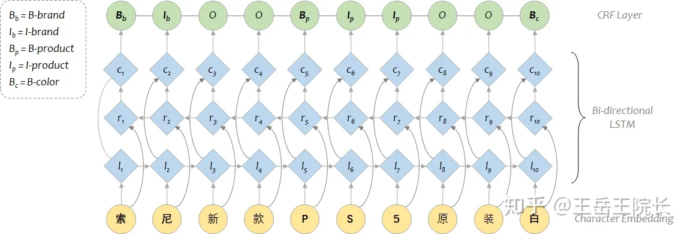
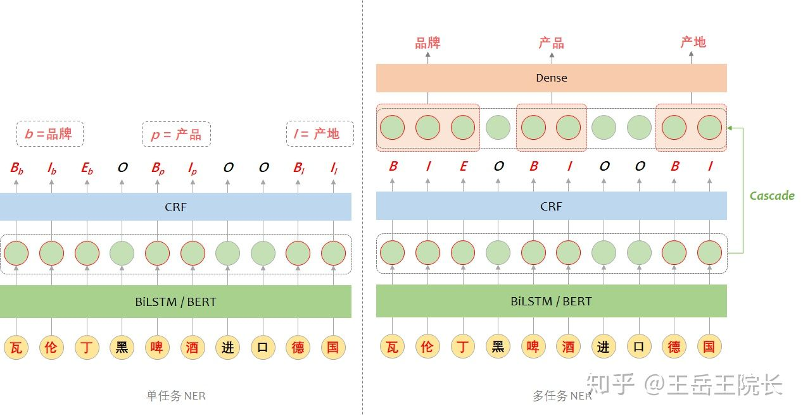
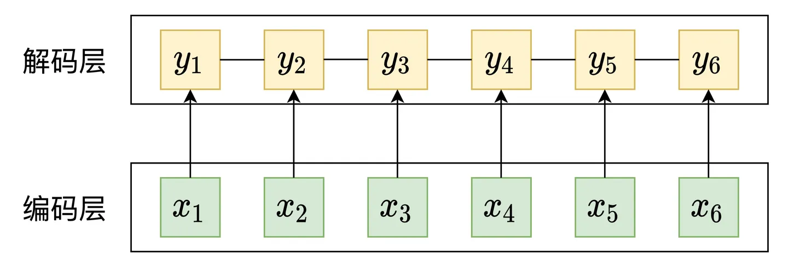
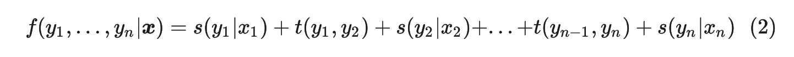
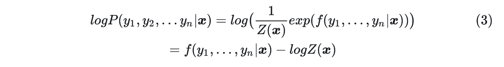
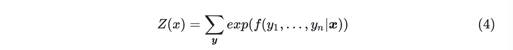

# 命名实体识别

## 前言

这篇文章的目的是对命名实体识别领域进行较为全面的综述，包括**数据集，评估指标，传统模型，前沿模型，发展方向，个人思考**等几大块，目的是为初学者提供一个较为前沿且易懂的学习文章。本文篇幅较长，请耐心阅读，别放在收藏内吃灰哦。

## NER简介


BIO / BIOES

LSTM - CRF / Bert - CRF

CRF: log likelihood 和 **transition matrix**






```python
self.inputs_seq = tf.placeholder(shape=[None, None], dtype=tf.int32, name="inputs_seq") # B * (S+2)
self.inputs_mask = tf.placeholder(shape=[None, None], dtype=tf.int32, name="inputs_mask") # B * (S+2)
self.inputs_segment = tf.placeholder(shape=[None, None], dtype=tf.int32, name="inputs_segment") # B * (S+2)
self.outputs_seq = tf.placeholder(shape=[None, None], dtype=tf.int32, name='outputs_seq') # B * (S+2)

# B, Batch 
# S + 2, Sequence with CLS, SEP.

logits_seq = tf.layers.dense(hiddens, vocab_size_bio) # B * (S+2) * V

log_likelihood, transition_matrix = tf.contrib.crf.crf_log_likelihood(logits_seq, self.outputs_seq, inputs_seq_len) # B * (S+2) * V, B * (S+2), B
				
  			#  B * (S+2), 
        preds_seq, crf_scores = tf.contrib.crf.crf_decode(logits_seq, transition_matrix, inputs_seq_len) 
```

条件随机场（Conditional Random Field，CRF）是一种用于预测序列数据标签的统计建模方法。在CRF中，log likelihood和transition matrix都是关键概念。

1. Log Likelihood：对数似然函数是衡量模型拟合观察数据好坏的一个重要指标。在CRF中，我们希望**最大化对数似然函数以找到最优参数**。具体来说，在线性链条件随机场中，给定输入序列x和输出序列y下的对数似然函数可以表示为：

   L(θ) = log P(y|x;θ) = ∑_i (θ·f(x, y_i, y_{i-1})) - log Z(x)

   其中 θ 是模型参数；f(x, y_i, y_{i-1}) 是特征函数；Z(x) 是归一化因子。

2. Transition Matrix：转移矩阵描述了状态之间转换的概率分布。在CRF中，这个矩阵通常被包含在特征函数里面，并通过训练数据学习得到。

例如，在命名实体识别任务（Named Entity Recognition）中使用 CRF 模型时，“B-PER”、“I-PER”、“O”等可能会作为状态存在。“B-PER” 到 “I-PER”的转移概率、"I-PER" 到 "O" 的转移概率等就会存储在 transition matrix 中。而 log likelihood 则用于评估在给定模型参数下，观察到实际标签序列的概率。通过最大化 log likelihood，我们可以找到最优的模型参数。


**（2）假设输出之间的关联仅仅发生在相邻位置，并且这种关联是指数可加的。**



意味着可将 进一步简化，如上图：



其中 表示发射分数， 表示转移分数。发射分数 已经通过LSTM\BERT模型编码得到了，**没有的是标签的转移分数** ，这正是我们需要学习的参数。


接下来，

为了训练CRF模型，我们可以使用对数极大似然方法来计算损失函数，也就是 



前面的 比较好计算，直接套用公式(2)计算即可，最难计算的就是归一化因子 



它表示对**所有可能的路径的打分**进行指数求和，计算归一化因子也是许多概率图问题的一大难题。如果序列的长度为 ，序列中每一帧的标签数为 ，那么所有可能的路径数为 ，指数级别增长非常大。

比较幸运的是CRF采用的马尔科夫假设只需要**考虑相邻标签的关系**，因此我们可以用动态规划算法来循环的计算归一化因子 。

## Reference

[1] A Survey on Deep Learning for Named Entity Recognition

[2] CLUENER2020: FINE-GRAINED NAMED ENTITY RECOGNITION DATASET AND BENCHMARK FOR CHINESE  -- 一个2020年最新的中文命名实体识别数据集

[3] LTP: A New Active Learning Strategy for Bert-CRF Based Named Entity Recognition

[4] Few-Shot Named Entity Recognition: A Comprehensive Study

[5] FLAT- Chinese NER Using Flat-Lattice Transformer

[6] Empirical Analysis of Unlabeled Entity Problem in Named Entity Recognition

[7] Lex-BERT- Enhancing BERT based NER with lexicons

