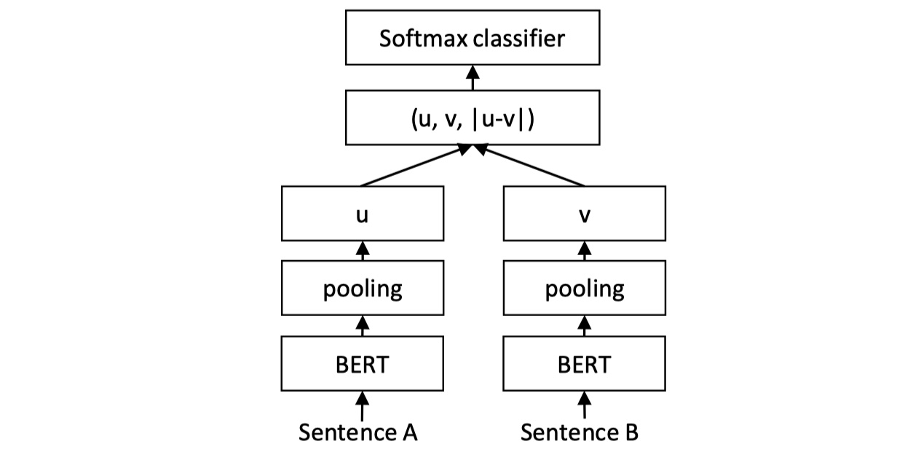
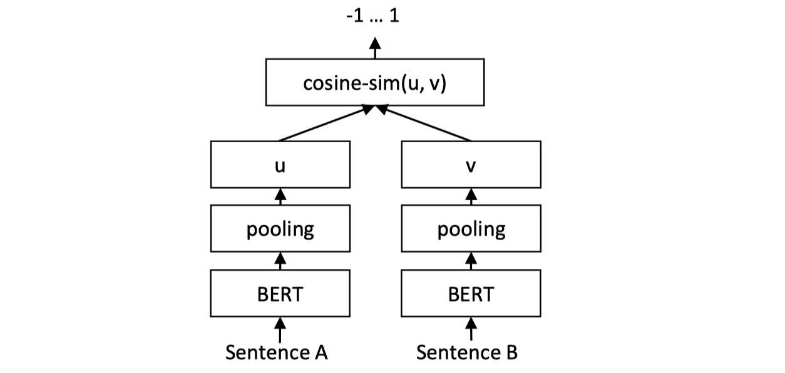
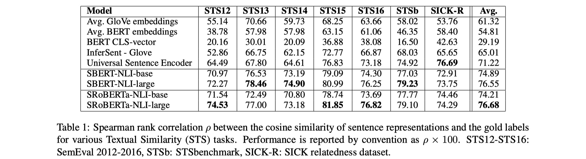
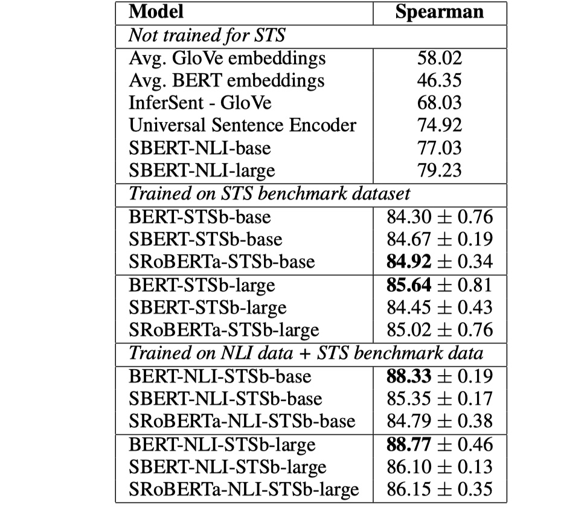
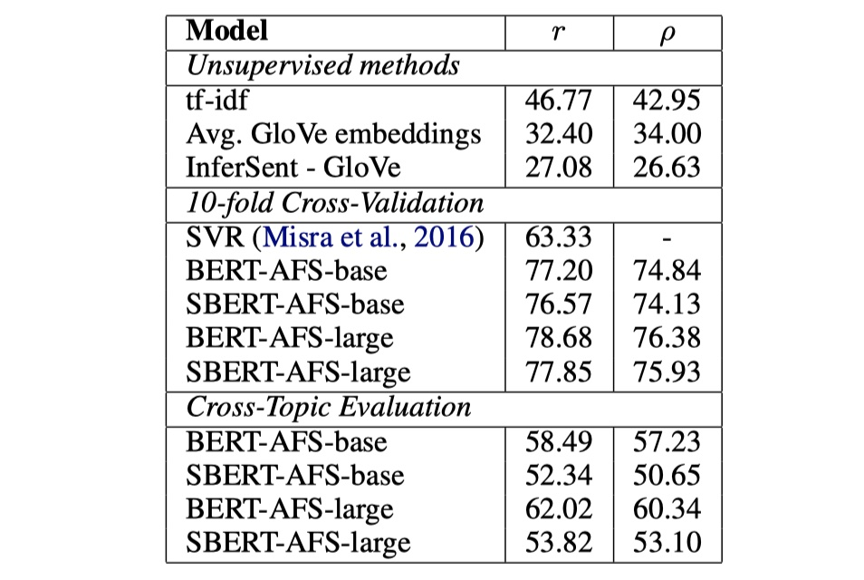
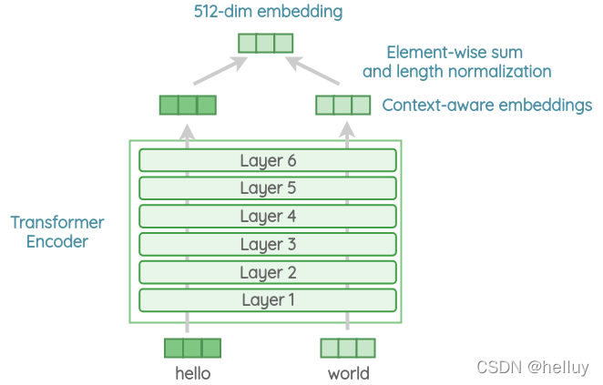
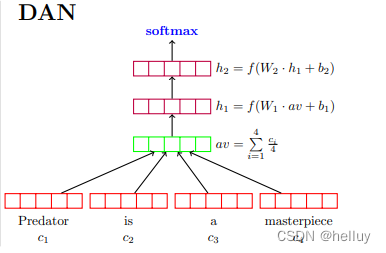
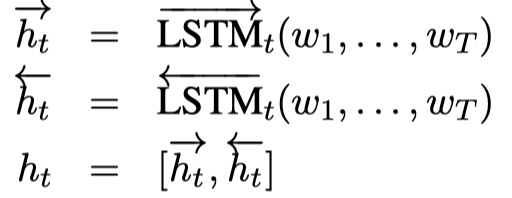
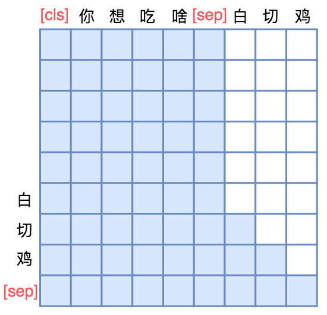
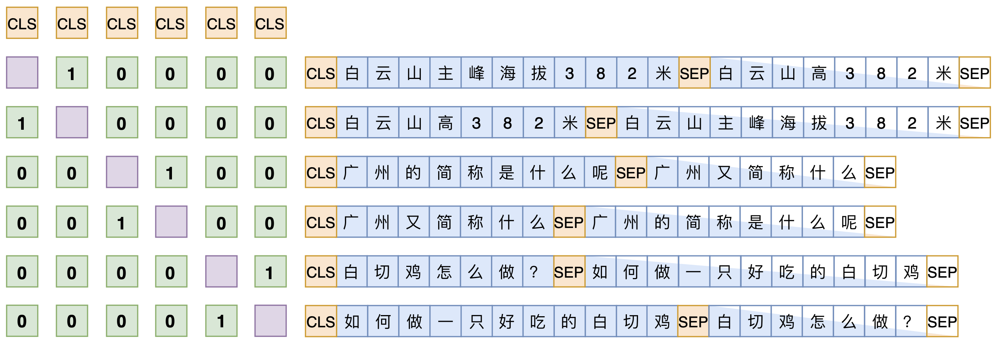

# 文本相似度

tags: NLP

500 questions ： 18.5.6 如何做语义匹配？

---

[TOC]

## 前言

文本匹配算是一个基础性的任务，其可以应用到其他上游任务中如：信息检索，问答系统，对话等，这些上游任务本质上还是文本匹配的机制，只不过关注的核心在于，不同的任务需要不同的匹配机制。

## 文本匹配简介

### 0. 问题简介

文本匹配在信息检索，自动问答等任务有着广泛的应用，而随着文本匹配逐渐从传统的文本匹配模型向深度文本匹配模型转移，在不同任务上的应用也有很大的改变。

文本匹配问题可以简述为，一个样本中有两段文本：$s_1, s_2$， 在搜索引擎中，二者分别为查询项和文档；在问答系统中，两者分别为问题和答案， 文本匹配的目的是预测二者之间的匹配程度 $r$。

在实际开发中，问题往往会抽象成一个排序问题，即给定一段文本 $s_1$， 然后给定另一个文本列表，其中包含多个文本段$S_2$， 目标是在这个文本列表中筛选出与给定文本 $s_1$ 匹配的文本。 文本匹配模型回计算 $s_1$ 与 其他文本的相似度。

最关键的是，语义匹配详细可以划分为5个子任务，分别是：

- 相似度计算
- 问答匹配
- 对话匹配
- 自然语言推理
- 信息检索中的匹配
- 阅读理解匹配

### 1. 文本匹配的挑战

- 词语匹配的多元性： 不同词可以表示同一个语义； 同一个词在不同语境下会有不同的语义。
- 短语匹配的结构性：中文中这种词非常常见， 如：“机器学习” 与 “学习机器” 是两个不同的概念
- 文本匹配的层次性：文本是以层次化的方式组织起来的，词语组成短语，短语组成句子，句子形成段落，段落形成篇章，在设计模型时，如何考虑不同层次的匹配信息是十分重要的。

### 2. 深度学习文本匹配模型[3]

根据特征提取的不同方式，深度学习在文本匹配模型中的应用大致可分为三类：

- 基于单语义文本表达的深度学习模型： 将单个文本表达成一个稠密向量，然后计算两个向量之间的相似度来作为文本的匹配度[1]   [2]。
- 基于多语义文本表达的深度学习模型：认为单一粒度的向量来表示一段文本不够精细，需要多语义的简历表达，即分别提取词，短语，句子等不同级别的表达向量，再计算不同粒度向量间的相似度作为文本间的匹配度
- 直接建模匹配模式的深度学习模型：认为匹配问题需要更惊喜的建模匹配的模式，即需要更早的让两段文本进行交互，然后挖掘文本交互后的模式特征，综合得到文本间的匹配度。

## 单粒度语义文本表达

### 1. DSSM,2013

### 2. CSDDM, 2014

ARC-I -- 卷积

CNTN -- 卷积

LSTM-RNN

## 2. 多粒度语义文本表达

MultiGranCNN

<https://github.com/NTMC-Community/awesome-neural-models-for-semantic-match>

<https://github.com/sebastianruder/NLP-progress/blob/master/english/semantic_textual_similarity.md>

## MANM

## Reference

[1]  Siamese Recurrent Architectures for Learning Sentence Similarity

[2]  Learning Text Similarity with Siamese Recurrent Networks

[3]  深度文本匹配综述

[3] 

## Sentence-BERT模型

BERT模型在各种NLU任务中基本上是都远超传统的深度学习模型，但是仍然有不足。譬如在文本匹配(or文本相似度计算)任务中，BERT的做法是：将两个句子用[SEP]token连接起来作为一个句子，再输入到BERT中。但是这么做的缺点是：当我们的数据量特别大的时候，论文说的是从10000个句子中找到与目标句子最为相似的句子，花费的时间为65小时，这显然是非常低效的。另外，也有研究人员将单个句子输入到BERT当中，对最后一个transformer layer进行平均或者只使用[CLS]token的张量，但是效果还不如GloVe embedding。于是，为了降低文本匹配的计算量与时间，并得到好的sentence embedding，就有了Sentence-BERT模型。

### Sentence-BERT模型架构

根据不同的数据组织形式，SBERT有着不同的结构。在论文当中，提出了三种情况下的模型结构，如下：

- 当输入数据是[sentence1,sentence2,label]，label是离散的，(对应的任务有NLI/RTE)，具体结构如下：

这个结构完全借鉴于InferSent模型，只不过是将BILSTM部分用BERT来进行替换，注意：两个句子使用的BERT部分共享权重。对于BERT部分输出的结果，论文中探究了不同的pooling策略：只使用[CLS]token对应的张量、使用Global max pooling、使用Global avg pooling。(最终是avg pooling策略或者只使用[CLS]token对应的张量最好，这与InferSent中所得出的结论是不一样的，InferSent中使用max pooling最好)。得到𝑢 和𝑣这两个句向量之后，然后再进行拼接，在这里，去掉了𝑢∗𝑣这一部分，因为实验表明，加了这一部分，效果反而下降了。最后将拼接后的结果输入到softmax中进行分类即可。loss function采用交叉熵。数据采用SNLI和MultiNLI进行fine-tune，pre-train直接采用使用wikipedia预训练得到的权重即可。

> 优化器采用Adam，16 batch size，warm up 16%，pooling策略是avg。

- 当输入数据是[sentence1,sentence2,label]，label是连续的，(对应的任务有STS(语义相似度计算))，具体结构如下：

整体结构与第一种相同，不同的地方是：在得到各自的句向量之后，我们使用余弦相似度来进行度量，当然也可以使用其他的譬如皮尔森相关系数。loss function采用MSE。注意：论文里说没有任何与STS相关的数据进行训练，也就是说，在使用第一种架构进行fine-tune之后，我们将拼接与softmax给拿掉，换成cosine similarity就可以了。

- 当输入数据是[query，positive_answer，negative_answer],（对应的任务有问答匹配)，具体结构与第一种结构相同，但是采用的loss function为triplet loss，公式如下：

𝑙𝑜𝑠𝑠=𝑚𝑎𝑥(||𝑠𝑎−𝑠𝑝||−||𝑠𝑎,𝑠𝑛||+𝜖,0)

也就是说，我们希望query与positive answer的距离比query与negative answer的距离要小至少𝜖。这样的话，譬如在问答匹配里面，我们最后就会更加倾向于召回正确的回答，而不是错误的回答。在论文中，衡量query句向量与答案句向量之间的距离采用的是欧几里得距离，𝜖=1。

### 实验结果

从结果来看，确实要比普通的InferSent或者USE要好。另外，我觉得这篇论文更大的意义在于实际应用吧，整体没有太大的创新。

## Universal Sentence Encoder模型

打算再来看一下sentence embedding的部分吧，因为之前被问到了，我却只答上了InferSent以及一些普通的方案。。。惭愧啊。其实除了InferSent之外，USE也是非常著名的一个模型，下面具体讲解一下～大致来说，就是USE有两个encoder：一个是transformer，一个是DAN，前者准确率高但是计算代价大，后者准确率略有下降但是计算代价小，两者都在多个数据上进行迁移学习。

> 在处理文本数据时，长句子中的噪声往往比短句子中的要多。因此，如果简单地将所有词嵌入相加然后除以句子长度，可能会导致长句子的结果被过度稀释。
>
> 为了解决这个问题，在实际操作中我们通常会采用平方根规范化（Square Root Normalization）来处理。具体来说就是将词嵌入向量之和除以句子长度的平方根。公式如下：
>
> E = (e1 + e2 + ... + en) / sqrt(n)
>
> 其中 E 是最终得到的词嵌入向量，e1, e2, ..., en 是各个词语对应的词嵌入向量，n 是句子长度。

ChatGPT

Universal Sentence Encoder（USE）是一种用于句子级别嵌入的深度学习模型，旨在将句子映射到高维空间中的向量。这些向量可以用于各种自然语言处理任务，如句子相似度计算、文本分类和聚类等。USE有两种主要的架构变体：Transformer版本和深度平均网络（DAN）版本。

### 1. Transformer版本

这个版本的USE基于Transformer架构，它是一种广泛用于自然语言处理的深度学习模型。Transformer模型的核心是自注意力机制，可以捕获句子中单词之间的复杂关系。USE的Transformer版本通常具有以下结构：

- **输入层**：将输入句子的单词转换为词嵌入向量。
- **位置编码**：为每个词嵌入添加位置信息，以保留句子中词的顺序。
- **自注意力层**：多个自注意力头并行处理词嵌入，捕获单词之间的上下文关系。
- **前馈网络**：在自注意力层之后，对每个位置的输出应用一个前馈神经网络。
- **池化层**：将所有词的输出向量汇总成一个句子级别的嵌入向量。这通常是通过对所有词嵌入进行平均或最大池化来实现的。

### 2. 深度平均网络（DAN）版本

DAN版本的USE是一种更轻量级的模型，适用于需要较低计算资源的场景。它的结构如下：

- **输入层**：将输入句子的单词转换为词嵌入向量。
- **平均池化层**：对所有词嵌入进行平均，得到一个代表整个句子的向量。
- **深度前馈网络**：将平均后的向量通过一个或多个前馈神经网络层进行处理，以捕获句子的高级特征。
- **输出层**：生成最终的句子嵌入向量。

总的来说，USE的两个版本都旨在将句子编码为密集向量，以便在各种自然语言处理任务中使用。Transformer版本更适合捕获复杂的句子结构，而DAN版本在计算效率方面更有优势。

Universal Sentence Encoder (USE) 的预训练任务通常包括以下几种：

1. **句子级别的任务**：这些任务旨在捕捉句子的整体含义。例如，USE 可能会被预训练来预测句子中缺失的单词或预测句子的下一个单词，以帮助模型学习句子的语义。
2. **句子对任务**：这些任务涉及成对的句子，并旨在训练模型理解句子之间的关系。一个常见的任务是自然语言推理（Natural Language Inference, NLI），其中模型需要判断一个句子（前提）是否蕴含、矛盾或与另一个句子（假设）无关。另一个任务是句子相似度评估，模型需要判断两个句子的语义相似度。
3. **多任务学习**：为了提高模型的泛化能力和鲁棒性，USE 通常会同时在多个任务上进行预训练。这意味着模型会同时学习处理句子级别和句子对级别的任务，从而获得更全面的语言理解能力。比如拿句子向量去做文类，情绪识别这些。

通过这些预训练任务，USE 能够学习到丰富的语言表示，使其能够在下游任务中有效地处理各种自然语言处理问题。

## InferSent模型介绍

InferSent模型来源于2018年Facebook发表的《Supervised Learning of Universal Sentence Representations from Natural Language Inference Data》论文。这是一篇非常有影响力的工作。首先谈谈InferSent提出的原因吧：**目前word embedding已经被广泛应用了，但是大多数时候，我们想要得到的是sentence embedding，即句子的向量化表示(甚至是段落、文章的向量化表示)，只是单纯对所有word embedding相加取平均，无法提取到有意义并且丰富的语义信息，所以怎么才能提取出有意义并且丰富的sentence embedding，并且提取的方法要非常的generalize，能在各种task中得到sentence embedding，成为了一个亟待解决的问题。**从结构上来讲，InferSent是一个基于表示的文本匹配模型，但是它的真正目的是提出一种有监督的sentence embedding的学习方法，从而完成迁移学习。废话不多说，直接上图吧～

由于InferSent仍然是一种基于表示的文本匹配模型，所以整个模型架构分为两个部分，下面一一介绍～

### sentence encoder

这一步就是对premise与hypothesis两个句子进行encoder。作者尝试很多的方法，最后发现使用BILSTM+maxpooling的方式效果最好。

公式如下：

其中，𝑤𝑖表示premise或者是hypothesis的第𝑖个位置的word embedding。然后再对ℎ进行max-pooling，得到premise与hypothesis的sentence embedding：𝑢,𝑣，其中𝑢,𝑣∈𝑅2𝑑𝑚，𝑑𝑚是前向LSTM或者后向LSTM输出的维度。具体可以参见我的关于SSE的文章[SSE模型](https://codewithzichao.github.io/2020/04/29/NLP-文本匹配模型-SSE/#more)

### classifier

这一步就是将得到的𝑢,𝑣以及它们之间element-wise的difference与product进行concat，得到向量𝑚。即：

𝑚=[𝑢,𝑣,|𝑢−𝑣|,𝑢⨂𝑣]

然后将𝑚输入到dense层，激活函数为relu，最后送入softmax层中，得到最终的结果。

training details：BILSTM的输出维度为4096，使用Adam。

**Noooooooote：像word embedding，我们可以存储下来，等到要用的时候，直接查询embedding lookup table即可，但是sentence embedding不行，那么sentence embedding的本质是什么呢？其实没有所谓的sentence embedding算法，因为我们没有用来评价得到的sentence embedding的方法，我们只有将sentence embedding嵌入到下游任务中，通过下游任务的好坏，来评价得到的sentence embedding的质量。所以，我们追求的通用的sentence embedding，实际上我们是要得到一个网络架构，或者称作encoder，在InferSent中，指的就是sentence encoder模块。我们输入文本序列，能够通过encoder，得到文本序列的向量化表示。这才是sentence embedding的本质，或者说其与word embedding的不同之处[链接](https://www.zhihu.com/question/299549788)。🥰**

### 简单唠叨一下sentence embedding的发展

目前来说，得到sentence embedding的方法分为监督学习与无监督学习两大类。一般来说，使用无监督学习就可以得到比较好的sentence embedding，代表性模型有SkipThought以及FastSent。监督学习的代表性模型就是InferSent，所以InferSent真的是一项非常有影响力的工作。而目前，sentence embedding的热点是多任务学习，即在一次训练中，组合不同的训练目标。代表性模型有：Universal Sentence Encoder(Google)。大致就是这样，之后有空再更新一篇关于sentence embedding的文章吧🥰～

## InferSent模型实现

## 参考文献

Supervised Learning of Universal Sentence Representations from Natural Language Inference Data

## SimBERT[ #](https://kexue.fm/archives/7427#SimBERT)

**UniLM**的核心是通过特殊的Attention Mask来赋予模型具有Seq2Seq的能力。

理解了UniLM后，其实就不难理解SimBERT训练方式了。SimBERT属于有监督训练，训练语料是自行收集到的相似句对，通过一句来预测另一句的相似句生成任务来构建Seq2Seq部分，然后前面也提到过[CLS]的向量事实上就代表着输入的句向量，所以可以同时用它来训练一个检索任务，如下图：

SimBERT训练方式示意图

假设SENT_a和SENT_b是一组相似句，那么在同一个batch中，把[CLS] SENT_a [SEP] SENT_b [SEP]和[CLS] SENT_b [SEP] SENT_a [SEP]都加入训练，做一个相似句的生成任务，这是Seq2Seq部分。

另一方面，把整个batch内的[CLS]向量都拿出来，得到一个句向量矩阵**V**∈ℝb×d（b是batch_size，d是hidden_size），然后对d维度做l2归一化，得到**V**̃，然后两两做内积，得到b×b的相似度矩阵**V**̃**V**̃⊤，接着乘以一个scale（我们取了30），并mask掉对角线部分，最后每一行进行softmax，作为一个分类任务训练，每个样本的目标标签是它的相似句（至于自身已经被mask掉）。说白了，就是把batch内所有的非相似样本都当作负样本，借助softmax来增加相似样本的相似度，降低其余样本的相似度。

说到底，关键就是“**[CLS]的向量事实上就代表着输入的句向量**”，所以可以用它来做一些NLU相关的事情。最后的loss是Seq2Seq和相似句分类两部分loss之和。
