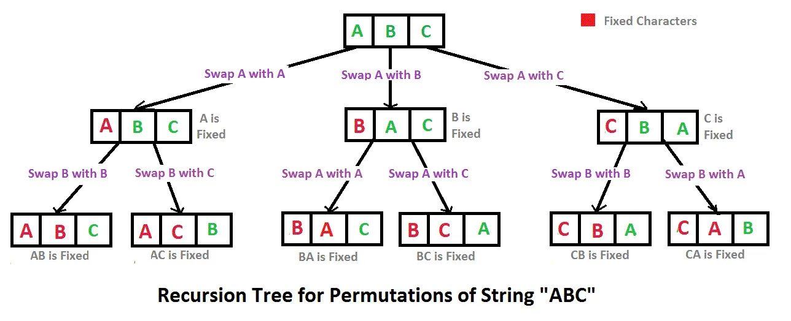
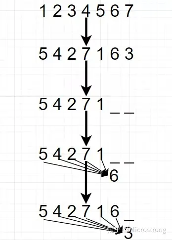
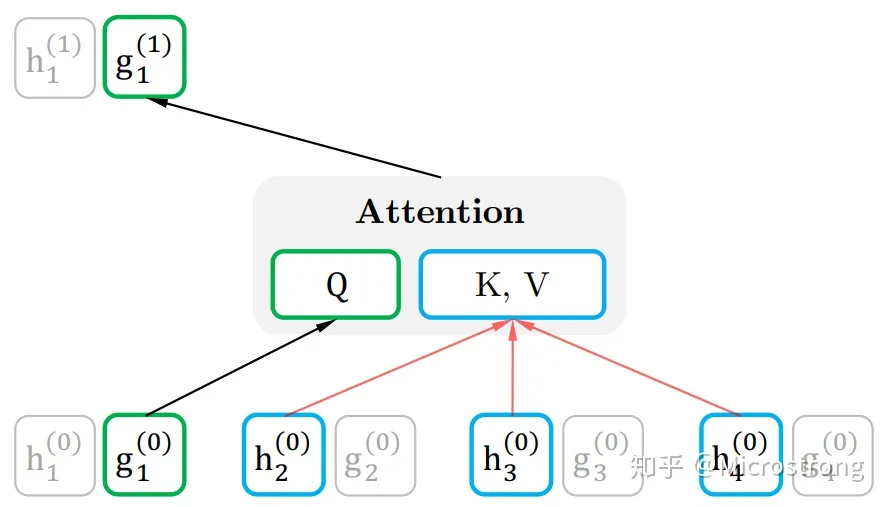
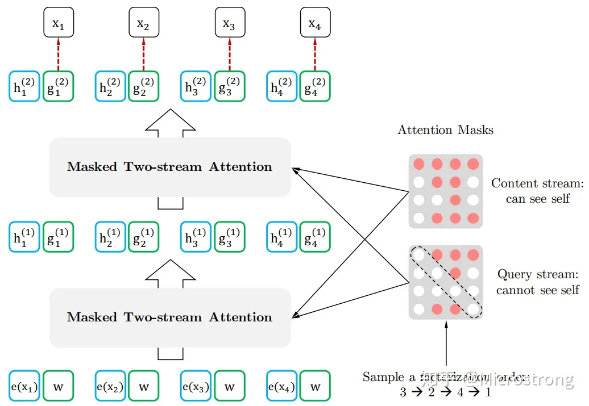
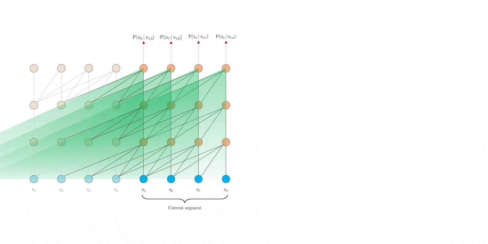

# 一文滤清预训练语言模型发展脉络

## 前言

预训练语言模型的诞生已经3年多了，其衍生的各个子领域可谓是百花齐放，这篇文章对我这几年看过的预训练语言模型方面的 paper 进行一个梳理，对于每个子领域有遗漏的欢迎大家评论补充。

这篇文章会以月为单位更新，拭目以待。

## 1. BERT 之前

### 1.1 从 Word Embedding 到 ELMO

Word Embedding 即词向量的诞生，其在13年就已经引起NLP领域的颠覆性发展，Word2vec 就是其典型代表。

考虑到词向量不能解决词的多义性问题，在 ELMO 之前，我们往往采用双向 LSTM 来减轻这种问题，但这毕竟治标不治本，对于大数据集好说， 深层双向 LSTM 的确能够很好的缓解这种问题，但对于小数据集，往往没啥效果。

为了解决这种多义性问题，ELMO 在训练语言模型时采用双向 LSTM 。 不同层的 LSTM 能够把握不同粒度和层级的信息，比如浅层的 LSTM 把握的是单词特征， 中层的 LSTM 把握 句法 特征， 深层的 LSTM 把握语义特征， 对于不同的任务来说， 不同的特征起到了不同的作用。 

举例来说： 文本分类问题为何 ELMO 与 BERT 所起到的作用与 Word2Vec 差距并不明显，这就是因为对于文本分类这类简单问题来说， n-gram 信息起到很大的作用，而这本质就是单词特征； 但对于阅读理解领域， ELMO 与 BERT 就能大幅提高模型效果，这也是因为 语法与语义特征对于阅读理解这种深层次问题是十分重要的。

ELMO 在迁移到下游任务时，会将不同层的特征采用**加权求和**的方式来获得每个词的最终表示。

事实证明， ELMO 的确解决了多义性问题， 词性也能对应起来了。

但， ELMO 的缺点也十分明显：

- **LSTM 特征抽取能力远弱于 Transformer ， 并行性差**
- **拼接方式双向融合特征融合能力偏弱**

### 1.2 Fine-tuning pretraining：  GPT 的诞生

GPT 虽然不是第一个预训练语言模型，但它的出现更具**开创意义**。其特点很明显：

- 采用**单向 Transformer** 作为特征抽取器
- 采用二阶段： 预训练 + 微调  来适配下游任务

GPT 1.0 与 GPT 2.0 的出现说明了一下几点：

- 高质量，大规模的预训练数据集是提升性能的根本
- 深层的 Transformer 模型具有更强的表示能力

至少，从目前为止， 业界还没有探索到数据与模型的极限，即仅仅堆数据，加深模型这条路，还没有走完。

## 2. 预训练新时代：BERT的诞生

GPT 虽然很强，但由于其基于 AR 模型且目前很多排行榜都是基于**自然语言理解**的，因此， GPT 在这方面无法与 BERT 的表现相抗衡。但 GPT 在生成方面是 BERT 无法比拟的， 就问你BERT： 会编故事吗？

BERT 主要分为两大部分： **Masked LM** 与 **NSP** (Next Sentence Prediction)。

BERT 由于其采用 AE 模型，MASK 操作所带来的缺陷依旧存在：

- 预训练与微调阶段不匹配的问题，这点 BERT 提供了一个策略来减轻该问题
- Mask 掉的  token 之间关系被忽略的问题

此外，由于数据量，模型都十分大，如果每次只 mask 一个token，那么整个训练过程将变得极为漫长， 文章采用 mask 15% 的操作，是一个经验性的选择，是对模型训练效果与训练时长做出了一个权衡。

至于 NSP 任务，事实证明其在句子关系上的确起到了一定的作用，对于某些任务的确有帮助，但也有文章指出，其实用处不大，这点后面会详细讨论。


减轻问题：

```text
序列：my dog is hairy
mask的词为 hairy
则 hairy 的替换过程如下：
- 80% 情况下： 用 [MASK] 替换 hairy
- 10% 情况下： 随机从词表中选择一个词来替换 hairy
- 10% 情况下： 不改变这句话，这样的目的是使得最终的表示偏向于实际的词
```

- **首先**，80% 的情况替换为 [MASK] 符合语言模型本身，最原始就是这么做的，可以参见 Word2Vec 的 CBOW。
- **其次**， 随机选择一个词来替换，我个人认为是为了增加泛化，文章也指出， 1.5%(10% * 15%) 的随机替换似乎并不会对模型的语言理解能力带来坏处。
- **最后**，10% 不做替换，目的是减少训练与微调的不匹配，使得最终的表示偏向于实际的词。

## 2. BERT 之后

BERT 之后，有诸多改进方案，无论是对语言模型进行改进，融合知识图谱进行改进，多任务学习+预训练语言模型等， 这些文章都具有很大的价值，且质量都很高，本节的目的是对最近的这些模型进行一个全面的总结，帮助人们理清思路。对此，我画了一个直观的优化图，如下图所示：

### 1. 预训练 + 知识图谱

预训练诞生之后， 在自然语言理解领域的确获得了很大的提升，尤其是在阅读理解领域，完全超过了人类的表现，虽然这并不表示真正的智能，但依旧意味着，NLP 已经逐渐走向成熟。

随之而来的问题十分明显， 如何表示知识， 有没有一种方式能够利用**大规模语料+预训练语言模型**使得模型能够学习到知识，从而应用到下游任务中。相信这个课题将是接下来一个十分核心的热点， 百度和清华就这方面做出了探讨， 具体可参加： [Bert 改进： 如何融入知识](https://zhuanlan.zhihu.com/p/69941989)

百度的文章中提出通过 mask 掉实体来获取实体的表示， 可以肯定的是，这样是能够更好的表示实体信息，但对于实体关系的把握，我个人觉得存疑，这是因为 mask 操作往往不仅仅 mask 掉一个实体，那么被 mask 掉的实体之间的关系如何把握？

我个人觉得可以设计一个**精巧的任务**来验证实体之间的关系， 可以通过知识图谱来生成一个语料， 如：

```
谢霆锋是张柏芝的__。 
```

我们来预测空白处的位置， 判断其是否为 `丈夫`， `前夫` 之类的词， 这点需要根据具体的知识图谱而定。

清华的那篇文章，其先编码实体与实体间关系信息为一个向量， 然后将向量融合如预训练语言模型中进行训练， 而实际的操作更为复杂，俺个人觉得，这条路恐怕不是正确的路，不符合大道至简的原则，且任务太多，反而会引入噪声（个人对知识图谱研究不深，只是直观感觉）。

目前来看，个人觉得百度的路是对的。

### 2. 预训练 +  自然语言生成

这部分包含两个课题： 

- **如何将 BERT 用于生成任务**
- **如何设计一个适合于生成任务的语言模型**

前面在 AR 与 AE 模型中已经介绍过为何 BERT 不适用于生成任务中， 那么随之而来的问题就是，既然预训练语言模型在自然语言理解中如此成功，那么我们怎么将其迁移到自然语言生成中呢， 这是一个很大的问题，个人觉得还需要1年以上的时间发展才能出现类似 Bert 这样的突破。

我个人前期看了两篇文章，大致提了一下思路：[Bert 之后：预训练语言模型与自然语言生成](https://zhuanlan.zhihu.com/p/70663422)

首先，对于第一个课题： **如何将 BERT 用于生成任务。** 从技术上来说， Encoder-Decoder 架构应该是首选的框架了， Encoder 输入原句子，Decoder 生成新句子，那么问题在于，Encoder 与 Decoder 如何表示？

对于 Encoder 端来说，我们只需要将 Bert 直接初始化就行；那么对于Decoder 端呢？ 也采用 Bert 初始化吗？ 要知道的是， Decoder 可是用来生成的， 如果你的 embedding 信息是通过 AE 模型训练得到的，那么生成效果估计会诡异的一批。 那么现在的问题就变成了， **如何合理的初始化 Decoder 端的 embedding 信息呢？**

然后，我们再来谈谈第二个课题：**如何设计一个适合于生成任务的语言模型。** 目前从我看到的两篇文章中有两个思路：

- MASS 通过 mask 连续的**一小段**来试图即学习到理解知识，又学习到生成知识， 通过预测一段连续的 tokens 的确有助于提高模型生成方面的能力，但我个人觉得 mask 一小段信息所提升的生成能力十分有限， 且我认为这会影响到模型理解方面的能力。
- UULM 就厉害了， 它涉及了一组语言模型： **Unidirectional LM， Masked Bidirectional LM， Seq2Seq LM**， 真的是有钱任性， 但这样直接堆语言模型的方式真的好吗？ 可以肯定的是， 不同语言模型的结合必然是接下来的一大趋势，但你这样直接堆是不是有点暴力啊，我个人感觉一般。

那么，怎么去设计一个适合于生成任务的语言模型呢？ 我个人的想法在之前的博客提到了： 就人类而言， **生成是基于理解的，而非独立的， 在大脑中， 理解与生成是两个区域， 先理解后生成，这才是正确的路。** 

因此，我个人觉得，接下来的一个思路应该是： **理解的归理解，不断提高预训练语言模型在理解领域的表现， 对于生成，采用 Encoder-Decoder 框架。** 在预训练的角度来说， 基于理解层面训练得到的模型， 然后分别初始化 Encoder-Decoder 端， 然后去预训练 Decoder 端的参数， Freeze/not Freeze Encoder 端的参数， 从而得到词在 Encoder 与 Decoder 的不同 Embedding， 然后再生成任务中的 Encoder-Decoder 中分别使用这两种 embedding。 

### 3.  预训练 + 多任务学习

多任务学习就更好玩了，目前主要有两大代表： MT-DNN 与 ERNIE 2.0。

- **MT-DNN** 又叫**联合训练**，其实就是将预训练语言模型用在多个任务中去接着预训练，从而提高模型泛化。具体来说，训练过程就是把所有数据合并在一起，每个batch只有单一任务的数据，同时会带有一个task-type的标志， 然后shuffle 之后进行训练。

- **ERNIE**  提出一个很好的思路： **Continual Learning**。 这点很有意思，就像人类做题一样， 它不像 MT-DNN 那样训练，而是这样：

  ```
  task1 --> task1,task2 --> task1, task2, task3
  ```

  即在训练后续任务时，前面的任务依旧要参与训练，主要是希望在学习后续任务时依旧记得前面任务的学习成果。

我个人觉得 ERNIE 更符合我们人类的训练方式，不过具体的两种学习方式的表现还需要对比一下。 

回想我们人类的学习方式，其最初是专题训练，即每个 task 分别训练， 然后再进行总体训练，即所有 task 一起进行训练，然后发现自己的弱点，然后适当加强对某任务的训练，然后又进行总体训练，如此反复， 过程更像是这样：

```
(task1 or task 2 or task3)--> (task1, task2), (task1, task3), (task2, task3) --> (task1, task2, task3) --> (task1 or task2 or task3) --> ...
专题训练 --> 组合训练 --> 总体训练 --> 专题训练 --> ...
```

如果要保证训练新任务时不会过分忘记前面训练所得到的成果，似乎各个任务的训练样本比例以及训练时间更加重要。比如你做了一年的阅读理解，突然让你做单向选择，你答的也不会太好。

因此，我个人觉得， **联合训练 + Continual Learning** 是一个不错的思路。

### 4. 改进语言模型

要说起改进语言模型，当首推 **XLNet**， 毕竟前段时间也是刷了榜的，通过交换 token 位置来解决 mask 所带来的预训练与微调不匹配的问题， 这似乎比 BERT 更加优秀。

但从最近的实验看来，似乎又不是那么回事， XLNet 精巧的语言模型设计有没有超越 BERT， 目前学界还没有一个定论，RoBERTa 的出现似乎验证了在同等数据集下，XLNet 并不占优势， 通过精调模型参数，**RoBERTa** 获得了十分漂亮的结果。

而 XLNet 对此予以回击，又在同等条件下对比了 XLNet 与 BERT 模型， 又说明了 XLNet 效果的确要超过 BERT，emmm， 俺也不知道该相信哪个，反正我都会试试，哪个好用哪个。

XLNet 网上讲的很多了，我就不细说了。


## **3. XLNet提出的方法** 

**3.1 Permutation Language Model**

作者发现，只要在 AR中再加入一个步骤，就能够完美地将AR与AE的优点统一起来，那就是提出**Permutation Language Model**（PLM）。




具体实现方式是，通过随机取一句话的一种排列，然后将末尾一定量的词给“遮掩”（和 BERT 里的直接替换 “[MASK]” 有些不同）掉，最后用 AR 的方式来按照这种排列依次预测被“遮掩”掉的词。



我们可以发现通过随机取排列（Permutation）中的一种，就能非常巧妙地通过 **AR 的单向方式来习得双向信息**了。


**在 XLNet 中，尽管考虑了句子的所有可能排列，但实际输入到模型的句子顺序并没有改变。模型通过调整注意力矩阵来模拟不同的排列顺序，而不是直接改变输入句子的顺序。**


**3.2 Two-Stream Self-Attention**

为了实现 Permutation 加上 AR 预测过程，首先我们会发现，打乱顺序后位置信息非常重要，同时对每个位置来说，需要预测的是内容信息（对应位置的词），于是输入就不能包含内容信息，不然模型学不到东西，只需要直接从输入复制到输出就好了。

于是这里就造成了位置信息与内容信息的割裂，因此在 BERT 这样的位置信息加内容信息输入 Self-Attention (自注意力) 的流（Stream）之外，作者还增加了另一个**只有位置信息作为 Self-Attention 中 query 输入的流**。文中将前者称为 **Content Stream**，而后者称为 **Query Stream**。

这样就能利用 Query Stream 在对需要预测位置进行预测的同时，又不会泄露当前位置的内容信息。具体操作就是用两组隐状态（hidden states） 和 。其中 只有位置信息，作为 Self-Attention 里的 Q。 包含内容信息，则作为 K 和 V。具体表示如下图所示：



图：Query stream attention

假如，模型只有一层的话，其实这样只有 Query Stream 就已经够了。但如果将层数加上去的话，为了取得更高层的 h，于是就需要 Content Stream 了。h 同时作为 Q K V。如下图所示：


图：Content stream attention

于是组合起来就是这样：



图：基于双流注意力机制的排序语言模型

上图中我们需要理解两点：

- 第一点，最下面一层蓝色的 Content Stream 的输入是 ，这个很好懂就是 对应的词向量 (Embedding)，不同词对应不同向量，但看旁边绿色的 Query Stream，就会觉得很奇怪，为什么都是一样的 ？这个和Relative Positional Encoding 有关。
- 第二点，Query stream attention图中为了便于说明，只将当前位置之外的 h 作为 K 和 V，但实际上实现中应该是所有时序上的 h 都作为 K 和 V，最后再交给上图中的 Query stream 的 Attention Mask 来完成位置的遮盖。


《Transformer-XL: Attentive Language Models Beyond a Fixed-Length Context》围绕如何建模长距离依赖，提出Transformer-XL（XL是extra long的意思）：

- 提出**片段级循环机制(segment-level recurrence mechanism)**，引入一个**记忆(memory)**模块（类似于cache或cell），循环用来建模片段之间的联系。这使得长距离依赖的建模成为可能；也使得片段之间产生交互，解决上下文碎片化问题。
- 提出**相对位置编码机制(relative position embedding scheme)**，代替绝对位置编码。在memory的循环计算过程中，避免时序混淆，位置编码可重用。

**Transformer-XL总结**：片段级循环机制为了解决编码长距离依赖和上下文碎片化，相对位置编码机制为了实现片段级循环机制而提出，解决可能出现的时序混淆问题。也可以简单的理解Transformer-XL=Transformer + RNN，即segment-wise的RNN模型，但是RNN模型的组件是Transformer的Encoder模块。


### 5. 预训练 + 中文领域

十分推荐： [BERT-WWM](<https://github.com/ymcui/Chinese-BERT-wwm>)

对于中文领域，分词还是分字一直是一个问题，那么，到底是选分词，还是分字，这一直是一个大问题。 

BERT 无疑选择了分字这条路， ERNIE 通过融入知识，其实带来了部分分词的效果，那么在预训练语言模型中，分词到底有没有用， BERT-WWM 给出了答案。

通过采用 mask 词的方式， 在原有的 BERT-base 模型上接着进行训练， 这其实有种 词 + 字 级别组合的方式， 我在 [深度学习时代，分词真的有必要吗](<https://zhuanlan.zhihu.com/p/66155616>) 中就有提到 字级别 与 词级别之间的差别， 而预训练语言模型能很好的组织二者，的确是件大喜事。

而事实证明， BERT-WWM 在中文任务上的确有着优势所在，具体就不细说了，至少目前来说，我们的中文预训练语言模型有三大选择了： BERT , ERNIE, 。

### 6. 预训练 + 精细调参

通过精细调参， BERT 能够发挥出更大的威力。 RoBERTa 证明了这一点。

此外， RoBERTa 认为 NSP 不仅不能带来下游任务的性能提升，反而会有所损害。 RoBERTa 的出现说明 BERT 本身的还有很多潜力要挖。

总的来说，这篇文章依旧是个苦工活，虽创新度一般，但价值很高。

### 7. 预训练+ 基础单元

大多数语言模型都采用 Transformer 来作为预训练的基本单元，那么 Transformer 有没有改进的空间呢？ 必然是有的。

XLNet 采用 Transformerxl 作为基本单元来解决长文本问题，Transformerxl 本质上就是 Transformer + 循环机制， 这样会带来并行性上的损失。

相信后续还会有更多的变体来解决 Transformer 的各种问题， 如果有对 Transformer 研究十分深的同学欢迎补充一下。




图7：Transformer-XL的推理过程

## 最后

本来打算再多研读几篇文章再写的，但是限于精力原因（忙于秋招），只能对前段时间看的论文大致总结， 提一些自己的思路，实在是无力去找新的 Paper 了。 

希望9月初会下 offer 雨打我的脸啊！！！

## Reference

[1]  BERT: Pre-training of Deep Bidirectional Transformers for Language Understanding

[2]  ERNIE - Enhanced Language Representation with Informative Entities

[3]  ERNIE - Enhanced Representation through Knowledge Integration

[4]  ERNIE 2.0 - A Continual Pre-training Framework for Language Understanding

[5]  MASS - Masked Sequence to Sequence Pre-training for Language Generation

[6]  RoBERTa - A Robustly Optimized BERT Pretraining Approach

[7]  UNILM - Unified Language Model Pre-training for Natural Language Understanding and Generation

[8]  XLNet - Generalized Autoregressive Pretraining for Language Understanding


### 1. AR 与 AE 语言模型

AR：Autoregressive Language Modeling

AE： Autoencoding Language Modeling

- AR 语言模型：指的是，依据前面（或后面）出现的 tokens 来预测当前时刻的 token， 代表有 ELMO， GPT 等
  $$
  forward: p(x) = \prod_{t=1}^T p(x_t | x_{<t}) \\
  backward: p(x) = \prod_{t=T}^1 p(x_t | x_{>t})
  $$

- AE 语言模型：通过**上下文信息**来预测被 mask 的 token， 代表有 BERT , Word2Vec(CBOW)
  $$
  p(x) = \prod_{x\in Mask} p(x|context)
  $$


二者有着它们各自的优缺点：

- AR 语言模型：

  > - **缺点：**它只能利用单向语义而不能同时利用上下文信息。 ELMO 通过双向都做AR 模型，然后进行拼接，但从结果来看，效果并不是太好。
  > - **优点：** 对生成模型友好，天然符合生成式任务的生成过程。这也是为什么 GPT 能够编故事的原因。

- AE 语言模型：

  > - **缺点：** 由于训练中采用了 [MASK] 标记，导致预训练与微调阶段不一致的问题。 此外对于生成式问题， AE 模型也显得捉襟见肘，这也是目前 BERT 为数不多实现大的突破的领域。
  > - **优点：** 能够很好的编码上下文语义信息， 在自然语言理解相关的下游任务上表现突出。


## BERT 诞生之前

NNLM， Word2vec， ELMO， GPT 1.0


## GPT 系列


## BERT 系列

spanBERT, Robert


## 多任务学习

MT-DNN


## 中文领域

bert-wwm


## 融入知识

ERNIE 系列， ERNIE-THU, LIBERT, SenseBERT， KnowBERT， BERT-MK，K-BERT，BERT-WWM，WKLM，LUKE，SemBERT，sentiLR，SKEP，KG-BERT，KEPLER


## 多语言

mBERT， XLM， Unicoder，XLM-R


## 模型压缩

ALBERT， MiniLM， DistilBERT， TinyBERT， BERT-PKD， Distilled-BiLSTM


## 文本生成

MASS， UNILM，bart


T5， XLNET， TransformerXL


