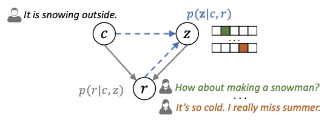
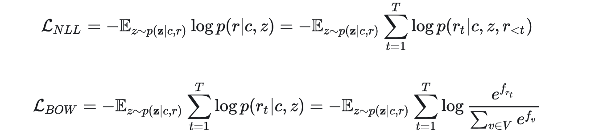
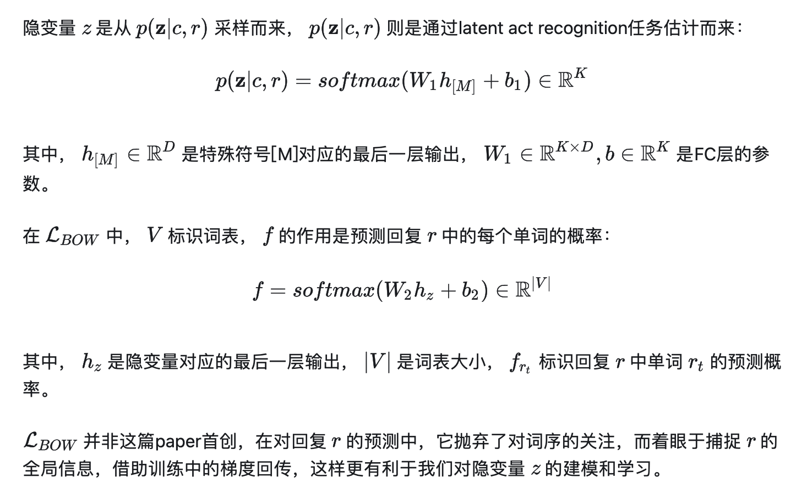
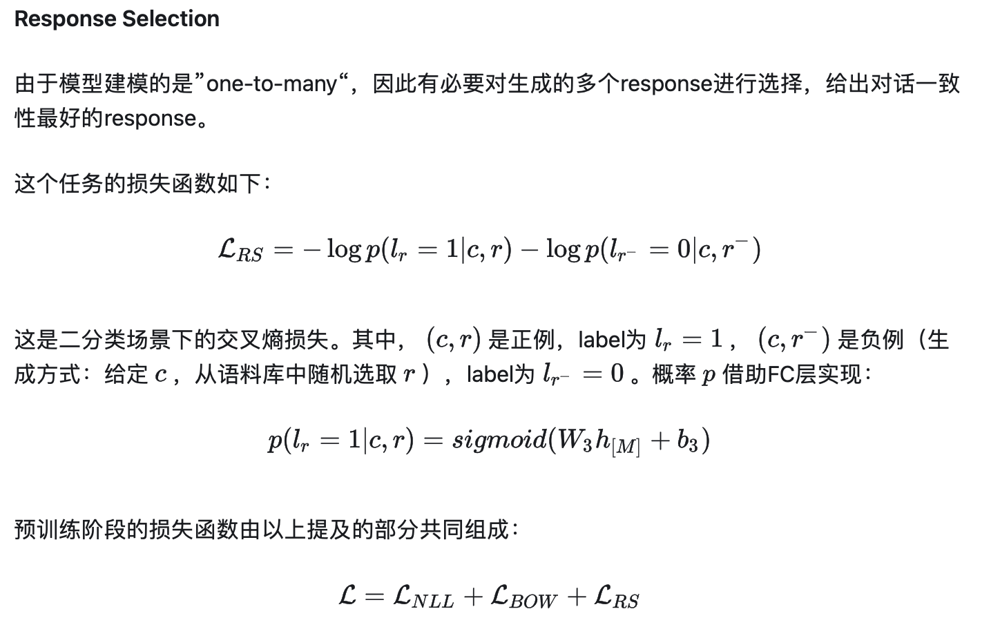
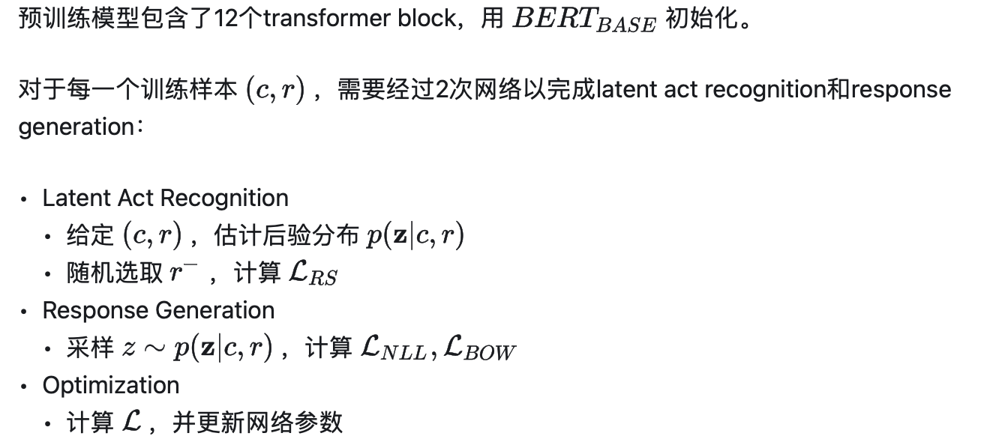
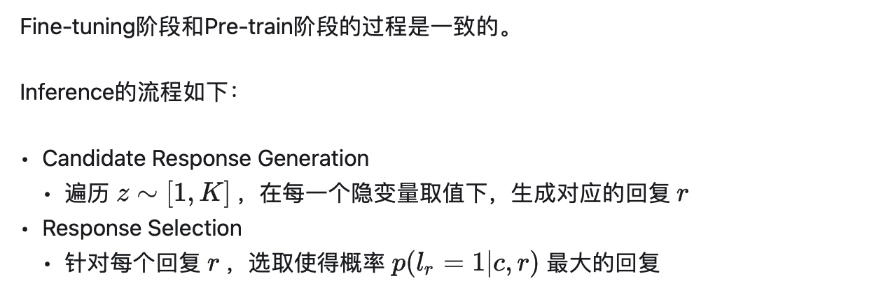
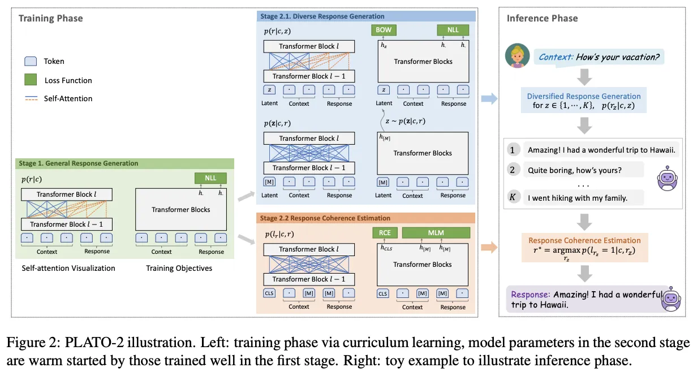
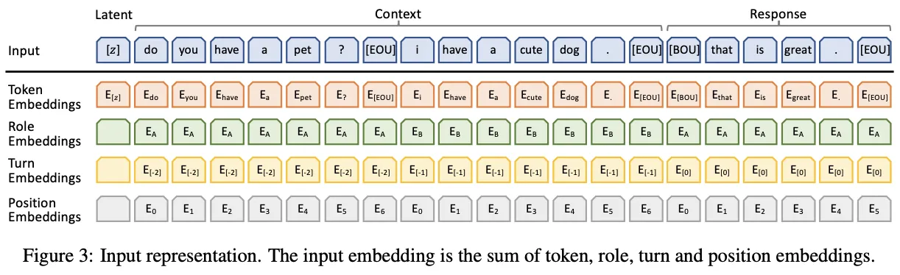

# 预训练语言模型 - PLATO系列

## 前言

本文介绍了对话模型的的PLATO系列，探讨预训练语言模型在对话场景下的应用。

## PLATO 1.0

### 1. 模型架构

首先，引入几个标识：对话上下文 （包含了历史的交互语句），回复 ，隐变量 ( ，有 种取值， 是超参数)。在这里，我们把隐变量具体又称为latent speech act。

以上三者的概率关系如下图：

给定对话上下文 ，有多个可选的latent speech act（由隐变量 标识），选定一种latent speech act后，回复 可以由概率分布 生成；给定对话上下文 和回复 ，潜在的latent speech act可以通过概率分布 进行估计。**训练时，response generation和latent act recognition是同时进行的。**

通过这两个相互关联的任务，PLATO 1.0 能够在对话生成过程中考虑到多种可能的情境和回应，提高对话的自然性和适应性。更多关于 PLATO 1.0 的详细信息和实现细节，可以参考[原始论文](https://aclanthology.org/2020.acl-main.9/)。

模型的预训练阶段，包含了2个任务：Response Generation、Response Selection。

**Response Generation**

该任务通过两个损失函数来体现：

其中， 是negative log-likelihood loss， 是bag-of-words（BOW）loss。

### 2. Embedding

模型的输入如下图所示：

和其它任务不同的是，这里新增了Role Embeddings、Turn Embeddings，标识对话的角色和轮次。

## PLATO 2.0

**课程学习（Curriculum Learning）**： 模仿人类的学习过程，先从容易的样本开始学习，并逐渐进阶到复杂的样本和知识。

课程学习，将训练分成了两个阶段：第一阶段，采用“one-to-one”的建模方式，训练一个baseline版本的粗粒度模型；第二阶段，和PLATO-1类似。

## PLATO XL

## Reference

[1] PLATO: Pre-trained Dialogue Generation Model with Discrete Latent Variable

[2] PLATO 2: Towards Building an Open-Domain Chatbot via Curriculum Learning