# 推荐类文章

https://mp.weixin.qq.com/s?__biz=MzI0ODcxODk5OA==&mid=2247506213&idx=3&sn=c11d20bf5d2fbd2c2acf17c50ac039b7&scene=21#wechat_redirect

https://cloud.tencent.com/developer/article/1476164

# 基于标签的实时短视频推荐系统 | 深度

发布于 2019-07-30 20:05:49

2.6K0

举报

文章被收录于专栏：[AI科技大本营的专栏](https://cloud.tencent.com/developer/column/1360)

作者 | gongyouliu

转载自大数据与人工智能（ID: ai-big-data）

导语：作者在[《基于内容的推荐算法》](https://cloud.tencent.com/developer/tools/blog-entry?target=https%3A%2F%2Fmp.weixin.qq.com%2Fs%3F__biz%3DMzI0ODcxODk5OA%3D%3D%26mid%3D2247506213%26idx%3D3%26sn%3Dc11d20bf5d2fbd2c2acf17c50ac039b7%26scene%3D21%23wechat_redirect&source=article&objectId=1476164)这篇文章中对基于内容的推荐算法做了比较详细的讲解，其中一类非常重要的内容推荐算法是基于标签的倒排索引算法，也是工业界用的比较多的算法，特别是**新闻资讯类、短视频类**产品大量采用该类算法。在本篇文章中作者会结合电视猫的业务场景及工程实践经验来详细讲解基于标签的倒排索引算法的原理及工程落地方案细节。

本文会从**基于标签的推荐算法应用场景、基于标签的推荐算法原理介绍、整体架构及工程实现、召回与排序策略、冷启动策略、未来优化方向**等6个方面来介绍基于标签的实时视频推荐系统。

希望读者读完本文，可以完整地了解基于标签的倒排索引算法的产品形态、算法原理、工程实现方案，并且能够基于本文的思路，具备从零开始搭建一套基于标签的算法体系的能力。

如上篇文章[《基于Erlang的相似视频推荐系统》](https://cloud.tencent.com/developer/tools/blog-entry?target=https%3A%2F%2Fmp.weixin.qq.com%2Fs%3F__biz%3DMzI0ODcxODk5OA%3D%3D%26mid%3D2247506506%26idx%3D4%26sn%3De53ce999c6d096e72abcbcc8e7724cb7%26scene%3D21%23wechat_redirect&source=article&objectId=1476164)所讲，电视猫有长视频和短视频各6大类，长视频对实时性要求相对没有那么高，所以本文主要以短视频的实时个性化推荐为例来讲解。

**一、基于标签的推荐算法应用场景**

在讲具体的算法原理及工程实践之前，我们先对基于标签的推荐算法可行的产品形态做简单介绍，让读者知道该类算法可以用到哪些业务场景中，从而有一个直观的印象，方便更好地理解后续讲解的内容。这些产品形态电视猫都落地到了真实业务场景中，下面的图例也是拿电视猫的产品形态来举例说明的。

在[《基于内容的推荐算法》](https://cloud.tencent.com/developer/tools/blog-entry?target=https%3A%2F%2Fmp.weixin.qq.com%2Fs%3F__biz%3DMzI1NjM1ODEyMg%3D%3D%26mid%3D2247484367%26idx%3D1%26sn%3D5f846834a949e58bea2f7992e7d3c14e%26chksm%3Dea26a04add51295c619ee4c81fdc65cee9f8e4c19aa2c8ee147ae16f8d451edae25e5012c9b3%26token%3D909739261%26lang%3Dzh_CN%26scene%3D21%23wechat_redirect&source=article&objectId=1476164)这篇文章第三节我们简单描述了基于内容的推荐算法的应用场景，而基于标签的推荐是内容推荐的一种，应用场景也是类似的：**完全个性化推荐、标的物关联标的物推荐(相似视频推荐)、主题推荐**这3类应用场景都是可行的，我们下面对这3大业务场景简单一一说明。

**1.1 完全个性化推荐**

完全个性化推荐是为每个用户生成不一样的推荐结果，下图是电视猫小视频实时个性化推荐，基于用户的(标签)兴趣画像，为用户推荐跟用户兴趣偏好相似的视频，用户可以无限右滑(由于电视猫是客厅端的视频软件，靠遥控器交互，所以产品交互方式上跟头条等手机端的下拉交互是不一样的)获取自己感兴趣的推荐结果，整个算法会根据用户的兴趣变化实时为用户更新推荐结果。

图1：电视猫小视频实时个性化推荐

**1.2标的物关联标的物推荐（相似视频推荐）**

短视频相似推荐基于[视频标签](https://cloud.tencent.com/product/ivld?from_column=20065&from=20065)构建视频之间的相似度，为每个视频推荐相似的视频。

下图是电视猫短视频的相似推荐，采用的产品形态是连播推荐的形式，当用户播放主视频后，相关联的相似视频会按照相似度列表连续播放，最大程度提升用户体验。

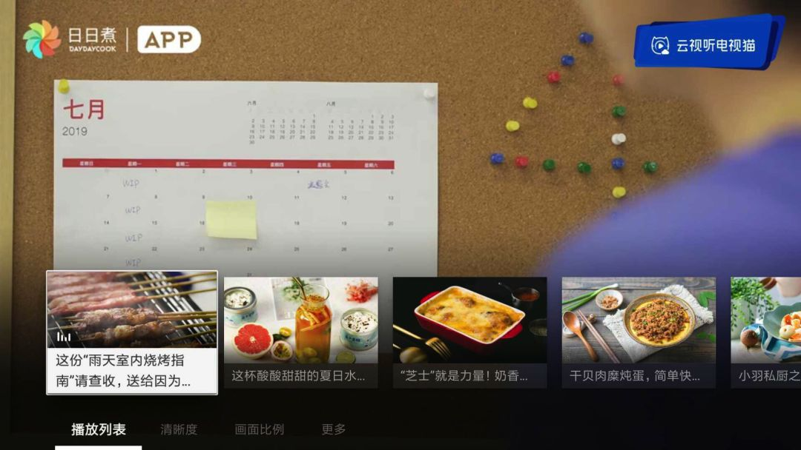

图2：电视猫短视频信息流连播推荐

**1.3主题推荐**

主题推荐根据用户播放行为历史，构建用户兴趣画像，这里是基于节目的标签来构建用户画像，基于用户画像标签为用户推荐最感兴趣的标签关联的节目。

下图是电视猫音乐频道的主题推荐，根据作者最近看过的音乐视频，为作者推荐了“国语”和“器乐教学”两个主题相关的音乐短视频。

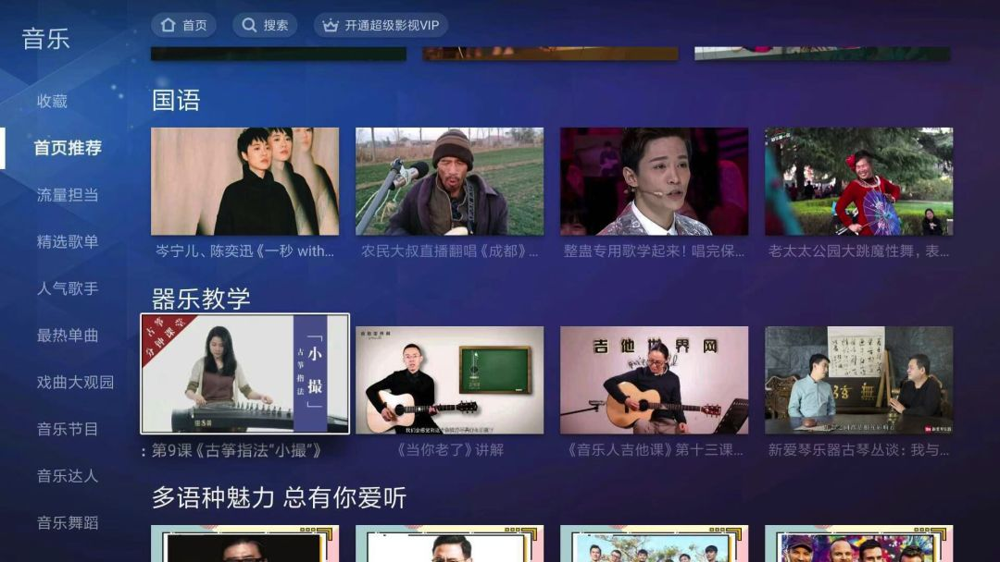

图3：电视猫音乐频道主题推荐

讲解完了基于标签的推荐产品形态，相信读者对基于标签的推荐有了较直观的认知，那么我们在实际业务中怎么实现这些产品形态呢？怎么构建合适的基于标签的推荐算法呢？在下节我们会详细讲解算法基本原理。

**二、基于标签的推荐算法原理介绍**

## 

我们在《基于内容的推荐算法》中对基于标签的个性化推荐算法原理已经做过初略介绍，读过该文章的读者应该有印象，不熟悉也没关系，本节我们会对上节提到的三个产品形态：个性化推荐、相似视频推荐、主题推荐的算法实现原理做细致的介绍，方便读者深入理解算法的实现细节。

**2.1个性化推荐（完全个性化范式）**

基于标签的个性化推荐算法具体推荐过程见下面图4：从用户画像中获取用户的兴趣标签，基于用户的兴趣标签从标签->节目倒排索引表中获取该标签对应的节目，这样就可以从用户关联到节目了。其中用户的每个兴趣标签及标签关联到的节目都是有权重的。

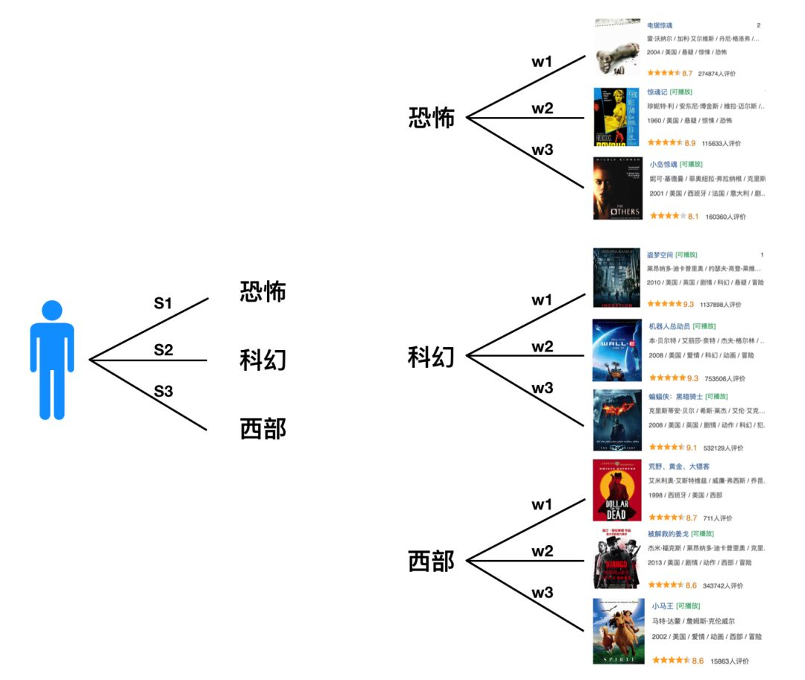

图4：基于倒排索引的视频推荐

假设用户的兴趣标签及对应的标签权重如下，其中 

 是标签，

 是用户对标签的偏好权重。

假设标签 

 关联的视频分别为：

......

其中 

、

分别是标的物及对应的权重，那么

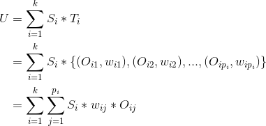

上式中U是用户对视频的偏好集合，我们这里将视频  

  看成向量空间的基，所以有上面的公式。不同的标签可以关联到相同的视频(因为不同的视频可以有相同的标签)，上式中最后一个等号右边需要合并同类项，将相同基前面的系数相加。合并同类项后，视频(基)前面的数值就是用户对该视频的偏好程度了，我们对这些偏好程度降序排列，就可以为用户做topN推荐了。

上面只是基于用户兴趣画像来为用户做推荐的算法原理，实际业务中，用户的兴趣有长期兴趣、短期兴趣，同时还需要考虑给用户提供多样性的推荐及根据用户播放过程中的实时反馈调整推荐结果，所以实际工程上会非常复杂，这一块我们会在第三节的架构及工程实现、第四节的召回和排序中详细说明。

**2.2视频相似推荐（标的物关联标的物范式）**

在本节我们先来讲解怎么利用视频的标签来计算两个视频之间的相似度，有了视频之间的相似度就很容易做视频的相似推荐了。

假设视频集合是

 ，其中 

是对应的视频。假设所有视频标签集合是 

 ，其中

是对应的标签。一般n和m都是非常大的数，从几十万到上百万，甚至更大。每个视频只有很少的标签，所以将视频表示成标签的向量的话，一定是稀疏向量，我们可以采用视频的标签向量表示的余弦相似度来计算两个视频之间的相似度，具体计算过程如下：

假设两个视频

  的向量表示如下(我们按照

中标签的顺序来编码向量)， 

 是对应的权重，如果采用one-hot编码，

 =0 或者 

 =1，如果标签是有权重的，

 就是对应标签的权重。

我们可以采用如下cosine余弦相似度公式来计算 

之间的相似度：

我们可以计算出 

与所有其他视频(除去 

自身)的相似度：

那么 

 的相似推荐就可以利用上述列表降序排列后取topN作为最终推荐列表。

**2.3主题推荐**

有了1中介绍个性化推荐的算法原理，就很容易说明怎么做主题推荐了。

首先我们根据用户画像获取用户的几个最感兴趣的标签，每个兴趣标签就是一个主题，将每个兴趣标签关联的节目推荐给用户就可以了，下面简要说明一下。

假设用户的兴趣标签及对应的标签权重如下，其中 

是标签，

是用户对标签的偏好权重。

我们可以将上述集合按照权重降序排序，选择k个权重最大(用户最喜欢)的标签 

 作为待推荐的主题。再从每个标签关联的节目(在实际工程实现上，我们会事先构建标签->节目的倒排索引表，方便从标签关联到节目)中选择对应的节目推荐给用户。

上面我们简要讲解了三类基于标签的推荐算法的算法原理，下面我们会结合电视猫的实践经验来讲解这三类推荐产品在工程上是怎么实现的。

## **三、整体架构及工程实现**

本节我们来详细讲解上述三类算法的整体架构、核心功能模块及工程实现。

这里我们重点只讲解个性化推荐和相似视频推荐两种推荐产品的架构和实现，主题推荐跟个性化推荐非常相似，我们会简单说明一下。

电视猫基于标签的个性化短视频推荐是基于Spark平台来实现的，其中流式处理采用Spark Streaming组件，离线处理采用Spark，整个代码工程整合到了Doraemon框架(不了解的读者可以参考[《推荐系统的工程实现》](https://cloud.tencent.com/developer/tools/blog-entry?target=https%3A%2F%2Fmp.weixin.qq.com%2Fs%3F__biz%3DMzU5OTI0NTc3Mg%3D%3D%26mid%3D2247487327%26idx%3D1%26sn%3D48d5370522468c97a899811952c908cb%26scene%3D21%23wechat_redirect&source=article&objectId=1476164)这篇文章)中。下面架构图的每一个处理逻辑都抽象为一个算子，封装在Doraemon框架中，便于业务的复用、拓展和工程维护。

为了让各个模块之间解耦，我们大量采用消息队列(RabbitMQ和Kafka)来传输消息(数据)，让整个推荐系统更加模块化、结构化。只要定义好两个模块(算子)之间的(数据)协交互议，就可以独立对各个子模块进行优化升级而不会互相影响。

节目倒排索引及用户画像是存储在HBase集群中，方便算法分布式读取，HBase的数据结构如下图，不熟悉的读者可以网上搜索了解一下。最终的推荐结果存储在CouchBase及Redis中，个性化推荐、主题推荐这类为每个用户都生成一个推荐结果的产品形态，数据量会更大，推荐结果存储在CouchBase(一个分布式文档数据库，可以方便横向扩容)中，而相似视频数据量相对较小存储在Redis这类key-value内存数据库中。

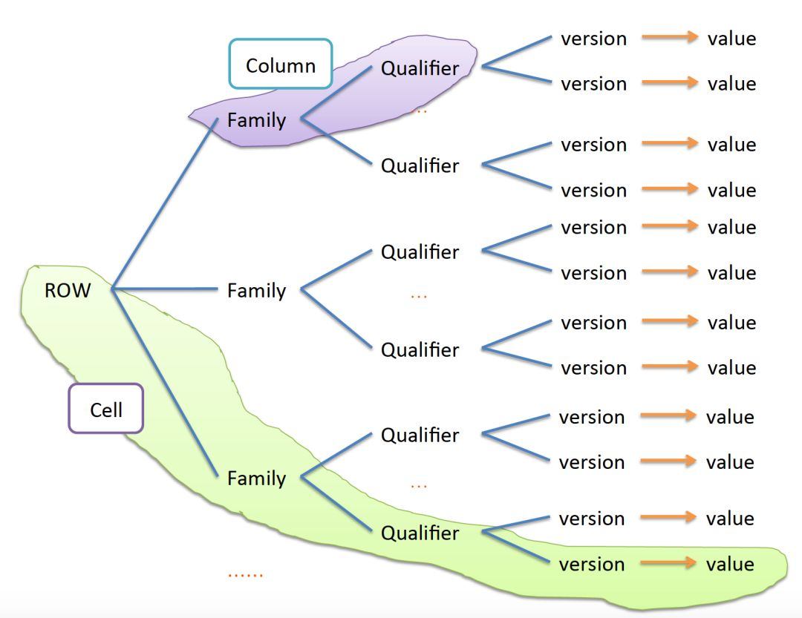

 图5：HBase数据结构

有了上面的背景知识，现在我们正式来介绍各类算法的工程实现。

**3.1个性化推荐**

个性化推荐分为离线模块和实时模块两部分，离线部分每天更新一次，为全量用户生成推荐结果，而实时部分基于用户实时的行为实时更新推荐列表。离线推荐和实时推荐相互配合，”交替进行“(严格不是交替进行，在离线任务运行过程中，只要有用户在用产品，实时推荐也是在运行的，只不过离线一般在凌晨跑，跑的时间也不会很长，这时用户比较少，其他时间都是实时推荐在起作用，所以简述为交替进行)，为用户提供全天候的推荐服务(见下面图6)。

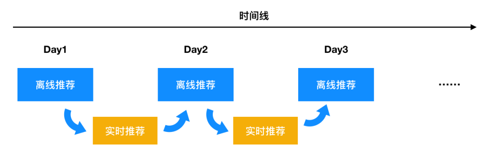

图6：离线推荐&实时推荐”交替“，离线每天更新一次，两次离线推荐之间采用实时推荐

下图是基于标签的个性化推荐的整体架构，分两条线，一条线从媒资系统生成节目标签的倒排索引，另一条线从用户行为日志生成基于标签的用户兴趣画像，最终倒排索引和用户画像供推荐程序(算子5)使用，为用户生成推荐。这里为了简单起见，我们只考虑基于用户画像来为用户做推荐，不考虑其他的各种召回策略，更多的召回策略放到第四节来讲解。

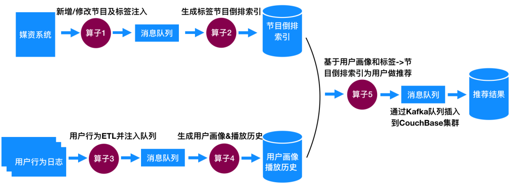

图7：基于标签的个性化推荐整体架构

整个算法实现主要包括大5核心模块(对应上图中标注1、2、3、4、5的5个算子)，每个算子是作为一个独立程序运行的，互不影响，其中算子5是最核心的推荐模块。我们来分别描述一下各个模块的核心功能及工程实现。

#### **(1) 新增节目及标签注入**

媒资系统是视频行业的内容管理系统，负责所有内容的管理、运营、输出。推荐系统依赖媒资系统的内容来源。基于标签的视频推荐系统从消息队列中获取新增/修改的节目及标签信息，利用这些消息来构建标签<->节目倒排索引表。该模块将推荐需要依赖的信息通过消息的方式发送到消息队列的固定topic中，后续模块通过监听该topic来获取新的消息做进一步处理。

下面图7给出了信息的一个简化版本，消息通过json的方式来组织，包括type(是新入库的节目还是对老节目标签的更新)、sid(节目唯一标识)、title(节目标题)、tags(标签)。

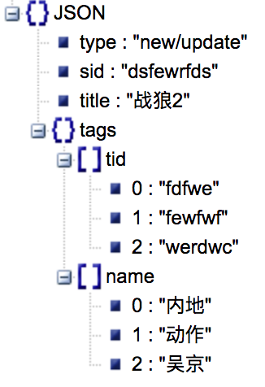

图8：信息队列中消息的结构

标签也是有唯一识别的，即是上图中的tid，类似视频的sid，在构建倒排索引及用户画像过程中通过使用标签的tid可以简化比较及处理逻辑，减少存储空间。

标签也是有权重或者层级结构的，电视猫的标签就有分类标签->栏目标签->内容标签三级体系，从粗到细，这个层级结构跟行业有很大关系，不同行业有不同的分级策略和方法。标签也是有权重的，权重衡量标签对节目的重要程度。在实际做算法时可以整合这些信息，让算法更加精准。本文为了简化起见，不考虑分级的标签，只考虑平展化的一级标签。

通过消息队列来获取消息的好处有两点：首先，可以将媒资系统跟推荐系统解耦(一般是两个不同的团队来负责)，方便两边系统独立扩展和升级，只要保持消息格式不变，不影响两边业务。其次，通过消息队列来传输信息，可以让系统做到更加实时。

在我们的项目中(1)对接的消息队列采用RabbitMQ，这一模块可以由媒资团队来提供基础服务，由媒资团队来维护，算法团队可以给媒资团队提需求，按照推荐算法需要的字段及规范提供数据即可。

#### **(2) 生成标签节目倒排索引**

该步骤(近)实时从消息队列中获取节目的标签信息，为每个节目构建标签<->节目的倒排索引，方便从节目关联到标签及从标签关联到节目。我们采用Spark Streaming流式处理组件来构建倒排索引，做到实时更新索引，索引存储到HBase集群中，方便后续实时处理程序分布式读取。

标签->节目倒排索引具体的[数据存储](https://cloud.tencent.com/product/cdcs?from_column=20065&from=20065)格式如下，其中tid是标签的唯一识别码(编号)、sid是节目的编号、publishTime是节目的发布时间，hot(新闻)、game(游戏)、sports(体育)是不同的短视频类型，节目->标签的倒排索引结构类似。

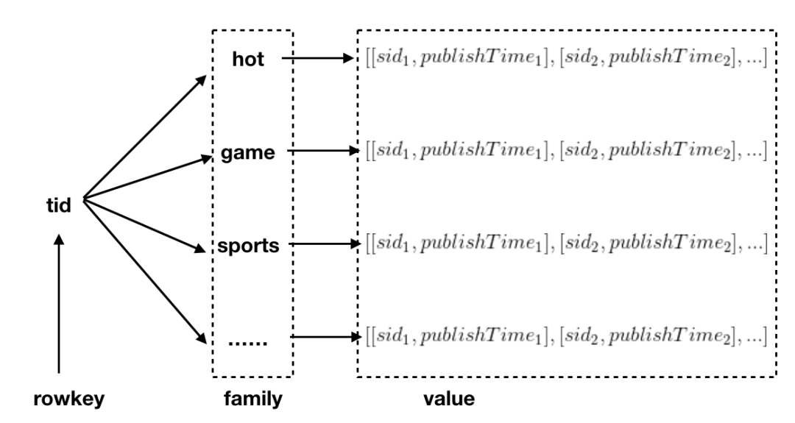

图9：标签->节目的HBase存储结构

基于图8中消息队列中的数据结构，算子2(Spark Streaming程序)近实时(一个时间窗口几秒钟)处理消息队列中新增的节目，对标签进行简单处理，获得标签与节目的对应关系，并更新到标签->节目的倒排索引表中。由于处理操作很简单，这里不细说。

#### **(3) 用户行为ETL并注入消息队列**

用户行为日志通过简单的ETL处理，提取关键信息，并将该信息插入对应的消息队列，供后续的构建用户画像模块生成用户画像。

用户行为日志的核心信息里面一定要包括用户唯一识别码和节目sid及用户对节目的偏好(可以用用户观看时长来衡量)(见下面图10)，通过节目sid我们可以从节目->标签倒排索引表中查到对应的标签。

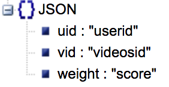

图10：用户核心行为信息

这里对接用户行为日志的组件，我们采用的是Kafka，整个电视猫的日志分为批和流两条链路，批日志按小时通过ETL入数据仓库，流日志打入Kafka，供后端的实时处理业务(如实时推荐、实时报表、业务监控等)消费。

#### **(4) 生成用户画像&播放历史**

该模块通过从消息队列中实时获取[用户行为数据](https://cloud.tencent.com/product/ida?from_column=20065&from=20065)，为用户生成基于标签的用户画像及播放历史记录。

为了能够反映用户长期和短期兴趣，我们可以生成多个不同时间阶段的画像，如长期画像(根据用户过去几个月或者更长期的行为)、中期用户画像(一天到几天时间)、短期用户画像(几分钟到几个小时)。长期、中期用户画像可以采用批处理的方式，每天定时生成一次。而短期用户画像最好采用流式处理，实时捕捉用户兴趣变化。

用户的历史记录用于记录下用户播放过的或者跳过的内容，这些内容对用户来说是没有价值的。记录下来是为了方便在最终推荐时过滤掉这些内容，提升用户体验。

下图是短期用户画像和用户历史行为的HBase数据结构，算子4通过从Kafka读取实时用户行为日志，从日志中获取节目sid、标签等，最终生成实时的用户画像和更新用户的播放历史记录。

为避免误解，这里简单提一些，图7只展示了利用Spark Streaming实时的从消息队列生成用户画像的流程，而离线生成画像的部分并未展示，离线用户画像是利用Spark直接从数仓读取离线行为数据，通过类似的处理生成用户中长期户画像的(存放在不同的HBase用户画像表中)。

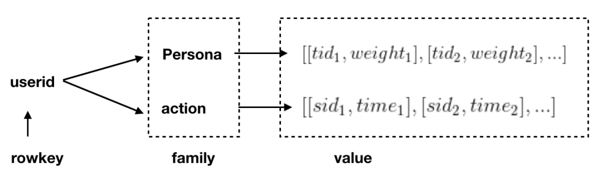

图11：短期用户画像(Persona)和用户历史行为(action) HBase数据结构

#### **(5) 基于用户画像和标签节目倒排索引为用户做推荐**

有了基于标签的用户画像及标签->节目倒排索引，就可以为用户实时生成推荐结果了，通过用户画像可以获取用户的偏好标签，再基于标签->节目倒排索引，就可以为用户关联到节目了。

这里我们简单介绍一下利用Spark为用户离线计算推荐的方法(实时推荐在第四节介绍)，首先Spark从HBase中读取所有用户行为数据，我们将用户分为N个Partition，为每个Partition内的用户更新个性化推荐(具体流程参考下面图12)，将最终推荐结果通过Kafka插入CouchBase集群，供推荐接口调用，返回前端展示给用户。将用户分为N个Partition的目的是方便做分布式计算，将推荐结果通过Kafka插入CouchBase是为了将推荐过程跟接口提供服务过程解耦合。

其中为单个用户生成个性推荐(第二节1中的个性化推荐算法)我们可以封装成独立算子，每个Partition循环调用该算子，为该Partition中的所有用户生成个性化推荐。

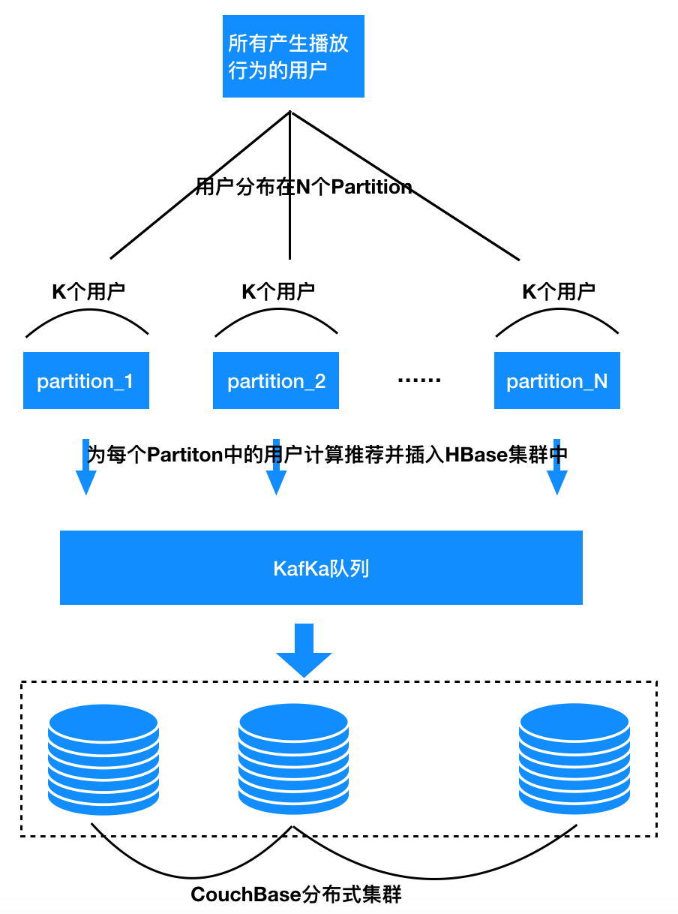

图12：基于Spark Streaming为用户计算推荐业务流

顺便说一下，最终的推荐结果除了要插入CouchBase外，还需要插入一份到HBase中，方便实时推荐模块基于该推荐结果实时调整用户兴趣。

这里的难点是怎么基于用户不同时间阶段的兴趣画像来为用户生成个性化推荐，以及怎么保证内容的多样性，并且要整合用户实时的反馈，为用户提供近实时的个性化推荐。详细的分析我们会在下一节的召回、排序、实时更新策略中讲解。

**3.2相似视频推荐**

下图是相似视频推荐的整体架构，包含3个部分(对应下图1、2、3三个算子)，其中1、2跟个性化推荐完全一样，这里不再讲解。

下面只针对3来说明。

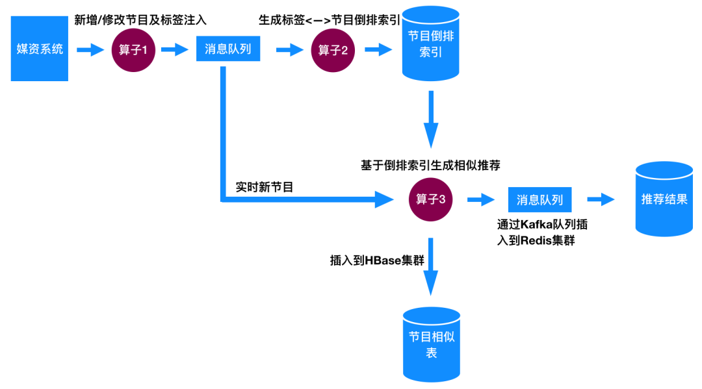

图13：基于标签的相似视频推荐整体架构

#### **基于倒排索引生成相似推荐**

在前面一节我们已经讲解过怎么计算视频相似度了，在这里我们简单描述一下计算视频相似度的业务流程。

当消息队列中有新视频注入时，从节目倒排索引表中将所有节目及其标签取出，与新注入的节目计算相似度，得到最终的TopN最相似的节目。这个相似推荐列表我们会插入HBase一份(具体的数据结构如下面图14)，同时通过Kafka消息队列插入一份到Redis，插入Redis的这份作为最终推荐结果，供接口调用返回前端提供给用户。插入HBase的这份相似推荐，会用于实时个性化推荐，根据用户实时行为更新用户推荐列表，具体怎么用会在下一节实时更新策略中讲解。

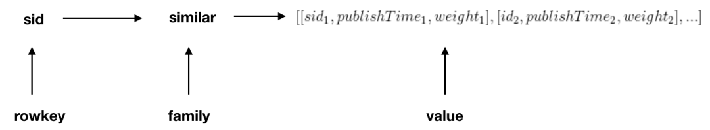

图14：相似视频在HBase的数据结构

下面我们针对单个节目怎么利用Spark Streaming来计算topN相似度做简单说明，首选将所有需要与节目A计算相似度的节目取出存放到一个RDD中，在计算时，所有节目分布在N个Partition中，我们分别计算A与每个Partition中节目的topN相似度，最终将N个Partition中topN相似度合并，获得最终的topN推荐，整个过程参考下面图15。

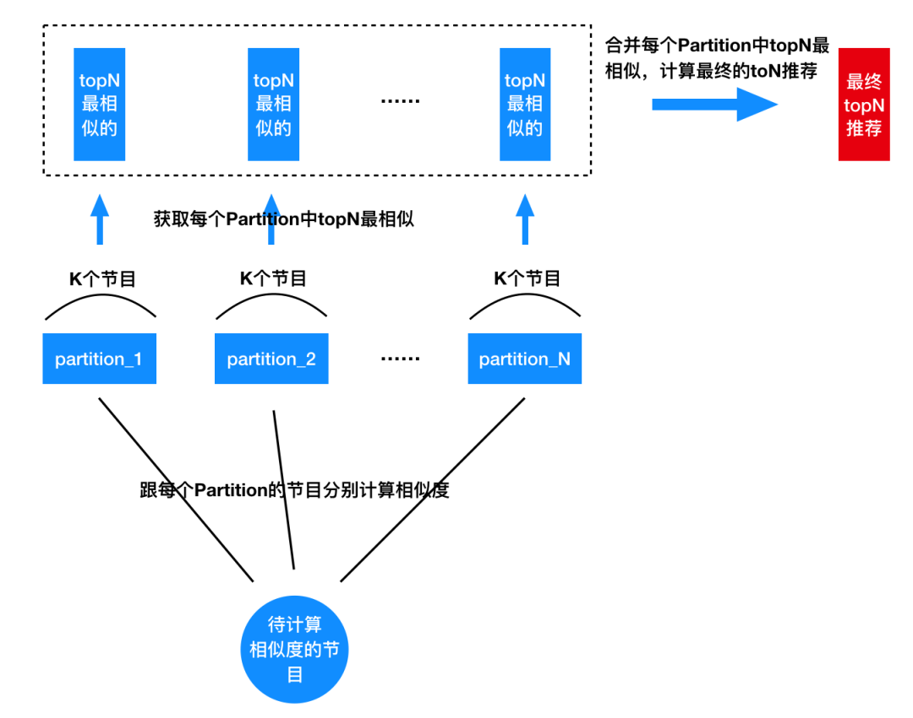

图15：基于Spark Streaming计算topN相似度算法逻辑

对于新闻、体育等时效性要求高的短视频，没必要将库中所有的视频都取出来，只需要取最近几天的就可以了，这样可以大大减少计算量。即使取出来了也可以先过滤掉不包含A中标签的节目(我们是基于标签计算相似度，如果B的标签跟A的标签都不一样，相似度肯定为0)，再计算相似度，也会少好多计算量(因为标签是稀疏的)。

除了上面的计算外，还需要处理一种情况：我们需要更新已经计算过相似度的视频的相似度列表，这是因为新加入的节目A可能与B的相似度比B的相似度列表中的节目相似度更大，这时更新B的相似度列表是必要的。具体更新策略我们这里不讲，在《基于Erlang语言的相似视频推荐系统》中有很详细的讲解，用Spark做这个更新的过程是类似的，只是实现方式不一样。

上面讲的整体架构是实时为新视频生成相似推荐列表。当我们第一次启动工程或者为新的短视频类型做相似推荐时，是需要一次性计算所有的视频相似度的。可行的方法有两个，一是将所有视频导入到消息队列中采用实时的计算相似度程序计算，另外一种方式是实现一套离线的计算相似度的程序，只用于工程启动或者新增视频类型第一次计算相似度的情形。第一种方法可能一段时间导致队列堆积，特别是视频总量比较大的情况下。我们团队是采用的第二种方案。

**3.3主题推荐**

为用户生成主题推荐的整体架构跟个性化推荐类似，我们需要获取用户的一批偏好标签，通过标签再关联到一组节目。

唯一的不同是，个性化推荐会将所有标签及标签关联的节目根据权重合并在一起形成一个汇总的推荐列表，而主题推荐将每个偏好标签形成一个主题，而每个标签关联的节目就是这个主题的推荐。这里不细讲。

**四、个性化推荐的召回与排序策略**

在整体架构这一节，我们讲解了怎么基于用户画像和节目标签倒排索引为用户做个性化推荐，重点聚焦在怎么根据用户兴趣偏好来为用户生成满足用户兴趣的推荐。

在本节我们来深入介绍一下怎么利用更多的召回策略来为用户生成更加多样性的内容，满足用户多样性的兴趣需要，同时怎么实时捕捉用户兴趣变化。由于短视频每条时长短，这些处理策略是很有必要的。只根据用户兴趣推荐会导致“越推荐约窄”的现象，不利于内容的分发及用户体验的维护。通过推荐多样性的内容，既可以拓展用户的兴趣空间，也更利于内容分发。

下图是短视频推荐召回和排序的流程，首先通过多种召回策略来为用户生成推荐，通过排序策略来将这些内容糅合在一起推荐给用户。下面我们分别对召回策略和排序策略做简单讲解。

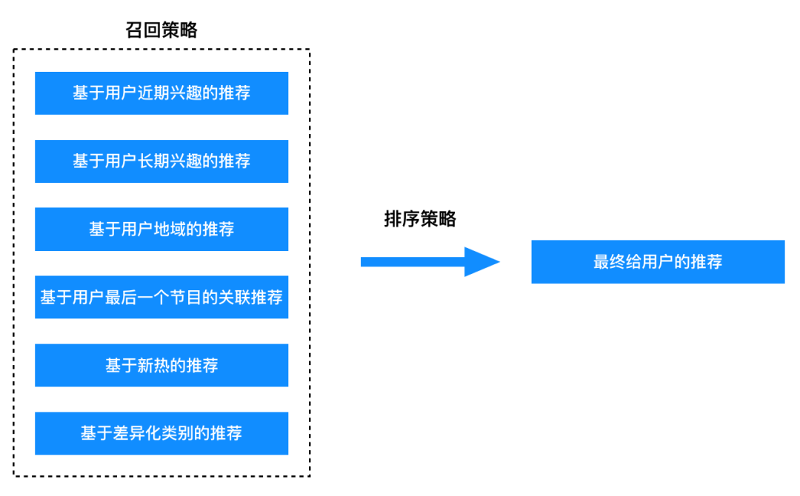

图16：个性化推荐召回与排序

**4.1召回策略**

对于短视频来说，除了基于用户的兴趣来为用户做推荐外，还可以通过多种方式来为用户做推荐，具体来说，可行的召回策略有如下6类：

#### **(1) 基于用户近期兴趣的召回**

对于短视频来说，特别是新闻，用户的兴趣是随着时间变化的，所以我们有必要基于过去较短时间(几天甚至更短时间内)生成用户的兴趣画像，在推荐中整合用户的近期兴趣。

#### **(2)基于用户长期兴趣的召回**

用户的兴趣也是稳定及缓慢变化的，这要求我们可以为用户生成较长期(几个月或者更长)的兴趣画像，在推荐中整合用户长期兴趣。

#### **(3)基于用户地域的召回**

在电视猫APP我们根据用户IP是知道用户所在地区的，很多内容是有地域属性的，用户也倾向于关注本地相关的信息，所以我们可以基于用户的地域，为用户召回匹配特定地域的内容(部分内容是有地域标签的)。

#### **(4) 基于用户最后一个节目的关联召回**

用户最后喜欢的的节目(用户看完了、有强烈的喜欢偏好)，代表了用户最近的兴趣点，那么我们完全有理由猜测用户喜欢该节目的相似节目，所以我们可以将该节目相似的节目推荐给用户作为召回。电视猫实时个性化推荐采用该召回策略。

#### **(5) 基于新热的召回**

人对未知的好奇的特性决定了人对新的东西会感兴趣，而人从众的一面又决定了我们很大概率会喜欢大家都喜欢的东西。所以为用户召回出新热内容是一种非常保险的策略。一般这类召回也会作为新用户的默认推荐，用于解决冷启动问题。

#### **(6) 基于差异化类别的召回**

为了避免给用户推荐的内容太窄，我们有必要为用户推荐多样性的内容，挖掘用户新的兴趣点。我们可以将内容按照标签分成多类(满足不同类的内容差异性较大)，从每类中随机筛选出几个节目汇总起来形成一个“大杂烩”，作为一种满足用户多样化需求的召回推荐给用户。

对于某些产品，如果有关注某个频道或者某个作者的功能，这些频道或者作者来源的内容也可以作为一种召回策略。另外，时间对用户的兴趣也是有影响的，不同的内容可能适合在不同时段观看，所以也可以基于时间为用户生成相关的推荐作为一种召回策略。

**4.2排序策略**

 前面介绍完了各种可行的召回策略，那么这么多的召回推荐怎么推荐给用户呢？肯定是不可能一股脑儿都推荐给用户的。我们需要对这些内容进行整合、过滤、筛选、排序形成一个更加精细化的列表推荐给用户，这就是排序策略需要解决的问题，最终的目的还是提升推荐列表的点击率，提升用户的体验。一般来说说排序策略可以分为基于规则的排序和基于模型的排序，我们在这里分别做简单介绍。

#### **(1) 基于规则的排序**

基于规则的排序主要是基于运营或者人工策略来进行排序，比较主观，需要一定的业务常识和行业经验。比如可以从上面的6种召回策略中每种取一个，循环选取，直到达到最终给用户推荐的数目为止。假设下面  

是六个召回列表，那么 

 就是按照上面循环排序的策略。

上面只是给出了一种最直观简单的排序策略，根据不同的产品形态及业务形式还有其他各种不同的排序和合并策略。比如，可以给不同的队列不同的权重，采用一定的概率选择一个队列，不同队列也可以选择不同数量的节目。

#### **(2) 基于模型的排序**

基于模型的排序，方法跟上面的规则不一样，通过用户行为数据训练一个机器学习模型(logistic回归、深度学习等)，该模型可以为每个用户、节目对输出一个用户对该节目偏好的概率或者评分，我们会根据所有召回队列中节目的概率或者评分来降序排列，并将排在前面的TopN推荐给用户。

基于模型的方法更加客观可靠，不会受到人类很多主观因素的影响，可以整合用户在产品上的所有行为数据及用户自身和标的物的数据，一般来说效果会更好。这里作者不细讲，未来会单独讲解排序学习方面的知识。

不同召回策略可能会召回重复的内容，我们在排序阶段还需要考虑过滤掉重复的内容。排序策略还跟具体的产品交互方式有关，比如今日头条APP采用下滑的方式，每次下滑更新12条新的内容，这12条新内容即是根据各类召回来为你统一排序推荐给你的。对于电视猫这类OTT端的采用遥控器交互的产品，我们采用图1这种“无限”右滑的方式来跟用户交互。

讲解完了召回和排序策略，下面针对电视猫短视频个性化推荐，我们来详细讲解怎么基于用户实时行为为用户近实时更新推荐列表。

**4.3电视猫个性化实时更新策略**

下面我们对电视猫短视频实时个性化推荐的排序方案进行简单描述，供大家参考。我们的推荐分为离线推荐和实时推荐两部分。在离线阶段，每天我们会根据上述规则的方式生成推荐列表，为用户推荐200个节目。当用户在使用过程中会实时更新用户的推荐列表，整合用户实时的兴趣变化。

下图是电视猫实时更新的架构图，算子1根据用户行为日志生成实时消息到消息队列，算子2从消息队列获取待更新的用户及操作行为，按照一定的规则来更新原来的推荐列表。推荐列表备份一份在HBase中，在具体更新某个用户的推荐时读取HBase中该用户的推荐列表，对推荐列表进行调整整合用户实时兴趣变化，调整完后更新到HBase中，同时再通过Kafka同步一份到CouchBase中，供推荐接口返回前端展示给用户，这样用户的推荐列表就真正更新了，用户就可以感知到了。

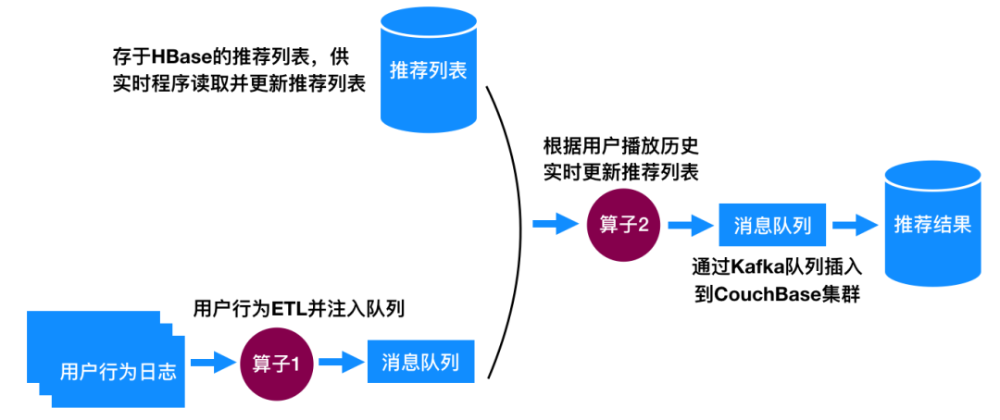

 图17：电视猫实时个性化推荐实时更新架构

下面我们来说说具体怎么根据用户最近的行为更新推荐列表的。

我们将给用户推荐的200个视频看成是一个环(如下面图18)，每20个节目看成一页，当用户起播时，根据用户在第一页的播放行为(第一页20个节目中用户会播自己感兴趣的，不感兴趣的会跳过，每一页的内容是根据离线阶段用不同的召回策略及规则排序策略生成的推荐)。我们采用Spark Streaming来处理，假设5秒是一个窗口(Window)，当计算下一个窗口时，在第二页最前面插入用户在第一页感兴趣的节目的相似节目，插入的节目数量跟用户在第一个窗口播放过的加上跳过的一样多，同时第一个窗口播放过的和跳过的节目从环中剔除，由于删除的和插入的一样多，总队列还是保持200个。这时从当前用户播放的位置开始是新的第一页，回到了队列最初的状态，整个过程是一个可以“无限右滑”的环。

图18：电视猫实时个性化推荐实时更新推荐方案

**五、冷启动策略**

## 

基于标签的相似视频推荐基本不存在冷启动问题，因为任何新注入的视频都是包含标签的，并且我们是近实时为新节目计算相似视频，在极短的时间内就会为新节目计算出相似推荐。本节我们来说说实时个性化推荐冷启动问题。

因为是基于内容的推荐，冷启动问题没有那么严重，只要用户看过一个视频，这个视频的标签就是用户的兴趣标签，我们可以为用户推荐具备该标签的节目。但是，如果用户一个节目都没看，那要怎么为用户做推荐呢？

我们可以采用如下3大策略：

**(1) 利用新热节目作为推荐；**

**(2) 基于用户特征(比如用户地域)来为用户生成相关推荐列表；**

**(3) 从所有视频中选择不同类别的视频推荐给用户，总有一款是用户喜欢的。**

## **六、未来优化方向**

基于标签的推荐算法在电视猫APP上整体效果还不错，但是还有很多地方是可以做得更好的，现在列举一些可能的优化点，作为后续我们优化的方向，也供大家参考。

**6.1增加模型排序模块**

虽然该算法有很多召回策略，但是最终排序展示给用户时是根据人工规则进行的，实时更新也是基于规则的，多少有一些主观，可行的优化方向是增加一层实时模型排序算法，将多个人工召回策略丢给排序模块进行算法排序，将排序好的结果推荐给用户。

基于模型的排序策略是根据用户点击行为及各类特征进行训练的，可以更好地反应用户点击情况，增加用户点击的概率。Google提出的FTRL(Follow-the-regularized-Leader)算法可以有效地构建实时的排序模型，对多类召回结果进行排序，目前在国内互联网公司有大量应用案例，有兴趣的读者可以参考文献11。目前很多深度学习算法(如Wide & Deep)也大量用于推荐排序中。

**6.2对重复的节目做过滤**

 特别是新闻、短视频类APP，会从不同源获取相关内容，不同来源的内容有可能是重复的，简单的方法是通过标题来判定两个内容是否重复，虽然相对简单一些，但是某些时候不一定可靠，比如两个视频标题差别较大，但是实际上内容是很重复的。这时就需要通过视频内容(或者文章内容)来判定是否重复了，但是这样处理成本相对太高，特别是对于视频。所以，往往通过标题来区分代价相对较小，精度还可以接受。

处理重复的方法一般有两种：事先处理和事后处理。事先处理就是在新视频入库时，从所有节目库中排查是否有重复的节目，如果有就丢弃，否则插入。一般可以采用为每个视频生成信息指纹，方便做比对。事后处理就是在生成推荐列表后，再做一次过滤，将重复的视频去掉只保留其中一个。

**6.3整合用户负反馈**

如果用户播放某个视频直接切换到下一个，或者播放很短时间就不播放了，这是一个用户不喜欢的信号。那么在基于标签的算法中，我们怎么整合这种负反馈呢？一种可行的策略是，对该视频包含的标签做负向处理，即如果用户画像中包含该标签，那么我们可以从该标签的权重中减去一个数值，代表对该标签的惩罚。目前在我们的算法中是没有整合负反馈机制的。

**6.4针对标签的优化**

基于标签的推荐算法，标签的质量直接关系到推荐的质量。在实际业务中标签是存在一些问题的，主要表现为如下几个方面：

**(1) 标签之间是有相关关系的，比如恐怖和惊悚就有相似的含义；**

**(2) 有些标签出现特别频繁而有些又出现特别稀少；**

针对(1)，我们可以尽量将意思相近的标签合并，让不同标签意思有一定的区分度。

针对(2)，我们可以剔除掉出现非常稀少的标签(比如只有几个视频才有的标签)，这些标签有可能是脏数据，对计算相似度帮助不大，对于出现太过频繁的标签(非常多的节目具备该标签)，这类标签区分度也不大，建议也可以剔除掉。

## **七、写在最后**

到此为止，基于标签的实时视频推荐系统讲完了，整个算法及工程实现细节基本上是基于我们在电视猫短视频推荐的经验总结而成。

基于标签的算法是一类非常常用的推荐算法，算法原理简单，可解释性强，在真实业务中得到大量使用，通过我们团队使用经验，效果还是很不错的，今日头条的推荐也是将基于标签的推荐算法作为核心模块之一。

基于标签的推荐算法最大的问题是强依赖于标签的质量，标签质量好坏直接影响算法效果。

如果要做好标签推荐，需要根据相关业务事先定义好一套完善的标签体系，需要投入极大的人力成本，并且对团队NLP方面的技术也有较高的要求。

参考文献：

1.Real-Time Top-N Recommendation in Social Streams

2.TencentRec- Real-time Stream Recommendation in Practice

3.Real-time Video Recommendation Exploration

4.Tag-aware recommender systems based on deep neural networks

5.Tag-aware recommender systems by fusion of collaborative filtering algorithms

6.Tag-Aware Personalized Recommendation Using a Hybrid Deep Model

7.Content-based recommendation in social tagging systems  

8.Real-time Attention Based Look-alike Model for Recommender System

9.【书】Big Data Principles and Best Practices of Scalable Realtime Data Systems

10.Real-time Personalization using Embeddings for Search Ranking at Airbnb

11.Ad Click Prediction- a View from the Trenches

*(\*本文为 AI科技大本营转载文章，转载请联系原作者)*

本文参与 [腾讯云自媒体分享计划](https://cloud.tencent.com/developer/support-plan)，分享自微信公众号。

原始发表：2019-07-26，如有侵权请联系 [cloudcommunity@tencent.com](mailto:cloudcommunity@tencent.com) 删除

[大数据](https://cloud.tencent.com/developer/tag/10796)

[推荐系统](https://cloud.tencent.com/developer/tag/10720)

[编程算法](https://cloud.tencent.com/developer/tag/10663)

[短视频](https://cloud.tencent.com/developer/tag/10375)

[消息队列 CMQ 版](https://cloud.tencent.com/developer/tag/10418)

评论

登录后参与评论

推荐阅读

编辑精选文章

换一批

【万字长文】K8s部署前后端分离web应用避坑指南之一：从源代码到docker compose到k8s云集群（macOS-2023版）

2207

穿越时空：2023年前端技术盘点与2024年技术展望

1237

禁止在代码中使用异常，一次时隔7年的复盘

1424

前端性能优化--性能分析工具

613

MySQL是如何保证数据一致性的？

806

[【腾讯云云上实验室】基于向量数据的客户价值体系推荐系统设计](https://cloud.tencent.com/developer/article/2363366?areaId=106001)

[向量数据库最佳实践征文活动](https://cloud.tencent.com/developer/tag/17995)[推荐系统](https://cloud.tencent.com/developer/tag/10720)[推荐算法](https://cloud.tencent.com/developer/tag/17480)[向量数据库](https://cloud.tencent.com/developer/tag/17853)

[很早之前就有过想写推荐系统系列文章了，本人曾任职高级大数据工程师全程参与过推荐系统的搭建，故在搭建推荐系统算得上是有一定的经验。推荐系统搭建有相当多的细节和要考虑的业务情况，以及要结合当前业务信息和用户信息的多维度属性，可以说得上是个大工程。做推荐系统的最看重的就是模块设计和用户画像体系，这两块相当于推荐系统的心脏和肌肉，光靠一篇文章是比较难全面讲解整体推荐系统的搭建的，好在腾讯云推出了向量数据库，免去了最为繁琐复杂的向量数据库设计步骤，可以直接利用腾讯云数据库强大的功能快速构建推荐系统。本篇文章将详细介绍推荐系统的定义以及推荐系统的架构设计，和深入浅出讲解向量分析，最后通过实例案例结合腾讯云向量数据库完成轻量级推荐系统搭建。](https://cloud.tencent.com/developer/article/2363366?areaId=106001)

fanstuck

2023-11-24

2700

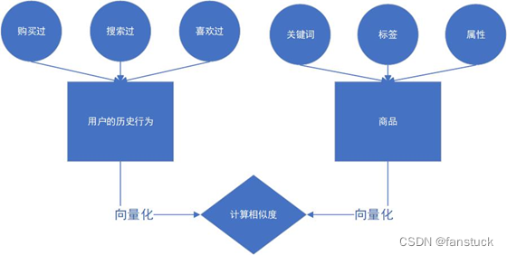

[深度学习应用篇-推荐系统[11\]：推荐系统的组成、场景转化指标（pv点击率,uv点击率,曝光点击率）、用户数据指标等评价指标详解](https://cloud.tencent.com/developer/article/2338219?areaId=106001)

[深度学习](https://cloud.tencent.com/developer/tag/10333)[推荐系统](https://cloud.tencent.com/developer/tag/10720)[产品](https://cloud.tencent.com/developer/tag/17210)[模型](https://cloud.tencent.com/developer/tag/17381)[数据](https://cloud.tencent.com/developer/tag/17440)

[在网络技术不断发展和电子商务规模不断扩大的背景下，商品数量和种类快速增长，用户需要花费大量时间才能找到自己想买的商品，这就是信息超载问题。为了解决这个难题，个性化推荐系统（Recommender System）应运而生。](https://cloud.tencent.com/developer/article/2338219?areaId=106001)

汀丶人工智能

2023-10-11

5190

![深度学习应用篇-推荐系统[11]：推荐系统的组成、场景转化指标（pv点击率,uv点击率,曝光点击率）、用户数据指标等评价指标详解](./assets/ab311a4883008d1e6409e6d6fd3cca3e.jpg)

[[自然语言处理|NLP\]推荐系统中的应用：从原理到实践](https://cloud.tencent.com/developer/article/2359412?areaId=106001)

[nlp](https://cloud.tencent.com/developer/tag/14918)[2023腾讯·技术创作特训营 第三期](https://cloud.tencent.com/developer/tag/17988)

[在推荐系统领域，自然语言处理（NLP）技术的崭新应用正迅速改变着用户体验和推荐精度。本文将深入研究NLP在推荐系统中的关键角色，探讨其对个性化推荐、搜索排序和用户交互的积极影响。我们将通过详细的示例和实践代码演示NLP在推荐系统中的实际应用，让你更好地理解这一领域的前沿发展。](https://cloud.tencent.com/developer/article/2359412?areaId=106001)

Y-StarryDreamer

2023-11-16

2800

[图解推荐系统知识点：用户理解、召回、排序、冷启动](https://cloud.tencent.com/developer/article/2361622?areaId=106001)

[深度学习](https://cloud.tencent.com/developer/tag/10333)[推荐系统](https://cloud.tencent.com/developer/tag/10720)[模型](https://cloud.tencent.com/developer/tag/17381)[排序](https://cloud.tencent.com/developer/tag/17390)[算法](https://cloud.tencent.com/developer/tag/17460)

[大家好，最近看到一篇图解推荐系统的文章，觉得全面和基础，可以快速了解推荐系统中的知识点~分享给大家](https://cloud.tencent.com/developer/article/2361622?areaId=106001)

数据STUDIO

2023-11-21

1900

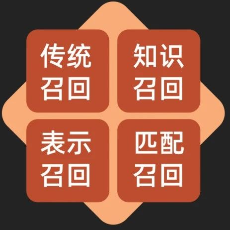

[深度学习应用篇-推荐系统[11\]：推荐系统的组成、场景转化指标（pv点击率,uv点击率,曝光点击率）、用户数据指标等评价指标详解](https://cloud.tencent.com/developer/article/2295919?areaId=106001)

[人工智能](https://cloud.tencent.com/developer/tag/10539)[深度学习](https://cloud.tencent.com/developer/tag/10333)[推荐系统](https://cloud.tencent.com/developer/tag/10720)

[在网络技术不断发展和电子商务规模不断扩大的背景下，商品数量和种类快速增长，用户需要花费大量时间才能找到自己想买的商品，这就是信息超载问题。为了解决这个难题，个性化推荐系统（Recommender System）应运而生。](https://cloud.tencent.com/developer/article/2295919?areaId=106001)

汀丶人工智能

2023-06-13

5480

![深度学习应用篇-推荐系统[11]：推荐系统的组成、场景转化指标（pv点击率,uv点击率,曝光点击率）、用户数据指标等评价指标详解](./assets/a8734d258a8075213853fe477deba433.jpg)

[微信向量检索分析一体化数仓探索：OLAP For Embedding](https://cloud.tencent.com/developer/article/2352088?areaId=106001)

[微信](https://cloud.tencent.com/developer/tag/10797)[embedding](https://cloud.tencent.com/developer/tag/13234)[olap](https://cloud.tencent.com/developer/tag/15032)[模型](https://cloud.tencent.com/developer/tag/17381)[数据](https://cloud.tencent.com/developer/tag/17440)

[在过去的一年里，大型语言模型 (LLM) 以及 ChatGPT 等产品吸引了全世界的想象力，推动新一轮技术浪潮。embedding 和 vector search(向量搜索)的概念是支持推荐、问答、图像搜索等功能的核心。我们发现社区中“向量搜索”的兴趣显著增加;具体来说，大家感兴趣了解的是：何时需要专门向量数据库，何时不需要？相比于语义性检索引擎（ES）与专业的高性能检索服务，OLAP 数仓的向量检索能力在场景有何区别？](https://cloud.tencent.com/developer/article/2352088?areaId=106001)

腾讯技术工程官方号

2023-10-27

5730

[大厂怎么做 | 快手短视频推荐中的多目标排序](https://cloud.tencent.com/developer/article/2318416?areaId=106001)

[短视频](https://cloud.tencent.com/developer/tag/10375)[模型](https://cloud.tencent.com/developer/tag/17381)[排序](https://cloud.tencent.com/developer/tag/17390)[视频](https://cloud.tencent.com/developer/tag/17431)[优化](https://cloud.tencent.com/developer/tag/17554)

[快手是中国领先的短视频和直播社区，拥有超过3亿的DAU和丰富的社交数据。快手秉承的价值观是真实、多元、美好、有用，致力于提高每一个用户独特的幸福感。而推荐覆盖了快手大部分流量，极大地影响整体生态，并直接作用于 DAU 和 APP 整体时长。短视频推荐需要更多地考虑生态，优化目标和约束非常多，包括消费侧指标、生产侧指标和社交侧指标。](https://cloud.tencent.com/developer/article/2318416?areaId=106001)

NewBeeNLP

2023-08-28

3810

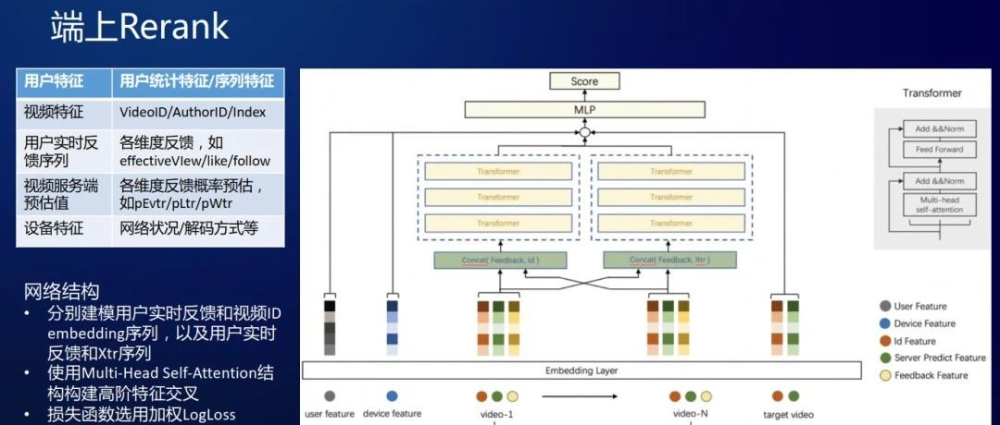

[推荐系统算法的研究与实践：协同过滤、基于内容的推荐和深度学习推荐模型](https://cloud.tencent.com/developer/article/2299605?areaId=106001)

[推荐系统](https://cloud.tencent.com/developer/tag/10720)

[推荐系统是一种通过分析用户历史行为、个人兴趣和社交关系等信息，向用户提供个性化推荐内容的技术。推荐系统在电子商务、社交网络和音乐视频等应用中得到了广泛应用。本文将详细介绍推荐系统算法的研究与实践，重点介绍了协同过滤、基于内容的推荐和深度学习推荐模型，并分析了它们的优缺点和实际应用场景。](https://cloud.tencent.com/developer/article/2299605?areaId=106001)

网络技术联盟站

2023-07-04

6410

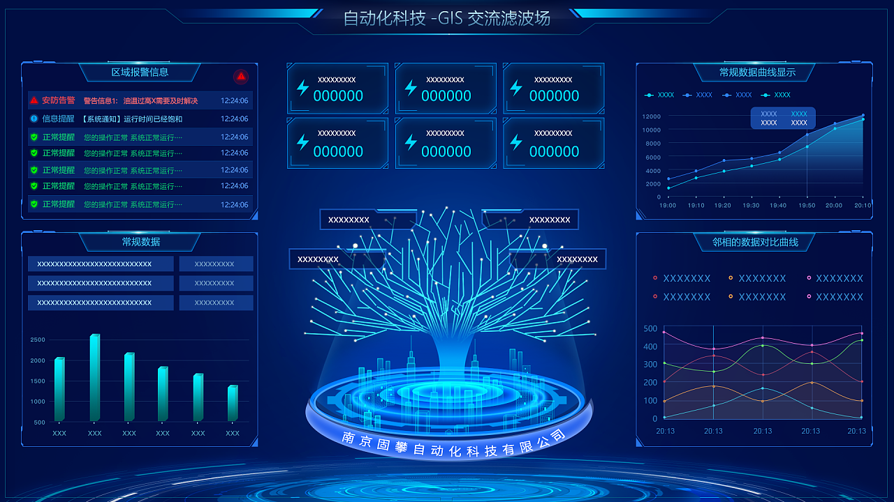

[用Python构建大数据推荐系统：一个世界500强企业的成功案例](https://cloud.tencent.com/developer/article/2309834?areaId=106001)

[python](https://cloud.tencent.com/developer/tag/10169)[企业](https://cloud.tencent.com/developer/tag/10573)[推荐系统](https://cloud.tencent.com/developer/tag/10720)[大数据](https://cloud.tencent.com/developer/tag/10796)[数据](https://cloud.tencent.com/developer/tag/17440)

[推荐系统是大数据时代的利器，它能够为企业提升用户体验、增加用户粘性、促进销售转化、提高营销效率等。但是，搭建一个成功的推荐系统并不容易，它需要综合考虑多方面的因素，并根据业务场景、用户需求、数据变化等不断地进行迭代和优化。](https://cloud.tencent.com/developer/article/2309834?areaId=106001)

博文视点Broadview

2023-08-09

1650

[得物词分发平台技术架构建设与演进](https://cloud.tencent.com/developer/article/2305378?areaId=106001)

[中文分词](https://cloud.tencent.com/developer/tag/10302)

[在文章开始前先介绍下导购，导购通常是指帮助消费者在购物过程中做出最佳决策的人或系统。在电商网站中，导购可以引导用户关注热卖商品或促销活动等，帮助用户更好地进行购物。导购的目的是为了提高用户的购物体验，促进销售额的增长。](https://cloud.tencent.com/developer/article/2305378?areaId=106001)

得物技术

2023-07-26

3060

[推荐系统[一\]：超详细知识介绍，一份完整的入门指南，解答推荐系统相关算法流程、衡量指标和应用，以及如何使用jieba分词库进行相似推荐](https://cloud.tencent.com/developer/article/2220394?areaId=106001)

[大数据](https://cloud.tencent.com/developer/tag/10796)[编程算法](https://cloud.tencent.com/developer/tag/10663)[https](https://cloud.tencent.com/developer/tag/10813)[网络安全](https://cloud.tencent.com/developer/tag/10681)[推荐系统](https://cloud.tencent.com/developer/tag/10720)

[如果说互联网的目标就是连接一切，那么推荐系统的作用就是建立更加有效率的连接，推荐系统可以更有效率的连接用户与内容和服务，节约了大量的时间和成本。](https://cloud.tencent.com/developer/article/2220394?areaId=106001)

汀丶人工智能

2023-02-21

5250

[用户画像--《美团机器学习实践》笔记](https://cloud.tencent.com/developer/article/2212164?areaId=106001)

[数据库](https://cloud.tencent.com/developer/tag/10244)[日志数据](https://cloud.tencent.com/developer/tag/10564)[数据处理](https://cloud.tencent.com/developer/tag/10805)[sql](https://cloud.tencent.com/developer/tag/10253)[大数据](https://cloud.tencent.com/developer/tag/10796)

[用户模型和用户画像的区别。用户模型是指真实用户的虚拟代表，在真实数据的基础上抽象处理的一个用户模型，是产品在描述用户需求时使用的概念。用户画像是从海量的用户数据中，建模抽象出每个用户的属性标签体系，这些属性通常要具有一定的商业价值。](https://cloud.tencent.com/developer/article/2212164?areaId=106001)

languageX

2023-02-01

3.3K0

[超详细丨完整的推荐系统架构设计](https://cloud.tencent.com/developer/article/2289221?areaId=106001)

[推荐系统](https://cloud.tencent.com/developer/tag/10720)[架构设计](https://cloud.tencent.com/developer/tag/10815)[数据](https://cloud.tencent.com/developer/tag/17440)[算法](https://cloud.tencent.com/developer/tag/17460)[系统](https://cloud.tencent.com/developer/tag/17506)

[推荐系统是移动互联网时代非常成功的人工智能技术落地场景之一。 本文我们将从架构设计的角度回顾和讨论推荐系统的一些核心算法模块，重点从离线层、近线层和在线层三个架构层面讨论这些算法。 本文不会讲解一些具体推荐模块的架构设计，但无论什么推荐模块，其逻辑经过拆解后都可以映射到本文的架构体系中，做到触类旁通，举一反三。 ----- 本文选自《从零开始构建企业级推荐系统》一书，在庞杂的领域知识网格中点亮关键节点，为你的商业化落地开辟泛化通道。 ▼ 扫码获取本书详情 ▼ ---- 1　架构设计概述  架构设计是](https://cloud.tencent.com/developer/article/2289221?areaId=106001)

博文视点Broadview

2023-05-19

7780

[如何快速搭建一个企业级推荐系统？| 极客时间](https://cloud.tencent.com/developer/article/2264965?areaId=106001)

[推荐系统](https://cloud.tencent.com/developer/tag/10720)[工程师](https://cloud.tencent.com/developer/tag/17275)[数据](https://cloud.tencent.com/developer/tag/17440)[算法](https://cloud.tencent.com/developer/tag/17460)[系统](https://cloud.tencent.com/developer/tag/17506)

[你好，我是黄鸿波，国内 40 多个谷歌开发者专家之一，《TensorFlow 进阶指南：基础、算法与应用》一书的作者。今天想和你聊聊推荐系统那些事。 遥想当年抖音、头条等应用横空出世的时候，全民一刷一整天，“猜你喜欢”的推荐就像肚子里的蛔虫，让人欲罢不能。与此同时，技术圈内到处都在讨论推荐算法，个性化推荐的重要性更是被吹上了天。 亚马逊号称 40% 的收入是来自个性化推荐系统的，这就是推荐工程师的最牛的地方，也是为啥人能拿百万年薪的原因。 当初我就是被这股奇妙又神秘的力量所深深吸引，随着近几年亲身实操了几个](https://cloud.tencent.com/developer/article/2264965?areaId=106001)

深度学习与Python

2023-04-14

4870

[揭秘短视频推荐系统的技术架构及四大模块](https://cloud.tencent.com/developer/article/2216299?areaId=106001)

[推荐系统](https://cloud.tencent.com/developer/tag/10720)[短视频](https://cloud.tencent.com/developer/tag/10375)[存储](https://cloud.tencent.com/developer/tag/10665)

[下面来看下短视频社区平台的推荐系统架构是如何划分的，由底层往上分别是日志信息层、模型策略层、数据计算层、数据结果层与用户交互层，如图2-5所示。](https://cloud.tencent.com/developer/article/2216299?areaId=106001)

IT阅读排行榜

2023-02-13

3930

[推荐系统[二\]：召回算法超详细讲解[召回模型演化过程、召回模型主流常见算法(DeepMF_TDM_Airbnb Embedding_Item2vec等)、召回路](https://cloud.tencent.com/developer/article/2220884?areaId=106001)

[推荐系统](https://cloud.tencent.com/developer/tag/10720)[编程算法](https://cloud.tencent.com/developer/tag/10663)[https](https://cloud.tencent.com/developer/tag/10813)[网络安全](https://cloud.tencent.com/developer/tag/10681)

[召回这里稍微有些复杂，因为召回是多路的。首先我们要解释主路和旁路的差别，主路的意义和粗排类似，可以看作是一个入口更大，但模型更加简单的粗排。主路的意义是为粗排分担压力。但是旁路却不是这样的，旁路出现的时机往往是当主路存在某种机制上的问题，而单靠现在的这个模型很难解决的时候。举个例子，主路召回学的不错，但是它可能由于某种原因，特别讨厌影视剧片段这一类内容，导致了这类视频无法上升到粗排上。那这样的话整个系统推不出影视剧片段就是一个问题。从多路召回的角度来讲，我们可能需要单加一路专门召回影视剧的，并且规定：主路召回只能出3000个，这一路新加的固定出500个，两边合并起来进入到粗排中去。这个栗子，是出现旁路的一个动机。](https://cloud.tencent.com/developer/article/2220884?areaId=106001)

汀丶人工智能

2023-02-22

1.2K0

[解密游戏推荐系统的建设之路](https://cloud.tencent.com/developer/article/2226875?areaId=106001)

[游戏](https://cloud.tencent.com/developer/tag/10666)[编程算法](https://cloud.tencent.com/developer/tag/10663)[缓存](https://cloud.tencent.com/developer/tag/10670)[推荐系统](https://cloud.tencent.com/developer/tag/10720)

[本文从零开始介绍了游戏推荐项目的发展历程，阐述了大型项目建设中遇到的业务与架构问题以及开发工程师们的解决方案，描绘了游戏推荐项目的特点以及业务发展方向，有着较好的参考与借鉴意义。](https://cloud.tencent.com/developer/article/2226875?areaId=106001)

2020labs小助手

2023-02-27

6230

[DSSM、Youtube_DNN、SASRec、PinSAGE…你都掌握了吗？一文总结推荐系统必备经典模型（一）](https://cloud.tencent.com/developer/article/2249219?areaId=106001)

[神经网络](https://cloud.tencent.com/developer/tag/10332)[推荐系统](https://cloud.tencent.com/developer/tag/10720)[模型](https://cloud.tencent.com/developer/tag/17381)[视频](https://cloud.tencent.com/developer/tag/17431)[算法](https://cloud.tencent.com/developer/tag/17460)

[ 机器之心专栏 本专栏由机器之心SOTA！模型资源站出品，每周日于机器之心公众号持续更新。 本专栏将逐一盘点自然语言处理、计算机视觉等领域下的常见任务，并对在这些任务上取得过 SOTA 的经典模型逐一详解。前往 SOTA！模型资源站（sota.jiqizhixin.com）即可获取本文中包含的模型实现代码、预训练模型及 API 等资源。 本文将分 3 期进行连载，共介绍 18 个在推荐系统任务上曾取得 SOTA 的经典模型。 第 1 期：DSSM、Youtube_DNN、SASRec、PinSAGE、TDM](https://cloud.tencent.com/developer/article/2249219?areaId=106001)

机器之心

2023-03-29

9880

[推荐系统遇上深度学习(一四一)-[快手\]移动端实时短视频推荐](https://cloud.tencent.com/developer/article/2203171?areaId=106001)

[短视频](https://cloud.tencent.com/developer/tag/10375)[特征工程](https://cloud.tencent.com/developer/tag/10924)[推荐系统](https://cloud.tencent.com/developer/tag/10720)[系统架构](https://cloud.tencent.com/developer/tag/10814)[apache](https://cloud.tencent.com/developer/tag/10314)

[今天给大家带来CIKM2022应用研究方向最佳论文-来自于快手团队的《Real-time Short Video Recommendation on Mobile Devices》，主要研究在移动端如何做到更好的短视频实时推荐，是一篇不错的落地经验分享的论文，一起来看一下。](https://cloud.tencent.com/developer/article/2203171?areaId=106001)

石晓文

2022-12-30

1.1K0

![推荐系统遇上深度学习(一四一)-[快手]移动端实时短视频推荐](./assets/f6db57966b3181f0bc68f8a9a7f70161.jpg)

[他山之石 | 快手推荐系统模型实践](https://cloud.tencent.com/developer/article/2159355?areaId=106001)

[短视频](https://cloud.tencent.com/developer/tag/10375)[云点播](https://cloud.tencent.com/developer/tag/106)[推荐系统](https://cloud.tencent.com/developer/tag/10720)[编程算法](https://cloud.tencent.com/developer/tag/10663)

[大家好，这里是NeeNLP。今天我们分享来自快手的精排模型实践，包括快手的推荐系统，以及结合快手业务展开的各种模型实战和探索，全文围绕以下几大方面展开：](https://cloud.tencent.com/developer/article/2159355?areaId=106001)

NewBeeNLP

2022-11-11

1.3K0

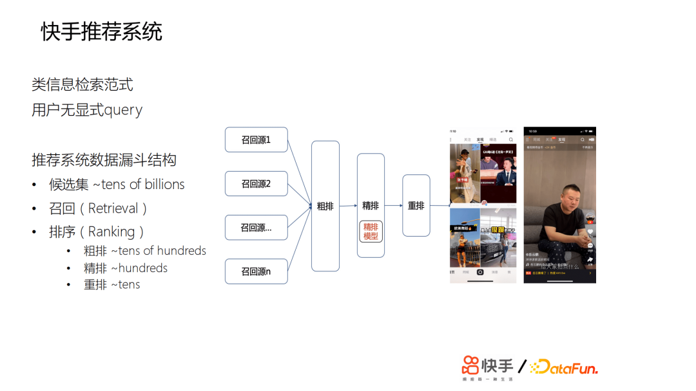

[AI科技大本营](https://cloud.tencent.com/developer/user/781483)0

LV.0

关注

文章

3.1K

获赞

12.5K

专栏

1

作者相关精选

换一批

- [知识就是力量，图谱路在何方 | ChatGPT冲击下，招商银行如何“抢救”知识图谱？](https://cloud.tencent.com/developer/article/2281998)
- [谜题科技发布Enigma Alpha平台，开启AI生成决策动作篇章！](https://cloud.tencent.com/developer/article/2259136)
- [搞深度学习框架的那帮人，不是疯子，就是骗子](https://cloud.tencent.com/developer/article/2282198)
