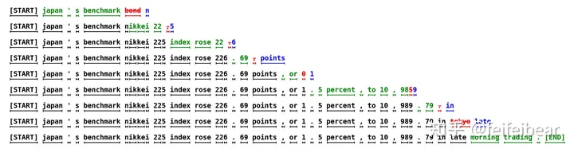
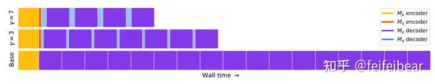
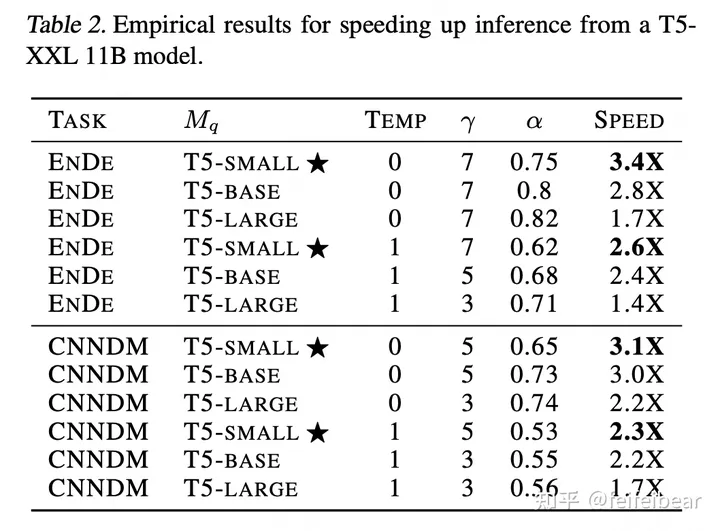

# 大模型推理妙招—投机采样（Speculative Decoding）

https://zhuanlan.zhihu.com/p/651359908

[方佳瑞](https://www.zhihu.com/people/feifeibear)

清华大学 计算机科学与技术博士

投机采样（Speculative Decoding）是Google[1]和DeepMind[2]在2022年同时发现的大模型推理加速方法。它可以在不损失生成效果前提下，获得3x以上的加速比。GPT-4泄密报告也提到OpenAI线上模型推理使用了它。

对如此妙到毫巅的方法，介绍它中文资料却很少，并且也缺少开源实现帮助理解。本文根据简要介绍了一下此方法，同时根据论文实现了一个简单的demo供大家参考。

[https://github.com/feifeibear/LLMSpeculativeSampling](https://link.zhihu.com/?target=https%3A//github.com/feifeibear/LLMSpeculativeSampling)

## 动机

大型语言模型（LLM）的推理通常需要使用自回归采样。它们的推理过程相当缓慢，需要逐个token地进行串行解码。因此，大型模型的推理过程往往受制于访存速度，生成每个标记都需要将所有参数从存储单元传输到计算单元，因此内存访问带宽成为严重的瓶颈。

为了解决推理速度慢的问题，已经进行了许多针对推理的工程优化，例如改进的计算核心实现、多卡并行计算、批处理策略等等。然而，这些方法并没有从根本上解决LLM解码过程是受制于访存带宽的问题。

有了投机采样（Speculative Decoding）**问题的性质变了**。

投机采样是一种可以从根本上解码计算访存比的方法，保证和使用原始模型的**采样分布完全相同**。它使用两个模型：一个是原始目标模型，另一个是比原始模型小得多的近似模型。近似模型用于进行自回归串行采样，而大型模型则用于评估采样结果。解码过程中，某些token的解码相对容易，某些token的解码则很困难。因此，简单的token生成可以交给小型模型处理，而困难的token则交给大型模型处理。这里的小型模型可以采用与原始模型相同的结构，但参数更少，或者干脆使用n-gram模型。小型模型不仅计算量较小，更重要的是减少了内存访问的需求。

看到这个idea，我的感觉是妙蛙种子吃着妙脆角来到米奇妙妙屋，妙到家了！

用一个例子展示随机采样的工作方式。下图中，每一行代表一次迭代。绿色的标记是由近似模型提出的token建议，而目标模型判断是否接受了这些token生成的建议。红色和蓝色的标记分别表示被拒绝和其修正。

例如，在第一行中，近似模型生成了5个token，目标模型使用这5个token和前缀拼接后的句子”[START] japan’s bechmark bond”作为输入，通过一次推理执行来验证小模型的生成效果。这里，最后一个token ”bond“被目标模型拒绝，重新采样生成”n“。这样中间的四个tokens，”japan” “’s” “benchmark”都是小模型生成的。以此类推，由于用大模型对输入序列并行地执行，大模型只forward了9次，就生成了37个tokens。尽管总的大模型的计算量不变，但是大模型推理一个1个token和5个token延迟类似，这还是比大模型一个一个蹦词的速度要快很多。

我们在看性能分析结果，下图是一个encoder-decoder结构网络的时间分解图。顶部一行显示了 =7的投机采样，中间一行显示了= 3的投机解码，是小模型一次生成token数目。Mp大模型，Mq的小模型。可见，使用投机采样，解码时间大幅缩减。

##  自回归采样

先科普一下LLM解码时采用的自回归采样，其过程如下：

1. 小模型使用前缀作为输入，将输出结果处理+归一化成概率分布后，采样生成下一个token。
2. 将生成的token和前缀拼接成新的前缀，重复执行1，直到生成EOS或者达到最大token数目。

第1步中，将模型输出logits的转换成概率，有几种常用的采样方法，包括argmax、top-k和top-n等。自回归采样中生成的token一个一个地蹦出来，因为每次只对序列长度为1的部分进行有效计算，但是却需要对全部前缀对应位置的activations进行访问，因此计算访存比很低。

## 投机采样

投机采样过程如下：

1. 用小模型Mq做自回归采样连续生成 个tokens。
2. 把生成的个tokens和前缀拼接一起送进大模Mp执行一次forwards。
3. 使用大、小模型logits结果做比对，如果发现某个token小模型生成的不好，重新采样这个token。重复步骤1。
4. 如果小模型生成结果都满意，则用大模型采样下一个token。重复步骤1。

第2步，将个tokens和前缀拼成一起作为大模型输入，和自回归相比，尽管计算量一样，但是个tokens可以同时参与计算，**计算访存比显著提升**。

第3步，如何评价一个token生成的不好？如果q(x) > p(x)（p，q表示在大小模型采样概率，也就是logits归一化后的概率分布）则以一定1-p(x)/q(x)为概率拒绝这个token的生成，从一个新的概率分布p’(x) = norm(max(0, p(x) − q(x)))中重新采样一个token。

## 为什么投机采样和自回归采样等价

论文[1]附录A1.1中严格证明了对于任意分布p(x)和q(x)，通过从p(x)和q(x)进行投机采样所得到的标记的分布与仅从p(x)进行采样所得到的标记的分布是相同的。

这里给一个直观的解释，p(x’) > q(x’)说明大模型在token x’上概率大于小模型，则大模型对生成token x’更有把握，说明小模型生成的问题不大可以保留x’。如果p(x’) ≤ q(x’)则小模型更有把握，大模型就以1-p(x)/q(x)为概率概率拒绝，并重新采样。因为接收的概率更偏向q(x)大的位置，重新采样的概率应该更偏向p(x)大的位置，所以是norm(max(0, p(x)-q(x))。

## 加速效果

投机采样相比自回归采样之所以有加速效果，因为它减少了对原始模型串行调用的次数。这里规定一次迭代可以接收小模型的tokens数为#generated tokens。

加速效果和 ，p，q都相关。直觉上讲，越大，p、q分布越接近，则# generated tokens越大。

这里 是反应大模型模型p，q性质的量。比如使用argmax作为采样，LAMDA (137B)和LAMDA (100M)的 是0.61。而LAMDA (137B) LAMDA (8B)是0.74。

论文[1]也报告了T5不同配置下有2-3x加速效果。

## 总结

用一句打油诗总结投机推理：

大小模型同台戏，并行计算加威力。

模型结构无需变，加速三倍不偏移。

我认为投机采样未来绝对会成为大模型推理上线必备之良药，希望本文对大家理解这项技术有帮助。

参考文献

[1] [Fast Inference from Transformers via Speculative Decoding](https://link.zhihu.com/?target=https%3A//proceedings.mlr.press/v202/leviathan23a/leviathan23a.pdf)

[2] [Accelerating large language model decoding with speculative sampling](https://link.zhihu.com/?target=https%3A//arxiv.org/abs/2302.01318)

编辑于 2023-08-21 17:57・IP 属地上海