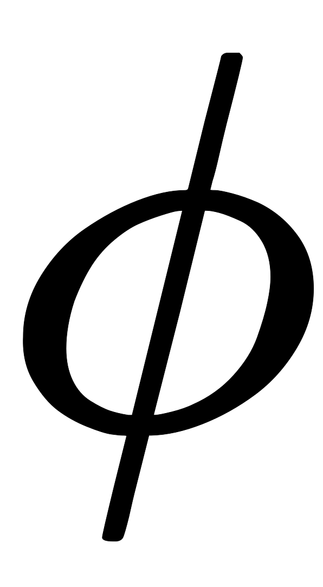

# NLP算法工程师 -【AI/算法类】

## NLP 运用场景

```
# NLP 运用场景：使用深度学习研究语言（文本/语音）的识别、理解、生成等问题。

# 1. 语音识别 ASR (Automatic Speech Recognition) 语音 -> 文本
# 2. 语音合成 TTS (Text to Speech) 文本 -> 语音
# 3. 语音分离和转换 语音 -> 语音
# 4. 语音标注 Recognition 语音 -> 类别
# 5. 文本分类 Classification 文本 -> 类别
# 6. 文本生成 文本 -> 文本
```


## Input & Output

```
# Speech Recognition: the ability of a machine or program to identify words and phrases in spoken language and convert them to a machine-readable format.

# Token

# Phoneme: a unit of sound in speech. 发音的基本单位
# 需要语言学知识去划分单词

# Grapheme: the smallest meaningful contrastive unit in a writing system. 语言文字的最小单位 
# e.g. 26个字母 + 空格 + 标点符号

# Lexicon: the vocabulary of a person, language, or branch of knowledge. 词典 word to phoneme: 词转音素
# 中文: Lexicon free language.

# word: 单词。英文单词的划分比较简单，中文单词的划分比较复杂。英文用空格划分。

# Morpheme: the smallest meaningful unit in a language. 最小的有意义的单元。e.g. un + break + able
# 可以表示意思的最小单位。e.g. un + break + able
# < word, > grapheme.

# Byte: UTF-8, 使 language independent. 使得可以语言无关。e.g. 0x41 -> A


# Acoustic Features: 声学特征
# Window: 词窗口
# frame, 25ms, 400 samples, 16kHz 帧向量
# 移动窗口，每次移动10ms，每次移动160个sample，有重叠的部分。

# Waveform* -- DFT 离散傅立叶变换 --> Spectrum 频谱图* --> Filter Bank Output* 滤波器组-- Log + DCT 离散余弦变换 --> MFCC* Mel 频率倒谱系数

# 数据集
# 英文语料库 Corpus 
# e.g. TIMIT* (4hr), WSJ* (80hr), LibriSpeech* (960hr), TED-LIUM, Switchboard* (300hr), Fisher* (2000hr), VoxForge, Common Voice, LibriSpeech, TED-LIUM, Switchboard, Fisher, VoxForge, Common Voice
# MNIST 49min, ISLVRC ImageNet 4096hr
```

## Model Seq2Seq

### Summary


### LAS

```
# Model: Sequence to Sequence Model, HMM.

# LAS: Listen, Attend and Spell
# Listen: Encoder. 
# Acoustic Features as input -> Encoder -> high level representation as output. 去除噪音，提取特征。
# Use 1-D CNN, RNN, CNN + RNN, Self-Attention.
# Down Sampling: 节省计算量，提取特征。1. 多个输出的向量合并成一个向量, Pyramidal RNN. 2. Pooling Over Time, 只选择最重要的特征。
# Attend: z0 + h1(Output of Encoder) -> Attention(e.g. dot production att 相似度， Additive att) -> alpha(0,1) -> softmax -> new alpha(0,i) (weight)-> weighted sum of hi -> c0 as input of Decoder.
# z0 -> Attention -> c0
# alpha(i) = att(z0, hi) with softmax
# c0 = sum of alpha(i) * hi
# Spell: Decoder, RNN
# z0 + Attention -> c0 -- dec --> z1 -> 'c' (z1 是 c0 decode的 hidden state。get spell token c from z1 (Distribution 概率最大)) argmax
# z1 + Attention -> c1 (Context Vector) + 'c'(上一个输出的token) -- dec -> z2 -> 'a' (概率最大) argmax
# ----> '<EOS>' (end of sentence)  
# typical seq2seq model with Attention.

# 每次选择最大概率的一条路径，
# 前一个token的选择，会影响后一个token的概率分布。一直选择最大概率的token，不一定是最优的。因为后面的token的概率分布会受到前面token的影响。
# 因此：Beam Search，每次选择概率大的多个路径作为候选集合。
# Beam Search: 选择概率最大的前k个token，作为下一个token的候选集合。然后再从候选集合中选择概率最大的前k个token，作为下一个token的候选集合。以此类推。
# k: beam size. k越大，计算量越大，效果越好。k越小，计算量越小，效果越差。

# 训练
# e.g. "cat"
# 训练目标: 最大化概率, max p(first token = 'c') * p(second token = 'a') * p(third token = 't')
# Teacher Foring: 训练时，使用正确的token作为输入，而不是使用上一个输出的token作为输入。
# 训练时，使用正确的token作为输入，而不是使用上一个输出的token作为输入。因为上一个输出的token可能是错误的，会影响后面token的概率分布。
# 防止错误不断传递和累积。

# Token, Ground truth, Prediction
# Ground truth Token -- One-hot Encoding --> One-hot Vector
# Prediction:                 RNN Output --> Softmax Vector
# Cross Entropy Loss --> Loss, minimize loss.

# Attention
# 1. Attention 的结果影响下一个token的概率输出。zt -- Attention --> ct, previous output token -> Decoder -> zt+1
# 2. Attention 的结果影响当前token的概率输出。  zt -- Attention --> ct + zt -- Decoder --> output token (current for t, previous for t+1) -> zt+1
# 3. Attention 的结果影响当前token的概率输出，同时也影响下一个token的概率输出。

# LAS 适应很复杂的语言环境，多种表达，triple a， aaa

# 限制：
# 需要听完整个句子，才能输出结果。
# 倒装可能会出现问题。e.g. "I am a student" -> "student a am I"
```

### CTC & RNA

```
# CTC: Connectionist Temporal Classification
# Decoder: Linear Classifier with Softmax -> Distribution over all possible tokens. 不涉及 Attention, 输出结果各自独立。
# Encoder: RNN... 可能是一个很深的LSTM
# 可实现Online的语音识别，不需要等待整个句子。

# 引入一个特殊的token: blank token，可能是前一个重复的token，也可能为空。下面记为'_'。
# e.g. "ca_av" -> "caav", "caat" -> "cat"
# ca的多种alignment方式: _ca_, ccaa, caaa, c_a_, _c_a, 

# RNA：Recurrent Neural Aligner
# 添加依赖：将 CTC Decoder 中线性分类器换成 RNN/LSTM，使得输出结果依赖于前一个输出结果。（+ 前一个的输出结果，+ 前一个的隐藏状态)
```


### RNN-T

```
# RNN-T
# CTC模型无法处理一帧中含有多个token的问题。
# 提出Encoder的输出的每一个h再经过一个RNN网，不断输出，直到最终输出$\phi$表示该帧信息已经全部输出完毕。
# ht -> t1 -> t2 -> t3 -> ... -> $\phi$, 
# ht+1 -> t1 ... -> $\phi$,
```


会存在alignment（对齐）的问题，例如的对于label 好棒， RNN-T存在多重排列，例如
$$
$\underline{好\phi_{1}\phi_{2}棒\phi_{3}\phi_{4}} \ ,\underline{\phi_{1}\phi_{2}\phi_{3}好棒\phi_{4}}$
$$
引入额外的RNN，建立在真正的token上，而无视blank token,$\phi$. 便于穷举所有的alignment。


### Neural Transducer

累积一个窗口的Encoder输出，h1, h2, h3,...

使用Attention + RNN 预测该窗口预测的tokens，直至产生$\phi$。


### MoChA

Dynamically shift the window. 由一个Module决定是否将window设在此处hi -> yes / no.

if yes, 使用 Attention + RNN decode 出一个token 即可。仅执行一次Attention操作。

if no, 向右移动一格。


## Model HMM

统计学视角。Hidden Markov Model


Phoneme -> Tri-phone -> State 更小的细分。


### All the alignments


#### HMM

可以选择向右下方走，即获得下一个token。或者向右走，即duplicate当前token。


#### CTC

1. 当前token为时，只能选择向右复制或者右下一个，拿到下一个非空token。
2. 当前token不为时，可以选择向右复制该token或者右下获得，或者右下跳步获得下一个非空token。
3. 例外：如果连续两个token相同，则不能右下跳步获得下一个非空token。


#### RNN-T

注意，最后一定要产生。


#### 概率计算 RNN-T


无视$\phi$，因此无论走哪条路线，在同一位置的softmax概率都是相同的。$p_{4,2} = p(l^2,h^4)$ 

##### 算法

定义为，已经读了i个h，输出了j个token的所有概率的总和。


，最后一个的值即。Dynamatic Programming

#### Summary


梯度下降算法：使用 back propagation 更新模型参数，以最小化损失函数。

## Language model

LM（language model）用来估测一个token序列（word，character，phoneme）可能的几率。

- Token sequence：
- 估测：

为什么需要LM呢？

1. 对于HMM来说，需要，需要P(Y)。
2. 对于LAS来说，需要，但是P(Y|X)是需要成对的资料，较难收集。而P(Y)只需收集token序列，比较容易。加上P(Y)获得，对训练模型很有帮助，我们总是想sequence Y的概率越大越常见越好。


### N-gram

假设第n个token只与前n-1个token有关。将总概率转换成条件概率相乘。

例如，2-gram：


问题是即使n-gram，训练资料也不够大，很多n-gram的组合未曾出现在训练资料中，使用language model smoothing 添加小的概率。

### Continuous LM

来源于Recommendation System，使用matrix factorization解决n-gram组合未出现问题。

每一个词汇有其对应向量，该向量通过最小化L学出，最终使用向量之间点乘代表出现次数。


有同样属性的token（dog，cat）往往具有相似的词向量。

后来就逐渐进入了deep learning的时代....上面使用matrix factorization的方案可以转化为下图使用DNN的方案，使用L2作为损失函数。


### NN-based LM

替代n-gram，使用NN训练下一个词汇出现的概率。


## RNN-based LM

可能会使用很长的history来决定下一个token的出现几率。


##  LM and LAS


####  Shallow Fusion


已经训练好的LAS的Decoder的output拿到token概率，和LM的softmax得到的概率log相加，最后得到概率最大的作为output。（Beam Search 同样适用）

####  Deep Fusion


已经训练好的LAS的hidden layer和LM output拿出来，再经过一个Network后得到softmax概率最大的。对于不同的domain，可能需要更换LM。接入Softmax之前的结果。

####  Cold Fusion


LAS 未经过训练，LM已被训练。加快LAS的训练速度，但与LM牢牢绑定，不可轻易更换。

## Voice Conversion 声音转换

#### 应用场景

> Deep Fake: Fool humans / speaker verification system 
>
> Personalized TTS.
>
> Style转换：情感转换 / Normal 2 Lombard / 悄悄话 2 Normal
>
> 改善清晰度 / 口音转换


> 通常假设，T' = T，此时 seq2seq 不一定需要。
>
> 可使用:
>
> Rule-based: Griffin-Lim algorithm 
>
> Deep Learning: WaveNet
>
> Vocoder: feature, vector -> Voice

#### 类型


Unparallel data: 1. Feature disentangle 2. 


**Instance Normalize**: 使 Content Encoder 移除语者信息，只保留内容信息。1-D CNN提取特征，对同一Row Normalize化。-mean / std.


...

