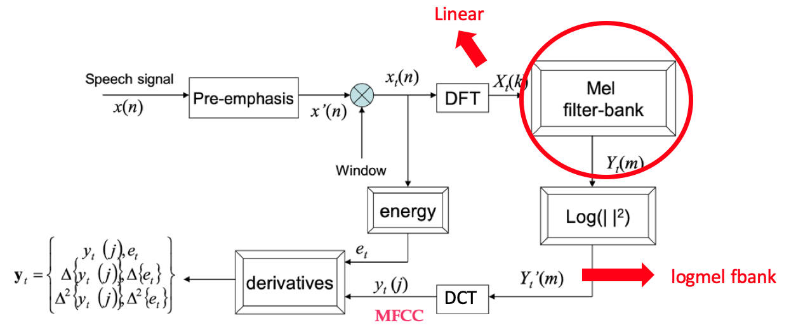
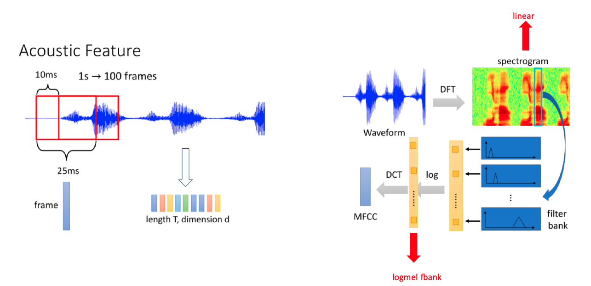

### Waveform* -- DFT 离散傅立叶变换 --> Spectrum 频谱图* --> Filter Bank Output* 滤波器组-- Log + DCT 离散余弦变换 --> MFCC* Mel 频率倒谱系数

以下是语音信号处理的典型流程，包括从原始声波图到MFCC特征的提取，以及CMVN归一化的步骤：

1. **声波图**:
   - **解释**: 声波图是表示语音信号的波形，显示了声音随时间变化的振幅。

2. **分帧**:
   - **解释**: 将连续的语音信号分割成一系列短时帧，每帧通常为20-30ms。这样做是因为语音信号在短时间内可以被认为是平稳的。

3. **应用窗函数**:
   - **解释**: 对每帧信号应用窗函数（如汉明窗）以减少帧边界的不连续性，从而减少后续频谱分析中的泄漏效应。

4. **DFT（快速傅里叶变换）**:
   - **解释**: 将每帧信号从时域转换到频域，得到频谱图。这一步骤揭示了信号的频率成分。

5. **滤波器组**:
   - **解释**: 将频谱图通过一组滤波器（通常是Mel滤波器组）处理，以模拟人耳的听觉特性，提取出对语音识别更有意义的频率特征。

6. **取Log**:
   - **解释**: 对滤波器组的输出取对数，得到logfbank特征。这一步骤增强了动态范围，使特征更适合于后续处理。

7. **应用DCT（离散余弦变换）**:
   - **解释**: 对logfbank特征进行DCT，得到MFCC特征。DCT有助于去除特征之间的相关性，使特征更加紧凑和表示性强。

8. **CMVN（Cepstral Mean and Variance Normalization）**:
   - **解释**: 对MFCC特征进行均值和方差归一化，以减少特征中的通道效应和不同语音之间的变异性。这有助于模型更好地学习和泛化。

以上是从原始声波图到MFCC特征提取的完整流程，以及CMVN归一化的步骤。每一步都是为了提取更有用的特征，以便于后续的语音识别或其他语音处理任务。

## 2.2 获取特征

### 2.2.1 音频特征 logfbank

#### 2.2.1.1 语音特征提取整体流程图

由"莊永松、柯上優 DLHLP - HW1 End-to-end Speech Recognition PPT" 修改得

#### 2.2.1.2 logfbank 提取过程简化图

logfbank 特征提取大致可以分为 3 个步骤：

1. 语音时域信号经过预加重（信号高频分量补偿），然后进行分帧。
2. 每一帧数据加窗后经过离散傅立叶变换（DFT）得到频谱图。
3. 将频谱图的特征经过 Mel 滤波器得到 logmel fbank 特征。

